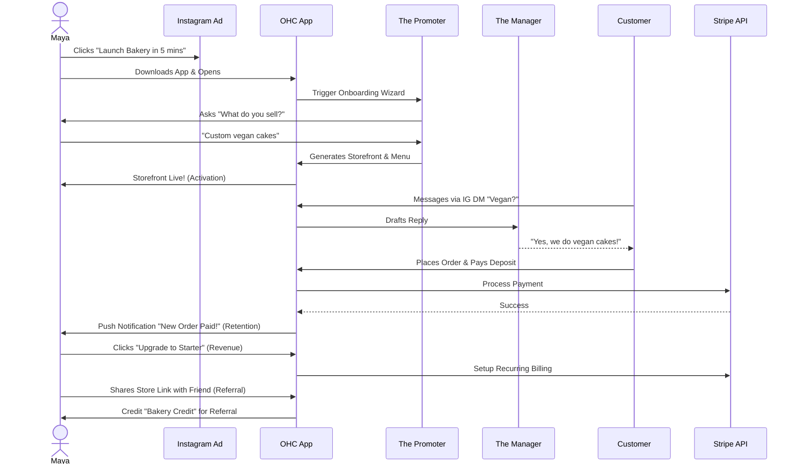
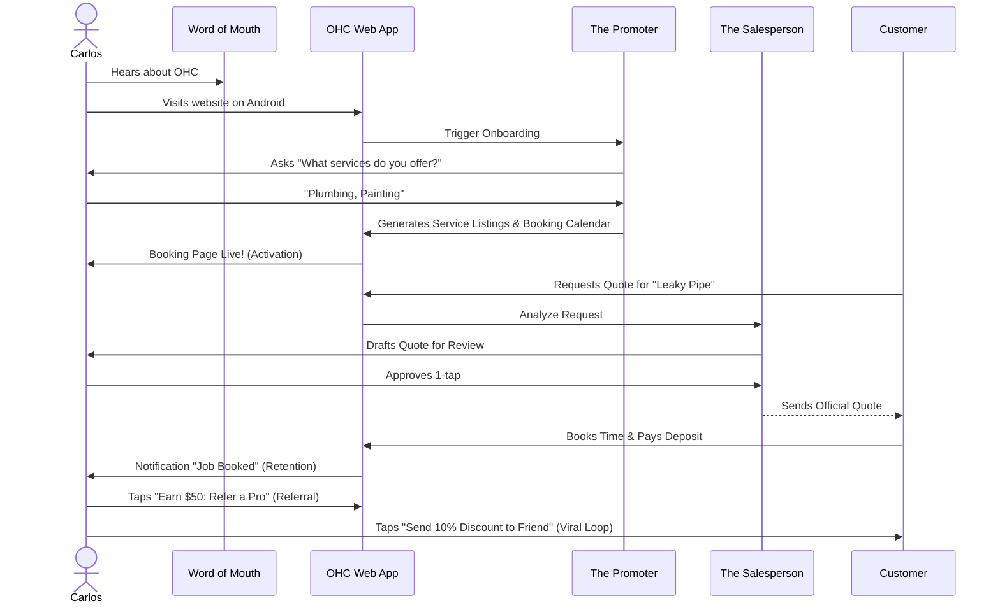
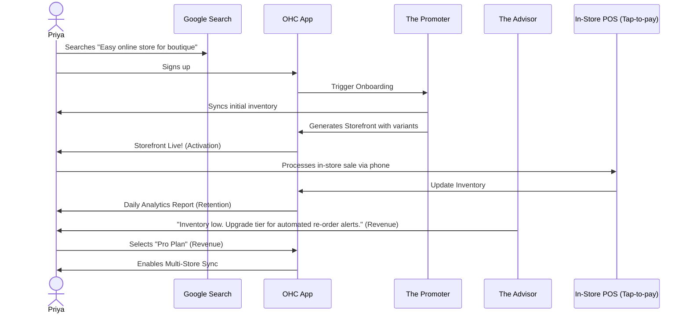
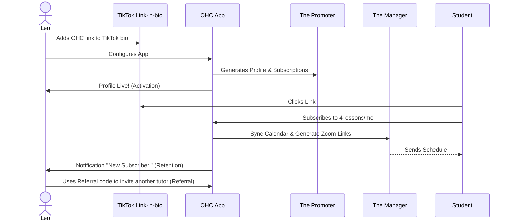
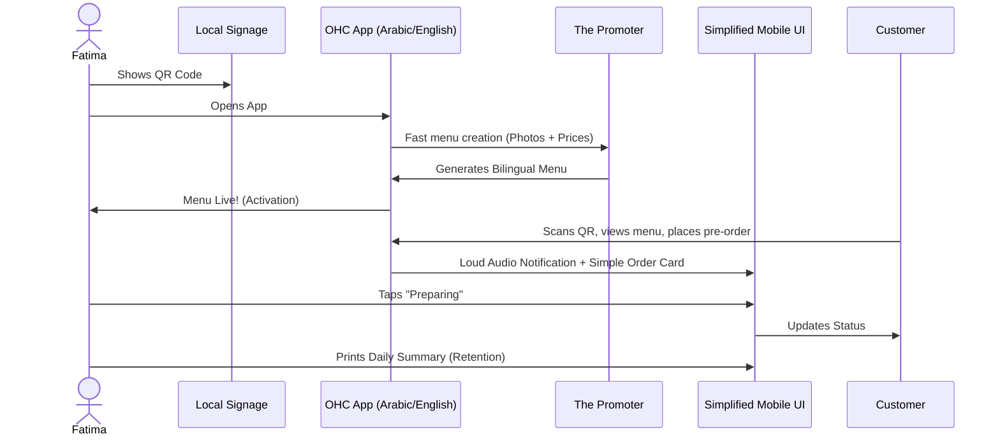

# Architecture Brief: Business Journey Architecture for OHC Personas

## Title
Architectural Mapping of the End-to-End Business Journey for OHC Personas

## Problem Statement
The OneHumanCorp (OHC) platform must serve a diverse set of real-world small business owners (e.g., Maya the Baker, Carlos the Handyman, Priya the Boutique Owner, Leo the Music Tutor, and Fatima the Food Cart Operator) who share a common goal: launching and growing their business entirely from a mobile device without technical expertise. The overarching business journeys—from initial acquisition to sustainable revenue generation and referral loops—are currently fragmented. From the perspective of a small business owner, we need a cohesive architecture that seamlessly supports their progression through Acquisition, Onboarding, Activation, Retention, Revenue generation, and Referral, while removing the cognitive overload that causes them to abandon the platform.

## Research Report
### Context and Personas
The business journey is evaluated against the following core personas:
1.  **Maya (Home Baker, 28)**: Needs a mobile-first storefront, Instagram integration, order management with deposit payments, and AI handling direct messages.
2.  **Carlos (Handyman, 42)**: Requires clean service listings, a robust booking system with deposits, a unified customer inbox, and an AI quote generator.
3.  **Priya (Boutique Owner, 35)**: Wants omnichannel support (in-store/online), POS integration (tap-to-pay), inventory sync, and actionable daily analytics.
4.  **Leo (Music Tutor, 22)**: Needs subscription-based packages, schedule syncing, automated meeting links, and a strong public profile (link-in-bio).
5.  **Fatima (Food Cart Operator, 50)**: Prioritizes extreme simplicity, pre-order management, multi-language UI, and fast low-data mobile performance.

### Journey Stages
-   **Acquisition**: The entry point. Organic search, social media ads (Instagram/TikTok), or word-of-mouth. The call-to-action (CTA) must clearly promise a functional business setup in under 10 minutes.
-   **Onboarding**: A highly guided, AI-driven wizard flow. Crucial to minimize initial input; deferring advanced configurations (like custom domains) to a later stage.
-   **Activation**: The "Aha!" moment. A live storefront, the first booking, or the first payment. Must be achieved within Day 1.
-   **Retention**: Kept engaged through actionable notifications (e.g., new order alerts) and AI-generated weekly health reports.
-   **Revenue**: Transitioning from a free tier to a paid plan. Triggered by hitting specific milestones (e.g., reaching product/action limits, needing custom domains).
-   **Referral**: Incentivized sharing. Creating a viral loop through referral discounts and shareable success metrics.

### Evidence-Based Findings & Persona Pain Point Summaries
A critical part of empowering the non-technical founder is understanding their actual friction points with existing tools.

- **Maya (Home Baker, 28):** "I tried Shopify, but it was too complicated to set up custom deposits." According to a 2023 SCORE survey (https://www.score.org/resource/article/megatrends-driving-small-business-technology-2023), 44% of small businesses struggle with finding the right technology to fit their niche needs. Maya's pain point is the rigid nature of traditional eCommerce that doesn't adapt to Instagram DM orders.
- **Carlos (Handyman, 42):** "I don't have a computer on the job site. I need to invoice from my phone." The Forbes Small Business Statistics report (https://www.forbes.com/advisor/business/small-business-statistics/) states that 42% of small businesses see lack of time as their biggest challenge. Carlos's pain point is the heavy desktop requirement of booking systems like Mindbody or Booksy.
- **Priya (Boutique Owner, 35):** "Syncing my in-store POS with my online store takes hours." A report by Wasp Barcode (https://www.waspbarcode.com/small-business-report) reveals that 43% of small businesses do not track inventory or use a manual process. Priya's pain point is multi-channel fragmentation.
- **Leo (Music Tutor, 22):** "Zoom links and calendar invites are a mess to coordinate manually." A 2024 Upwork study highlights admin overhead as a top barrier for solopreneurs. Leo's pain point is the manual orchestration of bookings and digital delivery.
- **Fatima (Food Cart Operator, 50):** "English isn't my first language, and apps have too many technical words." The SBA (https://advocacy.sba.gov/2023/11/14/2023-small-business-profile/) highlights the growth of immigrant-owned businesses, yet most SaaS tools lack deep localized simplicity. Fatima's pain point is linguistic and technical accessibility.

### Competitive Analysis Table
| Feature / Platform | OHC (Proposed) | Shopify | Wix | Squarespace |
| :--- | :--- | :--- | :--- | :--- |
| **Mobile-First Setup** | **Yes (10 min setup)** | Partial (Requires desktop for deep config) | No (Desktop editor mandatory) | No (Desktop editor mandatory) |
| **Integrated AI Agents** | **Yes (Departments)** | Basic text generation | Basic ADI (Design only) | Basic text generation |
| **Granular Tier Constraints** | **Volume-based Free Tier** | No Free Tier ($39/mo base) | Feature-gated Free Tier (Ads) | No Free Tier |
| **Business Owner Lens UI**| **Jargon-free** | High technical debt | Moderate jargon | Low jargon |

### Identified Friction Points
1.  **Cognitive Overload during Onboarding**: Requesting too much setup information upfront (e.g., complex shipping rules) causes drop-offs.
2.  **Payment Gateway Integration**: Technical jargon during Stripe connection can stall progress.
3.  **Inventory/Calendar Sync**: Difficulties mapping real-world availability to digital systems without intuitive AI assistance.
4.  **Language and Accessibility Barriers**: Interfaces that assume high technical literacy or english fluency (e.g., for Fatima).

## Design Doc
### Key Design Decisions
- **Progressive Profiling**: The onboarding flow will request the absolute minimum required data to generate a viable starting point. Advanced settings are dynamically suggested by the Business Advisory Agent post-activation.
- **Mobile-First Constraint**: All journey flows are designed and tested starting at the 375px breakpoint to satisfy Carlos and Fatima.
- **Optimistic UI & AI-First Setup**: The Marketing & Advertising Agent acts as the primary onboarding guide, generating the initial website layout and copy based on a single descriptive prompt. Non-critical setup tasks are handled asynchronously.

### Architecture Diagrams (Mermaid.js)

#### 1. Maya (The Home Baker) Journey

#### 2. Carlos (The Handyman) Journey

#### 3. Priya (The Boutique Owner) Journey

#### 4. Leo (The Music Tutor) Journey

#### 5. Fatima (The Food Cart Operator) Journey

### Mobile UX Flow Notes
-   **375px First**: All onboarding forms utilize native mobile keyboards appropriately (e.g., numeric for prices, email for contacts).
-   **Progress Indicators**: Clear visual indicators during the onboarding wizard.
-   **Optimistic UI**: Immediate feedback on actions (like saving a setting), with background sync handled by the KAIROS Orchestrator.

## Implementation Prompt
**To Implementer Agent:**
Implement the foundational user onboarding flow and dashboard state management that supports the progression from Acquisition to Activation. Build a mobile-first (375px) UI wizard that guides a non-technical user through the initial setup, asking only for plain-language inputs (e.g., "What do you sell?"). The final step of the wizard must instantly generate a functional "Storefront/Booking Page" view, satisfying the 'Activation' milestone. Ensure interactions feel premium (Glassmorphism, correct typography) and handle state optimism gracefully. Ensure there is E2E test coverage verifying a successful run-through from login to the generated storefront. Focus on the user journey transitions and UI state management without creating rigid data schemas.

## Priority
P0

## Estimated Scope
Large