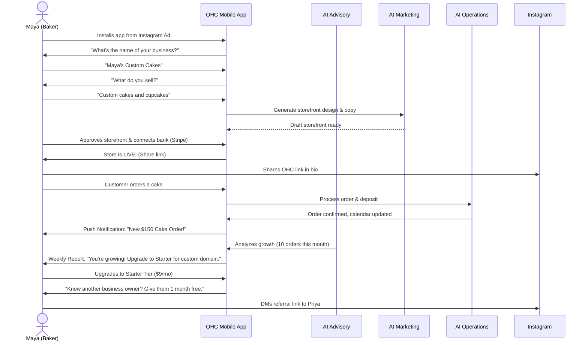
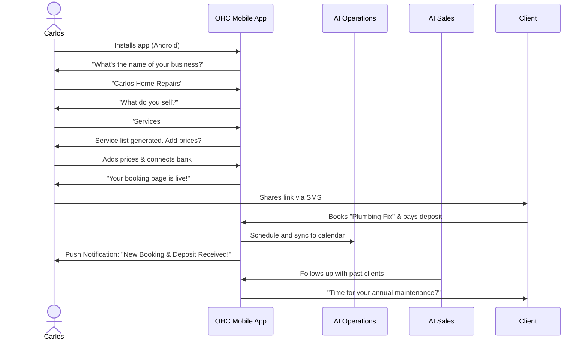
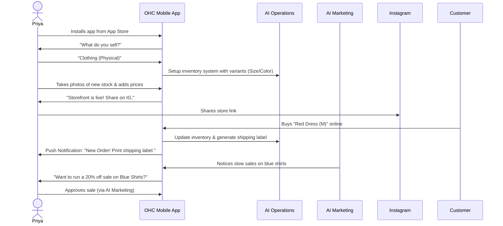
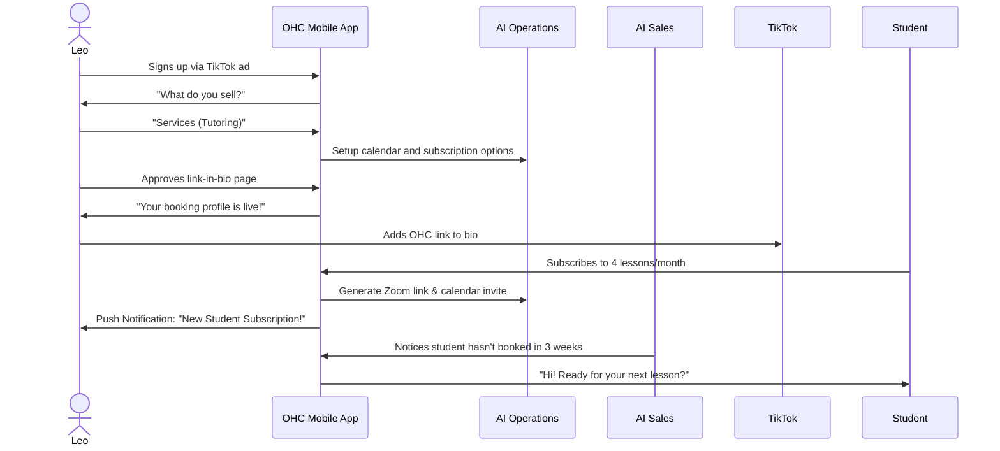
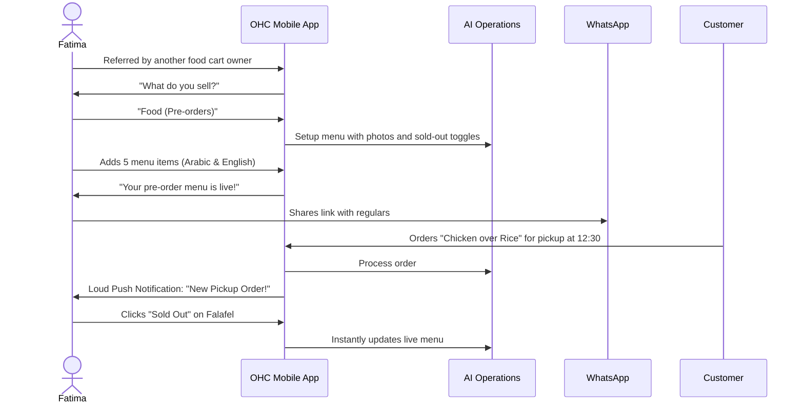

# Title
End-to-End Business Journey Architecture

# Problem Statement
Small business owners (such as Maya the baker, Carlos the handyman, Priya the boutique owner, Leo the music tutor, and Fatima the food cart operator) need a cohesive, guided experience from an idea to a fully operational business. A fragmented journey where users must figure out what to do next causes friction and high drop-off rates. Existing platforms require hours of setup, technical jargon, and manual assembly of different tools. The problem is that non-technical founders need a zero-friction, end-to-end journey (Acquisition, Onboarding, Activation, Retention, Revenue, Referral) handled entirely from their mobile phone in under 10 minutes, with AI agents invisibly doing the heavy lifting.

# Research Report
Competitive analysis reveals a clear gap in the market for a truly frictionless, mobile-first business creation journey.
- **Shopify / Wix / Squarespace**: Setup takes 20-60 minutes. They require the user to understand technical concepts (domains, payment gateways, theme customization) and manually assemble the store. They are desktop-centric during setup.
- **GoDaddy**: Basic but lacks full-stack business operations (booking, inventory, AI agents).
- **OHC's Differentiation**: OHC promises < 10 minutes from idea to live business. It treats AI as infrastructure rather than a bolt-on chatbot. It is genuinely mobile-first (375px baseline) and targets users with zero technical knowledge.

By mapping the complete journey for our core personas, we ensure that every interaction—from the first ad click to the first paid invoice and beyond—is radically simple, aesthetically excellent, and powered by autonomous AI departments.

# Design Doc

## Architecture Diagram

### Carlos (Handyman) Journey

### Priya (Boutique Owner) Journey

### Leo (Music Tutor) Journey

### Fatima (Food Cart Operator) Journey

## Friction Points
- **Onboarding drop-off**: If we ask for tax info or shipping rules before activation, non-technical users will quit.
- **Payment Gateway Setup**: Stripe onboarding can be daunting. We must abstract the complexity and guide the user through the bare minimum required to receive funds.
- **Mobile Clutter**: Complex tasks (like managing variants or writing policies) are hard on a 375px screen. This is exactly where AI agents must step in to draft and manage the heavy lifting.

## UI Wireframes or Screen Flow Description
1. **Onboarding Screen 1 (The Hook)**: "What are you building today?" Large, clear input field. Minimal branding.
2. **Onboarding Screen 2 (The Details)**: "What do you sell?" Options: Physical, Digital, Service, Food.
3. **Onboarding Screen 3 (The Magic)**: "Designing your business..." Loading screen with premium micro-animations (blur, pulse).
4. **Activation Screen (The Launch)**: "Your business is live." Big share button. Connect bank (Stripe) CTA.
5. **Home Dashboard (Retention)**: Feed of agent activities (e.g., "The Manager confirmed an order", "The Advisor says Tuesday is your busiest day").
6. **Upgrade Screen (Revenue)**: Plain-language comparison. "Starter: Get a custom domain and 3 AI agents for $9/mo."

## Mobile UX Flow
- **Acquisition**: User clicks an organic social link or referral. Deep-links into the app store or PWA.
- **Onboarding**: Step-by-step conversational wizard. Only ask for the business name, type, and 1 core product. Defer everything else (logo, policies, advanced settings) to AI agents to generate in the background.
- **Activation**: The user experiences their first "win" when the AI generates their storefront and they share the link.
- **Retention**: Push notifications for new orders. Weekly plain-language business health reports.
- **Revenue**: Upgrade prompts are contextual. They appear when the user hits a free-tier limit or achieves a milestone (e.g., 10th order).
- **Referral**: One-tap shareable link-in-bio or direct DM integration to invite peers.

## AI Agent Integration Points
- **Marketing & Advertising**: Generates the initial website design and copy during onboarding. Creates shareable social media posts for activation.
- **Operations**: Manages the first incoming order and coordinates fulfillment.
- **Finance & Payments**: Simplifies Stripe onboarding. Tracks revenue and triggers the "first dollar earned" celebration.
- **Legal & Compliance**: Auto-generates privacy policies and terms of service during setup.
- **Business Advisory**: Monitors user progress and triggers retention reports (weekly insights) and revenue CTAs (contextual upgrade recommendations).

## Key Design Decisions and Why
- **Progressive Disclosure in Onboarding**: We ask only 3 questions to go live. Asking for tax info or shipping rates upfront causes drop-offs. AI agents handle defaults until the user is ready to customize.
- **Mobile-First Touch Points**: All forms use native mobile keyboards (e.g., numeric keypad for pricing). Touch targets are strictly ≥ 44x44px to prevent fat-finger errors on small screens.
- **Contextual Upgrades**: Instead of forcing a paywall at signup, the platform offers a useful free tier. Upgrades are suggested by the Advisor agent based on actual business growth, increasing conversion rates.
- **Optimistic UI Updates**: All critical onboarding writes go through a retry queue. The user interface updates immediately, hiding network latency and ensuring a smooth experience even on slow mobile connections.

# Implementation Prompt
Implement the End-to-End Business Journey onboarding and activation flow in the Flutter frontend and Go backend.
- Create a conversational onboarding wizard that captures the business name, type, and first product.
- Integrate with the AI Marketing department to generate the initial storefront asynchronously.
- Build the Home Dashboard that displays the "Your business is live" share button and the AI agent activity feed.
- The outcome must be a fully functional, mobile-first onboarding CUJ where a user can complete the flow and see their live storefront link.
- Ensure 100% E2E test coverage starting from a fresh login, completing the wizard, and verifying the dashboard state and generated storefront.

# Priority
P0

# Estimated Scope
Large
