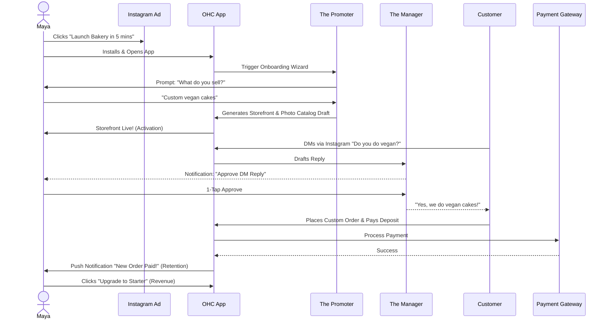
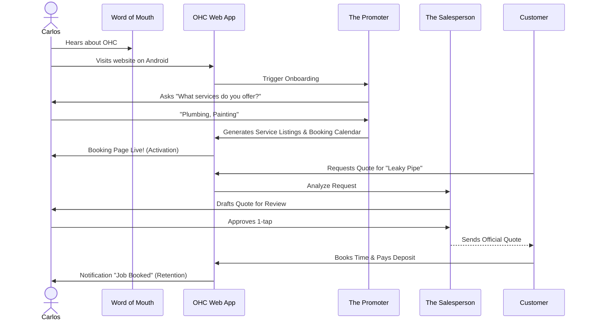
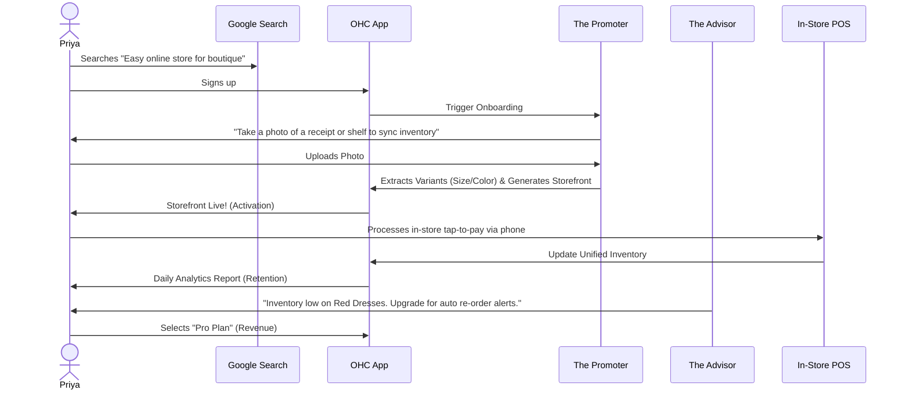
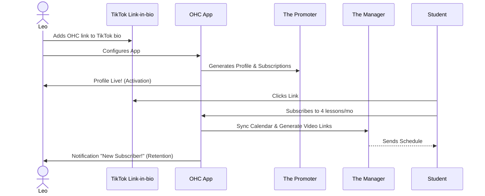
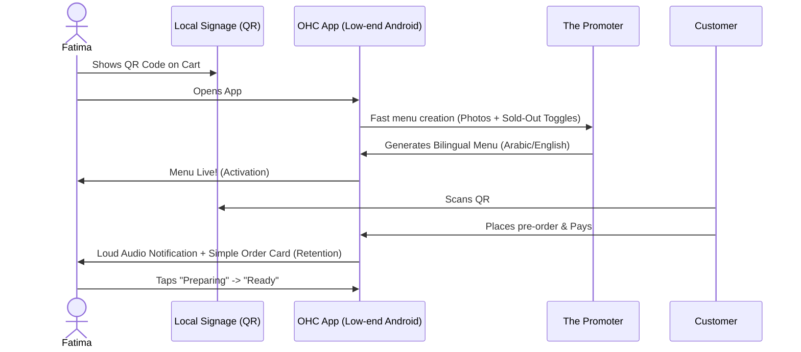

# Architecture Brief: Business Journey Architecture

## Title
OHC Business Journey Architecture: From Zero to Live in 10 Minutes

## Problem Statement
Small business owners—like Maya the baker, Carlos the handyman, and Fatima the food cart operator—need a digital platform that feels as simple and responsive as a native calculator app. They have no time to learn complex concepts like CNAME records, payment gateways, or web hosting. The goal is to design an architecture that supports a frictionless end-to-end journey from their first interaction (Acquisition) to daily usage (Retention) and expansion (Revenue/Referral). The current onboarding and usage flows on traditional platforms (like Shopify and Wix) are too complex and fragmented, causing non-technical users to abandon the process.

## Research Report
- **Competitive Analysis:**
  - *Shopify/Wix/Squarespace:* Often require desktop interaction for complete setup, use technical jargon (e.g., DNS, SSL, integrations), and lack a unified mobile-first onboarding.
  - *OHC Advantage:* A genuinely mobile-first (375px baseline) experience where AI agents handle the complexity invisibly.
- **Friction Points:**
  - Initial configuration requests too much data upfront.
  - Linking bank accounts or configuring payment gateways stalls the "Aha!" moment.
  - Mapping real-world inventory or availability to digital systems without AI assistance is tedious.
- **Key Metric Target:** Time-to-activation (live storefront/booking page) must be under 10 minutes.

## Design Doc

### User Journey Sequence Diagrams (Mermaid.js)

#### Maya (Baker) - Physical Products & Social Selling

#### Carlos (Handyman) - Services & Bookings

#### Priya (Boutique) - Omnichannel Retail

#### Leo (Music Tutor) - Digital Subscriptions

#### Fatima (Food Cart) - Offline-First Pre-orders

### Mobile UX Flow (375px)
- **Onboarding Wizard:**
  - Progressive profiling.
  - Step 1: Business name and type.
  - Step 2: Auto-generate catalog/services via AI prompt or image upload.
  - Step 3: 1-Tap "Go Live".
- **Glassmorphism Shimmer:** Used during the 30-60 second wait while AI generates the storefront.
- **Agent Activity Feed:** Post-activation, the home screen centers on actionable items (e.g., "Approve Quote", "New Order").

### AI Agent Integration Points
- **The Promoter (Marketing & Advertising):** Drives the onboarding wizard, extrapolating minimal user input into a fully fleshed-out digital presence (Vibe Coding).
- **The Salesperson (Sales & Acquisition):** Drafts quotes and analyzes customer requests (e.g., for Carlos).
- **The Manager (Operations):** Handles downstream fulfillment, such as booking calendar synchronization and video link generation (e.g., for Leo).
- **The Advisor (Business Advisory):** Contextually suggests tier upgrades based on usage patterns (e.g., inventory tracking for Priya).

### Key Design Decisions
- **Mobile-First Exclusively:** The entire journey, including advanced settings, is achievable on a 375px screen without horizontal scrolling.
- **Progressive Disclosure:** Do not ask for custom domains or complex shipping rules during onboarding. Introduce these later via "The Advisor".
- **Optimistic UI:** Interactions (like approving a quote) must feel instantaneous locally, even if the backend is syncing.

## Implementation Prompt
**To Implementer Agent:**
Implement the foundational user onboarding flow and unified dashboard state management that supports the progression from Acquisition to Activation for all business types.
- Build the mobile-first (375px) UI wizard that guides a user through the initial setup, ensuring that advanced configurations are deferred.
- The final step of the wizard should instantly generate a functional "Storefront/Booking Page" view, satisfying the 'Activation' milestone.
- Ensure that interactions feel premium (Glassmorphism, correct typography) and use plain, jargon-free language (The "Grandmother Test").
- Integrate the AI agent handoffs (e.g., passing user intent to "The Promoter" for generation).
- Include Playwright E2E test coverage verifying a successful run-through from login to the generated storefront for at least two personas (e.g., product and service).

## Priority
P0

## Estimated Scope
Large
