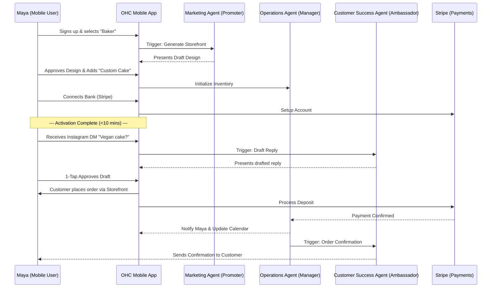
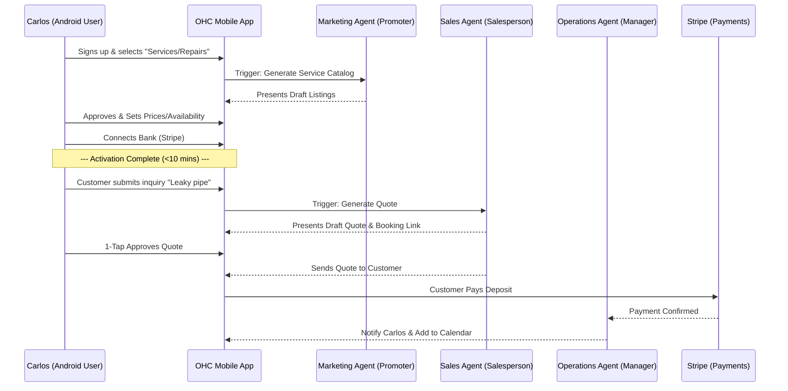
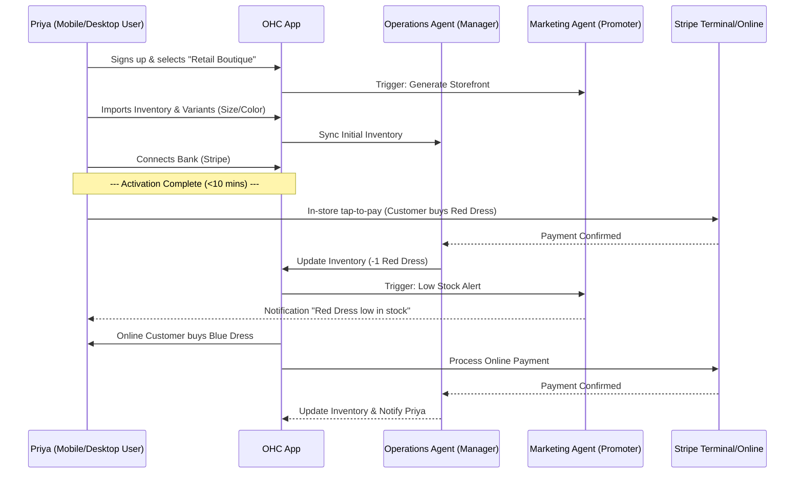
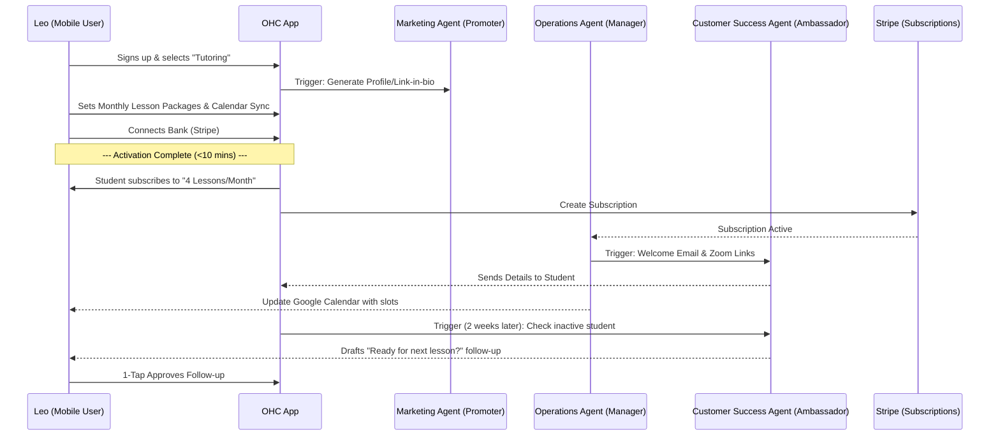
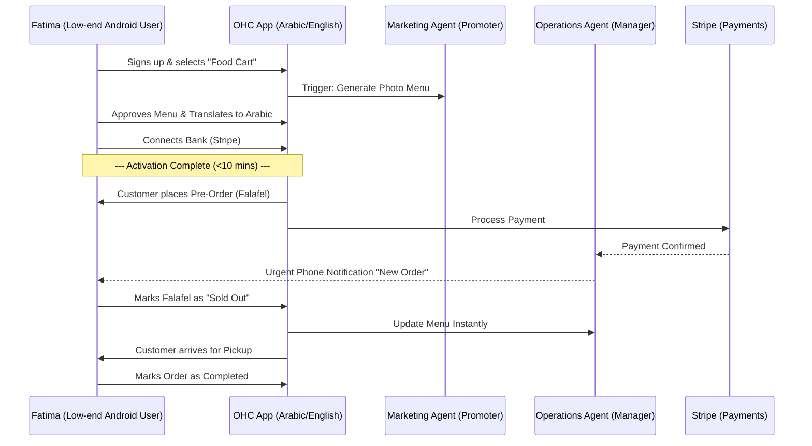

# Business Journey Architecture

## 1. Overview
The Business Journey Architecture maps the complete lifecycle of a non-technical user (persona) on the OneHumanCorp (OHC) platform. It covers everything from initial discovery and onboarding to activation, retention, revenue scaling, and referral. The architecture ensures that a user can go from zero to a fully operational business in under 10 minutes from a mobile device (375px baseline width), with AI agents invisibly handling the underlying complexity.

## 2. Core Personas & Journeys

The journeys are designed to accommodate the distinct needs of our core personas:
*   **Maya (The Home Baker)**: Physical products, custom orders with deposits, Instagram DM integration.
*   **Carlos (The Freelance Handyman)**: Services, pricing catalogs, booking with deposits, quote generation.
*   **Priya (The Boutique Owner)**: Physical products, POS/online inventory sync, variants, analytics.
*   **Leo (The Music Tutor)**: Subscriptions, booking with calendar/Zoom sync, portfolio presence.
*   **Fatima (The Food Cart Operator)**: Food pre-orders, sold-out toggles, multi-lingual (Arabic/English), low-end Android.

## 3. Journey Phases

### 3.1 Acquisition
*   **Entry Points**: Organic search, targeted Instagram/TikTok ads, or referrals from existing OHC users (e.g., "Powered by OHC" badge on a link-in-bio).
*   **Landing Page**: A clear, jargon-free CTA ("Launch your business in 10 minutes"). Emphasizes the "No Code, No Servers" promise and mobile accessibility.

### 3.2 Onboarding (Zero → Live in 10 Mins)
The onboarding flow is a guided conversational wizard powered by the AI Marketing & Advertising Agent ("The Promoter").
1.  **Business Name & Type**: User inputs name and selects category (e.g., "Food & Beverage", "Services").
2.  **Core Needs Assessment**: User selects what they want to do (e.g., "Take bookings", "Sell online").
3.  **Visual Identity**: AI generates a preliminary storefront design based on the business type, utilizing the OHC Premium Token library (Glassmorphism, Outfit/Inter typography).
4.  **First Catalog Item/Service**: User adds their first product/service (e.g., Maya adds a "Custom Vanilla Cake").

### 3.3 Activation (Day 1 Success)
*   **Success Metrics**: The user has a live storefront, has connected a payment method (Stripe), and is ready to accept orders/bookings.
*   **First Action**: The Operations Agent ("The Manager") simulates a test order or booking to demonstrate the flow. The Customer Success Agent ("The Ambassador") drafts an initial welcome email template for review.

### 3.4 Retention & Daily Use
*   **Mobile Dashboard**: A 375px-optimized dashboard showing daily metrics (e.g., new orders, messages).
*   **AI Advisory**: The Business Advisory Agent ("The Advisor") sends weekly plain-language reports ("You had 5 bookings this week. Tuesdays are your busiest day.").
*   **Push Notifications**: Alerts for new orders, low inventory, or pending AI drafts requiring 1-tap approval (e.g., "Review Instagram post draft").

### 3.5 Revenue (Tier Upgrades)
*   **Trigger**: The user hits limits on the Free tier (e.g., 10 products, 100 AI actions/month) or wants a custom domain.
*   **Upgrade Flow**: A seamless transition to the Starter ($9/mo) or Pro ($29/mo) tier, highlighting the unlocked value (e.g., unlimited products, custom domain, full AI agent access).

### 3.6 Referral
*   **Viral Loop**: Existing users share their storefront link or link-in-bio. The "Powered by OHC" badge serves as passive marketing.
*   **Incentive**: Referral rewards tracked by the Sales & Acquisition Agent.

## 4. Architecture Diagrams

### 4.1 End-to-End User Journey (Maya - Home Baker)

### 4.2 End-to-End User Journey (Carlos - Freelance Handyman)

### 4.3 End-to-End User Journey (Priya - Boutique Owner)

### 4.4 End-to-End User Journey (Leo - Music Tutor)

### 4.5 End-to-End User Journey (Fatima - Food Cart Operator)

## 5. Friction Points & Mitigation

*   **Payment Setup**: Stripe onboarding can be complex.
    *   *Mitigation*: Use Stripe Connect with simplified onboarding. Allow users to start taking orders (as "pending payment") before full verification if permitted by risk profile.
*   **Content Generation Blank Page Syndrome**: Users struggle to write descriptions or policies.
    *   *Mitigation*: AI completely generates these based on a few keywords. User only reviews/edits.
*   **Mobile UI Density**: Managing a complex store on a 375px screen is hard.
    *   *Mitigation*: Strict adherence to mobile-first UI patterns, hidden complexity, and conversational interfaces for settings.
