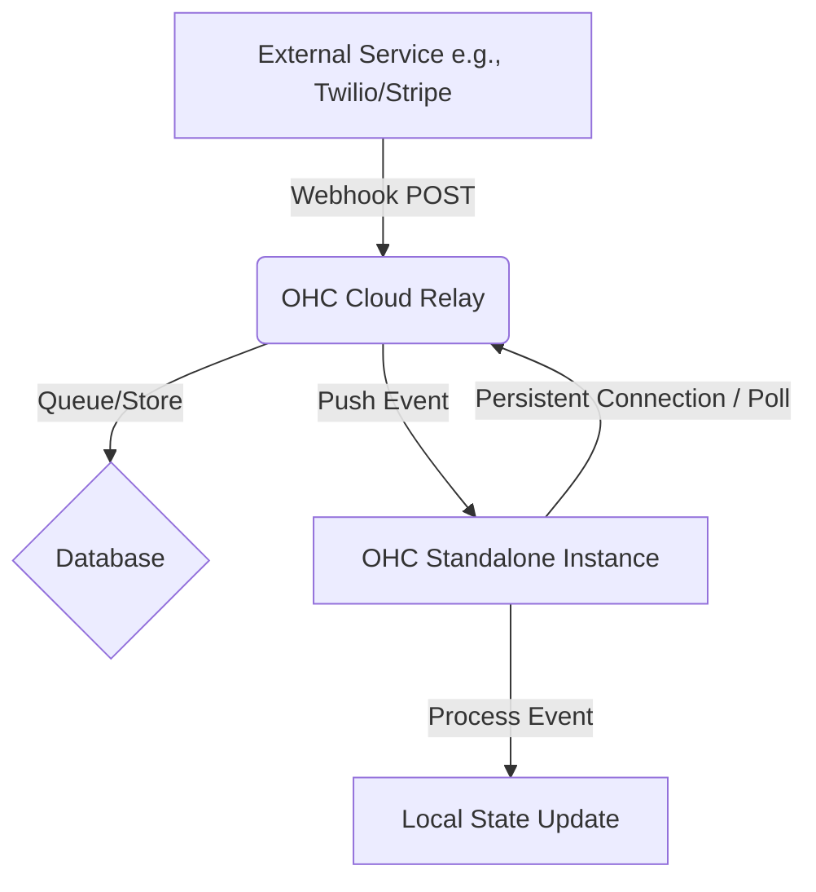

# Architecture Design Review: Cloud Relay for Standalone Webhooks

## Executive Summary
This document outlines the architecture for a "Cloud Relay" service. The purpose of this service is to solve the critical problem of receiving asynchronous webhooks from third-party services (like WhatsApp, Paytm, Alipay, and Twilio) and routing them to OHC Standalone instances, which typically lack public-facing IP addresses.

## Problem Statement
In Standalone mode, the OHC application runs on local networks or private machines. These environments are inaccessible from the public internet. Consequently, external integrations that rely on webhooks (HTTP POST requests initiated by the third-party service) fail because they cannot reach the Standalone instance.

## Proposed Architecture: Cloud Relay

The Cloud Relay acts as a publicly accessible intermediary.

### Components
1. **Public Endpoint (Cloud Relay):** A highly available, lightweight service hosted by OHC. It exposes unique webhook URLs for each Standalone instance/integration.
2. **Event Queue/Store:** When the Cloud Relay receives a webhook, it temporarily stores the payload in a secure queue or database, keyed by the target instance identifier.
3. **Delivery Mechanism:**
    *   **Polling (Fallback):** Standalone instances periodically poll the Cloud Relay for new events.
    *   **WebSockets/Long-Polling (Primary):** Standalone instances maintain a persistent outbound connection to the Cloud Relay. When a webhook arrives, the Cloud Relay pushes it down the established connection.

### Mermaid Diagram

## Security Considerations
*   **Authentication:** The Cloud Relay must verify the authenticity of incoming webhooks (e.g., via HMAC signatures provided by Twilio/Stripe).
*   **Authorization:** Standalone instances must authenticate themselves to the Cloud Relay (using secure API keys or mTLS) before retrieving events.
*   **Data Privacy:** Webhook payloads should be encrypted at rest in the Event Store and in transit.

## Next Steps
1. Prototype the Cloud Relay service using a lightweight framework (e.g., Go/Fiber).
2. Implement the WebSocket client in the Standalone core for real-time event delivery.
3. Establish the secure provisioning flow for Standalone instances to register with the Cloud Relay and obtain unique webhook URLs.
