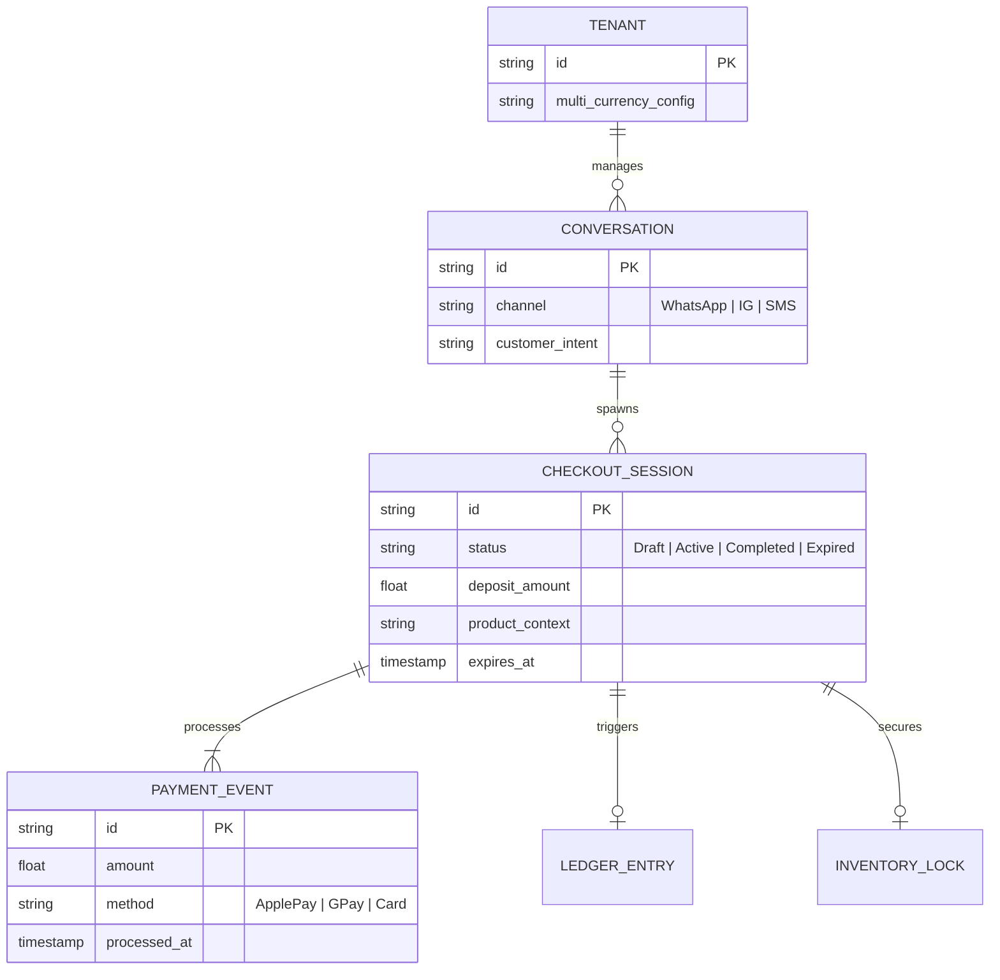
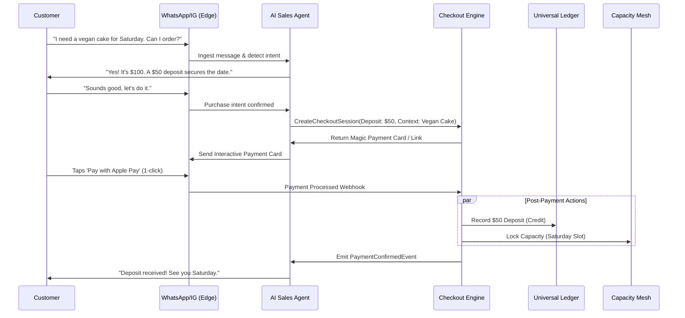

# [Architecture] Autonomous Conversational Checkout & Deposit Engine

## Title
Autonomous Conversational Checkout & Deposit Engine

## Problem Statement
Service providers and custom product makers (like Maya the baker and Leo the tutor) lose countless hours and sales switching between messaging apps (Instagram DMs, WhatsApp, SMS) and disconnected payment tools (Venmo, Stripe Links, Zelle) to secure deposits. This context switching creates a "leaky funnel" where customers drop off before paying, and requires the business owner to manually reconcile "who paid for what." They need a zero-friction way for AI agents to instantly generate and finalize secure, context-aware deposit checkouts directly within a conversational thread, locking in the sale without lifting a finger.

## Research Report

### Competitive Landscape
*   **Stripe Payment Links / Square Links**: Highly reliable but fundamentally disconnected from the conversational context. The business owner must manually generate the link, paste it into the chat, and manually track when it's paid.
*   **ManyChat / Chatbot Builders**: Can send static links automatically, but lack a native, tightly-coupled integration with an underlying financial ledger and unified capacity/inventory mesh.
*   **Shopify Inbox**: Geared primarily towards traditional physical e-commerce cart checkouts, struggling with the nuanced workflows of custom deposits, staggered service payments, or dynamic quoting.

### The OHC Gap
Reviewing the current architecture docs (`docs/research/`), OneHumanCorp has established concepts for an Omnichannel Unified Inbox, an Instant Localized Invoicing Ledger, and a Unified Capacity Mesh. However, we lack the critical architectural bridge: the engine that allows an AI Sales Agent operating inside a DM thread to autonomously construct a secure checkout session, render an interactive payment card (or zero-click webview), and immediately lock capacity/inventory the exact millisecond the deposit is confirmed.

## Design Doc

### Architecture Diagram

### Mobile UX Flow (375px First)
1.  **The Merchant View (Passive Observation):** Maya is actively baking. She receives a subtle, aggregated push notification: "Agent secured $50 deposit from Sarah (IG DM)."
2.  **The Thread View (Translucent Glass UI):** Tapping the notification opens the specific unified inbox thread. Maya sees the agent's conversation. The successful payment is rendered as a distinct, un-intrusive inline "Success Card" (green tint, checkmark, "$50 Paid").
3.  **The Customer View (Zero-Friction):** Sarah (the customer) receives a rich message bubble in Instagram or WhatsApp. It features a native "Pay $50 Deposit" button. Tapping it opens a lightning-fast, edge-cached webview (or native platform wallet integration where supported) invoking Apple Pay/Google Pay instantly. No account creation or manual data entry is required.

### AI Agent Integration Points
*   **AI Sales Department (Trigger):** Analyzes conversational sentiment and intent to recognize when the customer is ready to commit. Autonomously calls the `CreateCheckoutSession` API.
*   **AI Finance Department (Reconciliation):** Listens for the `PaymentConfirmedEvent`. Instantly attributes the funds to the correct ledger account and drafts a formal receipt behind the scenes.
*   **AI Operations Department (Fulfillment):** Immediately receives the context of the completed checkout session to update the daily production schedule or manifest.

### Key Design Decisions & Integrity
*   **Short-Lived Ephemeral Sessions:** Checkout sessions expire quickly (e.g., 15 minutes) to prevent inventory hoarding. The AI Agent will proactively follow up if the session expires ("Hey, let me know if you still wanted to grab that spot!").
*   **No PII in Conversational Context:** Payment details (credit card numbers) are fully abstracted from the AI Agent's context window. The agent only receives opaque `Session_ID` and binary `Success/Failure` states, ensuring Zero-Trust security and PCI compliance.
*   **Edge-Rendered Webviews:** For channels that don't support native rich payment buttons, the fallback is a cryptographically signed magic link that opens a massively optimized, globally edge-cached webview (< 1s load time) to ensure the highest possible conversion rate on low-end mobile devices.
*   **Strict Multi-Tenant Boundaries:** Every checkout session is cryptographically bound to the specific `tenant_id`.

## Implementation Prompt
**To Implementer Agent:**
Implement the backend architecture for the Autonomous Conversational Checkout Engine. Design a secure, multi-tenant capable API service that AI agents can call to instantiate short-lived `CheckoutSession` entities.

The system must:
1. Provide an endpoint for the AI Sales Agent to generate a `CheckoutSession` with a specific deposit amount and contextual metadata.
2. Generate a secure, signed URL or payload that can be rendered to the end customer.
3. Provide a webhook/callback handler to process successful payment events.
4. Upon payment success, atomically emit internal events to trigger the Smart Ledger (to record the deposit) and the Capacity Mesh (to lock the requested inventory/time).
5. Ensure all database operations strictly filter by `tenant_id` (Zero-Trust).

Do not implement the actual third-party payment gateway integration (Stripe/Square) or the frontend webview UI yet; focus on the internal domain model, state transitions (Draft -> Active -> Completed/Expired), and the reliable event broadcasting mechanism.

**Acceptance Criteria:**
* Can create a `CheckoutSession` linked to a tenant and an abstract conversation ID.
* State transitions correctly handle timeouts/expirations.
* Mocking a successful payment triggers the correct downstream internal events (Ledger update, Capacity lock).
* A tenant cannot access or modify another tenant's checkout sessions.

## Priority
P0 (Critical)

## Estimated Scope
Large
