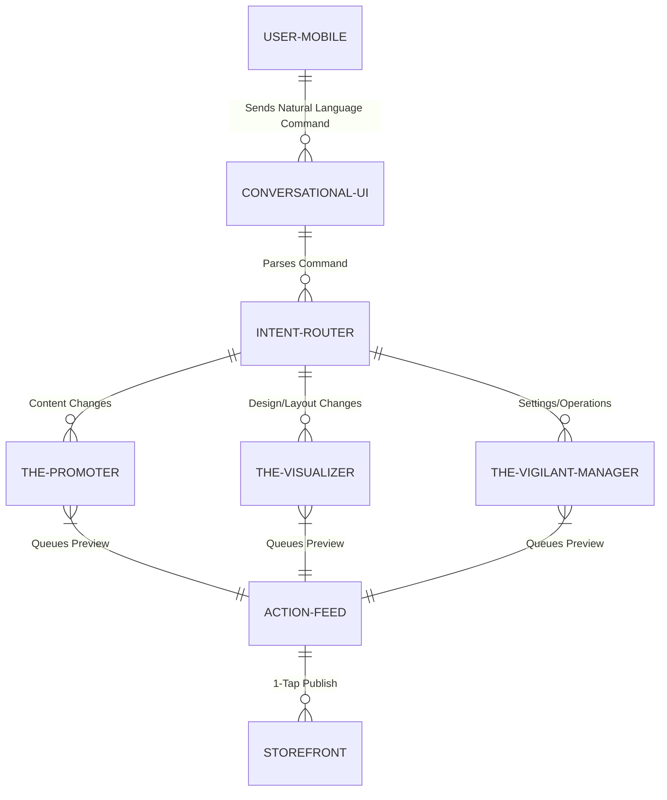

# Title: Living Mobile Editor: Conversational UI for Seamless Business Management

## Problem Statement
Small business owners, such as Priya (boutique owner) and Maya (baker), struggle to manage their businesses on the go. Traditional mobile apps from competitors (like Wix and Shopify) offer cluttered interfaces designed mostly for viewing analytics rather than actively managing storefronts, leading to a "Mobile Management Failure." Users face "Technical Debt" fears, afraid that making simple edits on mobile might break their layout or design. They need an effortless way to make updates, such as changing prices, updating business hours, or modifying text, directly from a 375px mobile screen without navigating complex menus or drag-and-drop interfaces that are not suited for touch screens.

## Research Report
*   **Current Architecture Limits:** Current platforms rely on complex dashboards and drag-and-drop mobile editors that translate poorly to smaller screens, resulting in high friction and accidental layout breakages.
*   **Competitor Analysis:**
    *   *Shopify:* Mobile app is primarily for fulfilling orders and checking stats; editing the storefront is clunky and often directs the user to the desktop experience.
    *   *Wix:* The mobile editor is notoriously difficult to use, with elements frequently snapping out of place. It functions as a static tool rather than a living assistant.
    *   *Squarespace:* Provides a slightly better mobile experience but still relies on manual configuration and lacks autonomous capabilities.
*   **Discovery:** OHC must implement a "Living Mobile Editor"—a conversational UI where the user simply types or dictates natural language commands (e.g., "Make the buy button bigger" or "Update my holiday hours to closed on Thanksgiving"). The underlying AI Agent will interpret the command, execute the structural/content changes, and present a preview for 1-tap approval, entirely abstracting the technical details.

## Design Doc

### Architecture Diagram

### Mobile UX Flow (375px First)
1.  **The Interface:** A unified chat-like interface or a floating action button on the mobile dashboard that opens the "Living Editor" conversational input.
2.  **User Action:** Maya types or uses voice-to-text: "Change the price of the custom vegan cake to $50."
3.  **Agent Processing:** The Intent Router directs the command to The Vigilant Manager (Ops Agent), which updates the catalog data.
4.  **Preview & Approval:** A macOS-style Translucent Glass card appears in the Action Feed: "I've updated the price of the 'Custom Vegan Cake' from $45 to $50. [Preview] [Approve & Publish]".
5.  **Execution:** Upon 1-tap approval, the change goes live instantly without Maya ever opening a product settings menu.

### AI Agent Integration Points
*   **Intent Router:** A lightweight NLP gateway that classifies the user's command and routes it to the appropriate specialized agent department.
*   **The Promoter (Marketing AI):** Handles commands related to copywriting, SEO adjustments, and promotional banners.
*   **The Visualizer (Vision/Design AI):** Translates visual commands ("Make the header red") into design token updates, ensuring they conform to the platform's accessibility and visual excellence mandates.
*   **The Vigilant Manager (Ops AI):** Manages pricing, inventory adjustments, and business settings (hours, location).

### Key Design Decisions
*   **Conversational First:** Replace traditional menus, sliders, and form fields with a unified natural language input as the primary interaction model for edits.
*   **Non-Destructive Previews:** All changes generated by the AI are queued as drafts in the Action Feed. The user must explicitly approve them, ensuring they always feel in control.
*   **Strict Design Tokens:** When the Visualizer agent makes aesthetic changes, it must strictly adhere to the OHC Premium design system (Glassmorphism, specific font families) to prevent the user from accidentally creating an ugly storefront.

## Implementation Prompt
Implement the "Living Mobile Editor" feature. This entails creating a conversational UI interface designed for a 375px mobile viewport where a user can input natural language commands to modify their business storefront or settings. Develop the backend "Intent Router" to classify and delegate these commands to the appropriate AI Agent (Promoter, Visualizer, or Vigilant Manager). The agents must generate the requested changes and surface them in the user's Action Feed for a simple 1-tap approval before applying them to the live edge-cached storefront. Acceptance criteria include the ability to handle basic layout, content, and operational changes purely via text input, maintaining strict multi-tenant isolation and adherence to the OHC premium visual standards. Do not prescribe specific database schemas or API endpoints.

## Priority
P0

## Estimated Scope
Large
