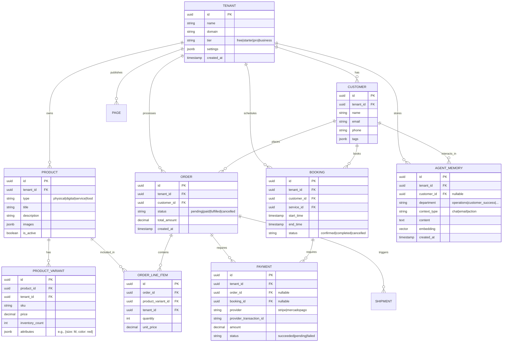

# OHC Data Model Architecture

## 1. Overview
This design document defines the unified data model architecture for the OneHumanCorp (OHC) platform. It outlines the core entity relationships, multi-tenancy guarantees via Row-Level Security (RLS), and primary access patterns for both AI agents and human users. The goal is to provide a scalable, secure, and performant data foundation that supports all business types (physical products, digital goods, services, food & beverage) from a single unified schema.

## 2. Problem Statement
To deliver on the OHC promise of "zero → live business in under 10 minutes" across a diverse set of personas (e.g., Maya the Baker, Carlos the Handyman, Priya the Boutique Owner), the platform requires a flexible but strongly typed data model. The data model must natively support multi-tenancy, handle complex relationships (e.g., product variants, booking time slots, custom orders), and enable AI agents to efficiently query contextual memory without violating cross-tenant data boundaries.

## 3. Entity-Relationship Diagram

## 4. Key Invariants & Multi-Tenancy Guarantees
1.  **Row-Level Security (RLS):** Every single operational table (except global system tables) MUST contain a `tenant_id` column. PostgreSQL Row-Level Security policies are strictly enforced on all tables.
    *   *Invariant:* A database session associated with a specific tenant identity can ONLY read, update, or delete rows where `tenant_id` matches their context. Cross-tenant queries are impossible at the database layer.
2.  **Referential Integrity with Tenant Scope:** Foreign keys must include `tenant_id` to prevent composite ID spoofing (e.g., `FOREIGN KEY (order_id, tenant_id) REFERENCES orders (id, tenant_id)`).
3.  **Agent Context Boundaries:** AI Agent departments queries for context (e.g., vector similarity search on `AGENT_MEMORY`) are automatically scoped to the current `tenant_id`. Agents cannot hallucinate data from another business.
4.  **Immutable Financial Records:** Records in the `PAYMENT` and `ORDER` tables transition through strict state machines (e.g., `pending` -> `paid`). Once finalized, financial amounts and transaction IDs cannot be altered, only appended via refund records (not pictured for brevity).

## 5. Key Access Patterns
### 5.1 Mobile App (Business Owner)
- **Dashboard Load:** Fast retrieval of aggregates (e.g., `SELECT count(*), sum(total_amount) FROM orders WHERE tenant_id = ? AND created_at > ?`). Handled via materialized views or dedicated aggregate tables for larger tenants.
- **Order Fulfillment:** Fetching an order with its line items and customer details. `SELECT * FROM orders JOIN order_line_items ... WHERE tenant_id = ? AND id = ?`.

### 5.2 AI Agents (Background Orchestration)
- **Customer Success Context:** When drafting a reply to a customer, the agent queries `AGENT_MEMORY` using vector similarity: `SELECT content FROM agent_memory WHERE tenant_id = ? AND customer_id = ? ORDER BY embedding <-> ? LIMIT 5`.
- **Operations Inventory Check:** When an order is placed, the Operations agent executes a `SELECT ... FOR UPDATE SKIP LOCKED` on the `PRODUCT_VARIANT` to atomically decrement inventory without blocking other concurrent checkouts for different products.

### 5.3 Public Storefront (Customer)
- **Product Catalog:** Fast, read-heavy queries for active products. Heavily cached via Redis or CDN edge nodes, invalidated only when a product/variant is updated by the tenant.

## 6. Schema Evolution & Migration Strategy
- **Additive Changes:** Prefer additive changes (adding columns, creating new tables) over destructive ones.
- **Zero-Downtime Migrations:**
    1. Add new schema elements (tables/columns).
    2. Deploy application code that writes to both old and new schema.
    3. Backfill data in the background.
    4. Deploy application code that reads from the new schema.
    5. Drop old schema elements (after a safe retention period).
- **JSONB for Flexibility:** For highly variable attributes (like `product_variant.attributes` or `tenant.settings`), `JSONB` columns are used to avoid constant schema migrations while still allowing indexing (e.g., GIN indexes on common keys).
- **Tooling:** All migrations are managed via a robust migration tool (e.g., `golang-migrate` or similar) integrated into the Bazel build and deployment pipeline.

## 7. Implementation Prompt
Implement the foundational Data Model Architecture as described. This includes defining the initial database migration scripts (incorporating `tenant_id` on all tables and setting up initial RLS policies), establishing the ORM/Query builder patterns in the Go backend to automatically inject `tenant_id` into all queries, and configuring the `pgvector` extension for the `AGENT_MEMORY` table. Ensure all database access is fully unit-tested for tenant isolation.
