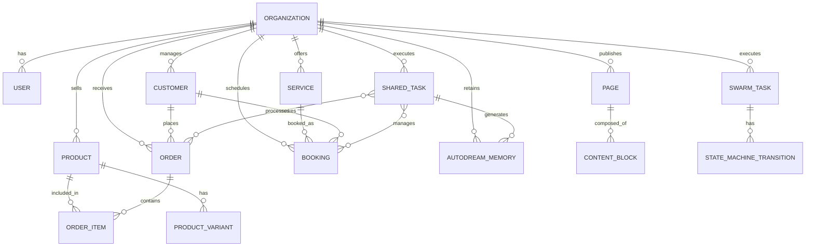

# [Architecture] Data Model Architecture

## Problem Statement
The OneHumanCorp (OHC) platform needs a robust, scalable data model that ensures strict multi-tenancy, rapid AI integration, and a mobile-first user experience. Our users (like Maya, Carlos, Priya, Leo, and Fatima) operate varied businesses but share a need for an invisible, complex backend that simplifies their day-to-day operations. The data model must seamlessly bridge standard business domain entities (products, orders, customers, bookings, pages) with cross-department AI orchestration primitives, all while enforcing secure multi-tenancy and distributed execution without exposing technical jargon.

## Research Report
An analysis of our current infrastructure and competitive landscape reveals several key structural demands to support the OHC vision:
- **Multi-Tenancy at Core:** The system relies on a multi-tenant SaaS architecture where every business is logically isolated. Database migrations show the explicit and required use of `organization_id` (originally `tenant_id` which was systematically migrated via `058_autodream_rename_tenant_id.sql` to `organization_id`) as the primary partition key across almost all entities (e.g. `shared_tasks`, `autodream_memories`, `users`).
- **Domain vs AI Entities:** While platforms like Shopify and Wix structure their data heavily around generic catalogs and rigid extensions, OHC must unify standard business entities (Product, Booking, Customer, Order) with AI orchestration (e.g. `swarm_tasks`, `shared_tasks`, `state_machine_transitions`, `autodream_memories`).
- **Core Business Domains needed for Personas:** The data model must be evolved to support the specific needs of Maya, Carlos, Priya, Leo, and Fatima:
  - Catalog management: Products, Services, Variants (for Priya's boutique).
  - Transactions: Orders, Bookings, Appointments, Deposits (for Maya's cakes, Carlos's handyman services, Leo's lessons).
  - Relationships: Customers, Tags, Testimonials (for Leo's portfolio and Carlos's reviews).
  - Presence: Pages, Sections, Content Blocks.
- **AI Agent Contexts:** AI agents operate based on past interactions. The implementation of `autodream_memories` using PG `VECTOR` and `state_machine_transitions` indicates a need to securely associate pgvector embeddings, LLM context, and task transitions tightly to the organization context alongside business data.

## Design Doc

### Entity-Relationship Architecture Diagram

### Key Invariants
- **Strict Multi-Tenant Isolation:** Every single business (tenant) is strictly isolated using the `organization_id` column. A business owner or AI agent can only query, modify, or observe their own tenant's data. This invariant is enforced at the database layer via PostgreSQL Row Level Security (RLS) policies based on the `organization_id` column for all entities.
- **AI Access to Domain Entities:** AI agents (e.g., "The Manager" processing an order) interact with domain entities through Shared Tasks and Swarm Tasks. The context (Autodream vectors, memories) and the state changes (recorded via `state_machine_transitions`) are all strictly bounded by the `organization_id`.
- **Hybrid Domain Support:** Entities like Products and Services are distinct but share transactional pathways (Orders vs Bookings) to gracefully handle hybrid businesses (like a music tutor who also sells digital course materials).
- **Hybrid Graceful Degradation Database Schema**: The core stack relies on Postgres for cloud, but standalone instances use SQLite. Thus, schema definitions must not rely on pure-Postgres features without SQLite equivalents (e.g., fallback for `VECTOR` is `BLOB` or `TEXT`, and `JSONB` maps to `TEXT`).

### Migration Strategy
To ensure zero downtime and robust backward compatibility, the schema evolution must adhere to the following strategy:
1. **Additive Changes First:** Introduce new entities (like expanded AI sub-departments or advanced eCommerce schemas) as additive migrations. Never drop existing columns or tables without a multi-phase deprecation window.
2. **Hybrid Compatibility Validation:** Ensure all migrations gracefully degrade. For example, PostgreSQL `vector` types must map correctly to `BLOB` or `TEXT` in the local SQLite standalone environment, mapping `JSONB` to `TEXT` (as seen in `20260425000000_autodream_memories.go`).
3. **Automated Auditing:** Migration steps that alter multi-tenant RLS invariants must be paired with automated security audits to confirm that cross-tenant queries return zero results.

## Implementation Prompt
**Context:** Implement the core business domain entities (Product, Order, Customer, Booking, Page) to fulfill the needs of the various business owner personas, ensuring strict adherence to the existing multi-tenant architecture and hybrid PostgreSQL/SQLite degradation pattern.

**Task:**
1. Define the business logic models for `products`, `orders`, `customers`, `bookings`, and `pages`.
2. Ensure every model inherently supports the multi-tenant architecture by requiring an `organization_id` field.
3. Design the database migration scripts required to instantiate these new domain entities in the database, making sure to use `github.com/pressly/goose/v3` in Go to dynamically verify `SELECT sqlite_version()` and execute the correct database syntax (e.g. SQLite versus Postgres types).
4. The models should enable standard CRUD capabilities while remaining isolated by `organization_id` enforcing Row-Level Security.

**Acceptance Criteria:**
- The domain entities represent the real-world business needs of Maya (Orders), Carlos (Bookings), Priya (Products), Leo (Bookings/Customers), and Fatima (Orders).
- The entities are successfully integrated into the hybrid database architecture without breaking existing tests.
- Multi-tenant isolation is preserved via `organization_id`.

## Priority
P1

## Estimated Scope
Medium

