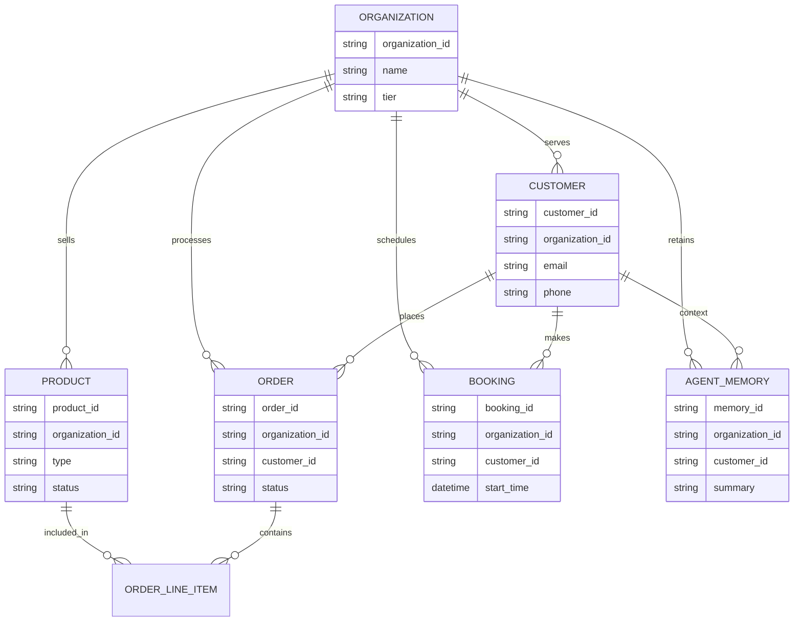

# Evolve the OHC Core Data Model Architecture

## Problem Statement
Small business owners—whether they're baking custom cakes, fixing plumbing, or running a boutique—need a single, unified view of their entire business. Right now, managing different parts of the business (products, bookings, customers, orders) often feels disconnected. Maya the baker needs to easily see if a customer who ordered a birthday cake previously ordered cupcakes, but the system's underlying data structures make this cross-referencing complex. To provide a seamless, magical experience where AI agents can instantly understand the state of the business and provide actionable advice, our underlying data model needs to be deeply integrated, unified, and strictly isolated per business.

## Priority
P0

## Estimated Scope
Large

## Research Report
### Market Findings & Competitive Analysis
- **Shopify:** Primarily optimized for physical products and variants. Their data model struggles with service bookings and subscriptions natively without heavy third-party app integration.
- **Wix / Squarespace:** Offer separate modules for commerce, bookings, and blogs. Data is often siloed, meaning a customer in the store might not perfectly sync with a customer in the booking system.
- **GoDaddy:** Very simple flat model, but lacks the relational depth needed for complex AI reasoning or varied business types.
- **OHC Opportunity:** By creating a unified, multi-tenant data model where `business` is the root, and `product`, `order`, `customer`, `booking`, and `agent_interaction` are top-level interconnected entities, our AI can traverse the graph seamlessly. The AI can instantly answer "Which customers who booked a plumbing service last year haven't bought our new maintenance subscription?"

## Design Doc

### Entity-Relationship Architecture Diagram

### UI Wireframes or Screen Flow Description
- **Global Search (375px):** A single search bar at the top of the mobile dashboard. Typing a name (e.g., "Sarah") queries the unified data model to return matching Customers, their past Orders, upcoming Bookings, and recent Agent Interactions in one view.
- **Customer Profile View:** A unified screen showing contact info, lifetime value, purchase history (products), past appointments (bookings), and AI-generated interaction summaries.

### Mobile UX Flow
1. User opens the OHC app and lands on the unified Dashboard.
2. User taps on a "Customer" from a recent notification.
3. The app fetches a comprehensive payload combining `Order`, `Booking`, and `Agent_Memory` entities linked to that `Customer`.
4. User views a seamless timeline of all interactions.

### AI Agent Integration Points
- **The Advisor (Business Advisory):** Queries the interconnected model to find cross-sell opportunities (e.g., customers who bought X but haven't booked Y).
- **The Ambassador (Customer Success):** Fetches complete customer history to personalize responses.
- **Data Access:** Agents use the `organization_id` to retrieve isolated context, ensuring they only reason over the specific business's data graph.

### Key Invariants & Design Decisions
- **Strict Multi-Tenancy:** Every single entity must include an `organization_id`. The primary invariant is that a user or agent can only read, write, or modify data where the `organization_id` strictly matches their authenticated context (enforced via PostgreSQL Row-Level Security).
- **Unified Customer Root:** All transactional entities (Orders, Bookings, Agent Interactions) must link back to a single unified `Customer` entity. This prevents the "siloed data" problem seen in competitors.
- **Hybrid Data Types:** Use robust types mapping to standard structures across environments (e.g., PostgreSQL JSONB mapped to SQLite TEXT, VECTOR to BLOB) to ensure local development and cloud production parity.

### Migration Strategy
- **Phase 1: Add Organization ID:** Ensure all existing tables have the `organization_id` column and apply RLS policies. Default to a single organization for legacy standalone data.
- **Phase 2: Unify Customer Records:** Create the new unified `Customer` entity and run a background migration to link orphaned orders and bookings to consolidated customer records.
- **Phase 3: Expose Unified Graph:** Update API endpoints to fetch the interconnected data, deprecating old, siloed endpoints gracefully.

## Implementation Prompt
**Objective:** Implement the unified core data model entities and relationships to support physical products, services, and bookings under a single business umbrella.
**CUJ:** A business owner opens the app and navigates to a customer's profile, where they see a unified timeline of the customer's orders, bookings, and AI agent interactions, all correctly isolated to their specific business.
**Acceptance Criteria:**
- Core entities (Product, Order, Customer, Booking, AgentMemory) are defined and inherently linked to an `organization_id`.
- The multi-tenant invariant is structurally enforced so cross-organization data leakage is impossible.
- The data access layer supports unified queries (e.g., retrieving a customer with all their associated orders and bookings in one call).
- Tests verify that data is correctly isolated and relationships can be traversed from the root organization.

