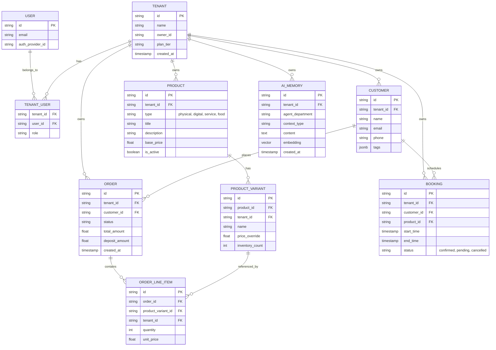

# Title: Data Model Architecture

**Priority**: P0
**Estimated Scope**: Large

## Problem Statement
The OneHumanCorp (OHC) platform aims to provide a radically simple, AI-assisted small business management system where anyone can launch a live business in under 10 minutes. A fundamental challenge is managing complex and varied business models (physical products, digital downloads, services, food & beverage pre-orders, and subscriptions) under a unified SaaS framework without exposing database intricacies to the end-user. We currently lack a consolidated Data Model Architecture that clearly defines core entities, their relationships, multi-tenant boundaries (RLS), and AI agent access patterns. Without this, development efforts risk creating fragmented, insecure, or inefficient data silos that hinder mobile-first performance and cross-department AI operations.

## Research Report

### Findings
Our research into existing platform architectures (Shopify, Wix, Squarespace) and our diverse user personas (Maya the Baker, Carlos the Handyman, Priya the Boutique Owner, Leo the Music Tutor, Fatima the Food Cart Operator) reveals:
1. **Entity Flexibility**: A rigid schema fails. Maya needs order deposits, Carlos needs time-slot bookings, and Priya needs multi-variant inventory. A unified, extensible product/service model is required.
2. **Multi-Tenancy Isolation**: Strong data isolation is non-negotiable. Every database operation must be strictly bound to a `tenant_id` (the business). Relying solely on application-level checks is prone to human error; PostgreSQL Row-Level Security (RLS) provides the necessary safety net.
3. **AI Contextual Access**: AI Departments (The Manager, The Promoter, The Ambassador, etc.) require seamless but governed access to the entire business history (orders, customers, inventory) to function effectively. This necessitates vector embeddings for unstructured memory alongside structured data access.
4. **Mobile Performance**: The data model must support optimistic UI updates and fast offline reads, requiring efficient indexing and carefully designed query paths that fetch minimal necessary payloads for a 375px screen.

### Competitive Analysis
- **Shopify**: Offers a robust e-commerce data model but is overly complex for simple service businesses (like Carlos or Leo) which require different booking and calendar structures.
- **Wix/Squarespace**: Uses a flexible document-like approach for unstructured content but lacks the strict relational integrity needed for financial transactions and complex AI reasoning.

## Design Doc

### Architecture Diagram

### UI Wireframes & Screen Flow Description
1. **Data Initialization Flow (375px first)**:
   - **Screen 1**: "What are you selling?" - User selects categories (e.g., Cakes, Repairs). Triggers creation of `PRODUCT` templates.
   - **Screen 2**: "Let's set your prices" - Simple form native mobile keyboard (numeric). Populates `PRODUCT_VARIANT`.
2. **Order & Booking Dashboard**:
   - A unified feed combining `ORDER` and `BOOKING` entities sorted by chronological urgency.
   - Touch target (≥ 44x44px) on each card to view details.
3. **Customer Profile**:
   - Displays aggregated `CUSTOMER` history: past orders, total LTV (Lifetime Value), and AI-generated summary from `AI_MEMORY`.

### Multi-Tenant RLS Invariants
- **Strict Isolation**: Every table associated with business data MUST have a `tenant_id` column.
- **Row-Level Security (RLS)**: PostgreSQL RLS policies must be enabled on all tenant-scoped tables. The policy will enforce `tenant_id = current_setting('app.current_tenant')` to guarantee that queries can only read/write data for the currently active business context.
- **Agent Access Invariant**: AI Agents operating in background queues assume the identity of the tenant they are acting on behalf of, setting the appropriate RLS context before executing any operations.

### AI Integration Points
- **The Manager (Operations)**: Subscribes to `ORDER` and `BOOKING` creation events to update `PRODUCT_VARIANT` inventory counts and manage fulfillment state.
- **The Ambassador (Customer Success)**: Queries the `CUSTOMER` and `ORDER` tables along with semantic search on `AI_MEMORY` to draft contextual replies to inquiries (e.g., "Do you do vegan cakes?").
- **The Advisor (Business Advisory)**: Runs weekly analytical aggregations over `ORDER`, `PRODUCT_VARIANT`, and `BOOKING` data to generate insights, storing resulting narratives back into `AI_MEMORY`.

### Key Design Decisions
- **Unified Tenant Root**: Tying everything explicitly to `tenant_id` allows for seamless horizontal sharding by tenant in the future and guarantees strict data isolation.
- **Polymorphic Product Types**: Instead of separate tables for physical goods and services, a single `PRODUCT` table with a `type` enum simplifies the core catalog while allowing flexible specific attributes via `PRODUCT_VARIANT` or a dedicated metadata JSONB column.
- **AI Memory Vector Table**: Integrating a dedicated `AI_MEMORY` table natively using `pgvector` ensures AI context is first-class and transactionally consistent with core business data, rather than relying on an external disconnected vector store.

### Migration Strategy
- Use an evolutionary schema approach with `goose` for migrations.
- **Phase 1**: Establish the core `TENANT`, `USER`, and `TENANT_USER` structures with basic RLS policies.
- **Phase 2**: Introduce `PRODUCT`, `ORDER`, and `CUSTOMER` tables with hybrid SQLite (for local testing/standalone) and PostgreSQL mappings.
- **Phase 3**: Roll out `AI_MEMORY` with `pgvector` support in cloud environments and fallback local vector strategies.

## Implementation Prompt
**User-Facing Outcome**: Establish the foundational database schema and multi-tenant access layer so that the platform can securely store and isolate business data across diverse user personas (e.g., physical goods for Maya, service bookings for Carlos).

**Acceptance Criteria**:
- Implement the core data model entities (Tenant, Product, Order, Customer, Booking) with strict `tenant_id` foreign keys.
- Enable PostgreSQL Row-Level Security (RLS) on all tenant-scoped tables to ensure data isolation.
- Provide a unified query layer that correctly applies the active tenant context for both user-initiated API calls and background AI agent jobs.
- Include unit/E2E tests verifying that a user from Tenant A cannot access data from Tenant B under any circumstances.

