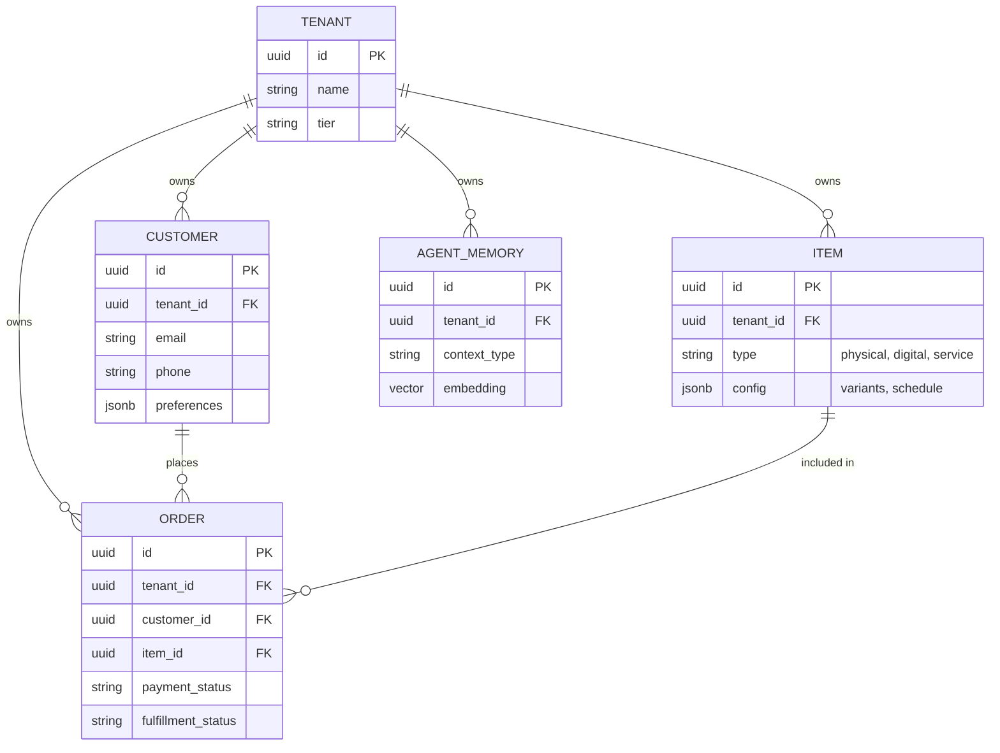

# [Architecture] Data Model Architecture

## Problem Statement
The OHC platform must serve a diverse set of small businesses—from bakers taking custom deposit orders to freelancers booking time slots. However, these businesses all share fundamental entities (customers, orders, products, bookings) that require a strict multi-tenant isolation guarantee. Without a carefully designed, generalized data model, the system risks data leakage, complex one-off implementations for different business types, and inefficient AI agent data retrieval. We need a unified data architecture that scales securely and intuitively supports all AI department operations without complex joins or tenant crossover.

## Research Report
### Current Context & Challenges
1.  **Multi-Tenancy:** The most critical invariant is that no business owner can see or access data from another tenant. PostgreSQL Row-Level Security (RLS) driven by a universal `tenant_id` column is mandatory.
2.  **Diverse Entities, Unified Storage:**
    -   *Products:* Must handle physical items (cakes, shirts), digital downloads (e-books), and services (tutoring). This requires a flexible attributes/variants design rather than rigid column schemas.
    -   *Transactions:* Needs to support single payments, multi-part deposits (custom cakes), and subscriptions.
3.  **AI Accessibility:** AI Agents (Departments) require low-latency access to business state (inventory, customer history) to make autonomous decisions. The data model must support contextual retrieval, likely augmented by vector embeddings (`autodream_memories`) for unstructured history.
4.  **Competitive Landscape:** Shopify enforces a rigid product/variant model that is hard to bend for service bookings. Wix provides separate apps that often don't share data well. OHC must provide a single, unified graph.

## Design Doc
### Key Entities & Relationships
-   **Tenant (Business):** The root entity. Every other record in the system belongs to one Tenant. Contains configuration, tier limits, and global settings.
-   **Customer:** Individuals who interact with a Tenant. Owned by the Tenant. (A single physical person might exist as multiple Customer records across different Tenants).
-   **Product/Service (Item):** Represents anything sold or booked. Uses a type classifier (physical, digital, service) and a flexible JSONB configuration for variants/options.
-   **Order/Booking:** The transactional record tying a Customer to an Item. Tracks payment state (deposit, paid, refunded) and fulfillment state.
-   **Agent_Memory:** Vector-embedded interactions, decisions, and context owned by the Tenant, providing historical grounding for AI actions.

### Architecture Diagram (ERD)

### Multi-Tenancy Invariants & Access Patterns
1.  **Strict Isolation:** EVERY table (except global configuration) MUST have a `tenant_id`. PostgreSQL RLS policies must enforce `tenant_id = current_setting('app.current_tenant_id')`.
2.  **API Access:** API endpoints must implicitly inject the authenticated user's `tenant_id` into the database session context. Mobile clients never pass `tenant_id` explicitly for security.
3.  **AI Agent Access:** When an AI Department executes a task, the Orchestrator provisions an execution context scoped strictly to the target `tenant_id`, ensuring agents cannot accidentally hallucinate or retrieve cross-tenant data.

### Schema Evolution & Migration Strategy
Over time, business requirements will require new data patterns. The migration strategy for evolving this schema must follow these rules:
1.  **JSONB for Rapid Evolution:** Attributes specific to business niches (e.g., "shoe size" vs. "ticket date") should be added to the `config` JSONB column on the `ITEM` or `ORDER` table. This avoids wide, sparse tables and reduces the frequency of DDL migrations.
2.  **Additive DDL Migrations Only:** When a true relational index or new core table is needed, migrations MUST be strictly additive. Do not drop or rename columns, as this would break the `SKIP LOCKED` worker queues that process data asynchronously.
3.  **Zero-Downtime Multi-Tenancy Changes:** If a new tenant-isolated table is introduced, its migration must immediately apply the `ENABLE ROW LEVEL SECURITY` and attach the standard RLS policy within the identical Goose transaction to prevent a default-deny state that would block standard application queries.

## Implementation Prompt
**To the Implementer:**
You are tasked with implementing the foundational database schema and corresponding Go structs for the OHC Data Model based on this architecture.
1.  Initialize the Goose SQL migrations for `tenants`, `customers`, `items`, `orders`, and `agent_memories`.
2.  Crucially, ensure EVERY table includes a `tenant_id` column and the migration script explicitly includes the `ALTER TABLE ... ENABLE ROW LEVEL SECURITY;` and appropriate `CREATE POLICY` statements for tenant isolation. Remember to put RLS policies strictly in Postgres-specific (`_pg.sql`) migration files if SQLite is used for local tests.
3.  Implement the Go domain models (`src/server/domain`) with appropriate JSON tags and validation.
4.  Write comprehensive unit tests proving that a query attempting to access a different `tenant_id` returns 0 rows or an error under RLS.
5.  Do not implement API endpoints yet; focus purely on the robust, secure data layer.

## Priority
P0

## Estimated Scope
Large
