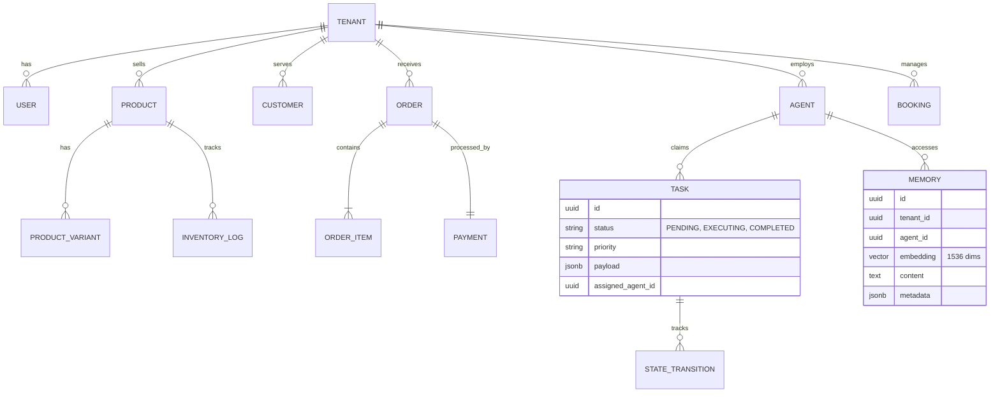

# Architecture Brief: Data Model Evolution

## Title
OHC Data Model: Entity-Relationship & Multi-Tenancy Architecture

## Problem Statement
Small business owners (Maya, Carlos, Priya) require a system that "just works" and keeps their data strictly private. Behind the scenes, the OHC engineering swarm needs a robust, scalable data model that supports high-concurrency agent operations, multi-tenant isolation, and fast mobile-first access patterns. Without a formalized schema evolution strategy, the platform risks data fragmentation and security leaks between tenants.

## Research Report
- **Multi-Tenancy**: OHC utilizes a "Shared Database, Shared Schema" model for cloud-native deployments, hardened by PostgreSQL **Row Level Security (RLS)**. In standalone mode, it uses localized SQLite file isolation.
- **Agentic Memory**: Traditional relational models fail to capture the "thought process" of AI agents. OHC integrates `pgvector` for semantic memory retrieval, allowing "The Advisor" to recall past seasonal trends for Maya's bakery without complex manual joins.
- **Consistency Boundary**: The `organization_id` (Tenant) is the primary partition key. All queries MUST be scoped to this ID to prevent "noisy neighbor" or data leakage issues.

## Design Doc

### Entity-Relationship Diagram (Mermaid.js)

### Key Invariants
1.  **Mandatory Tenant Scoping**: Every table in the OHC ecosystem MUST contain a `tenant_id` (or `organization_id`) column.
2.  **RLS-First Security**: No query shall be executed without an active `SET app.current_tenant = '...'` session variable in PostgreSQL.
3.  **Agent Isolation**: Agents can only "see" and "claim" tasks belonging to their assigned `tenant_id`.
4.  **Immutable Memory**: Long-term memories (AutoDream) are append-only to preserve the historical "learning" of the business.

### Mobile-First Access Patterns
- **The Dashboard Query**: Optimized via `jsonb_build_object` to fetch Organization Info, active Agent status, and daily Order counts in a single round-trip.
- **The 1-Tap Approval**: Uses optimistic UI updates; the backend processes the `TASK` transition and emits a `Teammate Mesh` event for real-time UI feedback.

## Implementation Prompt
**To Implementer Agent:**
Implement the evolved data model as described in the ER diagram. Ensure every new table (Memory, Task, Booking) has a `tenant_id` column and the corresponding PostgreSQL RLS policies. Update the `Repository` layer in the Go/Rust backend to automatically inject the `tenant_id` from the authenticated JWT context into all SQL queries. Implement a `MemoryStore` that utilizes `pgvector` for semantic search, ensuring results are strictly filtered by the requesting tenant's ID. Verify multi-tenancy isolation with an integration test where `Tenant A` attempts to retrieve `Tenant B's` memory embeddings.

## Priority
P0

## Estimated Scope
Large

### Cross-Tenant Data Leakage Prevention
A core requirement for OHC is ensuring zero data leakage between tenants.
- **RLS Policies**: Postgres Row Level Security must be the primary enforcement mechanism.
- The `tenant_id` must be extracted from the authenticated session context (e.g., JWT or SPIFFE ID) and set at the beginning of the transaction.
- Queries should never rely on the application code to explicitly append `WHERE tenant_id = ?` clauses; the database layer itself must enforce this via RLS.

### Support for Hybrid Mode
- The data model must seamlessly transition between Cloud (Postgres) and Standalone (SQLite) modes.
- This requires abstracting complex Postgres-specific features (like specific JSONB operators or pgvector) through application-layer interfaces or falling back gracefully when in SQLite mode.
- Migrations must be written and tested for both database engines.

### Agent Context and Memory Schema
- Agents require a dedicated schema to store their "thoughts," drafts, and historical interactions with users.
- `agent_memories`: Stores conversational history, user preferences, and inferred business rules.
- `agent_actions`: An audit log of every action taken by an agent (e.g., drafting a quote, sending an email), critical for transparency and user trust.
- These tables must be heavily indexed by `tenant_id` and timestamp to ensure fast retrieval during active conversations.

### Event Sourcing and Audit Trails
- For critical operations (payments, inventory adjustments, tier upgrades), the system must utilize an event-sourced model.
- Instead of just updating a row, a corresponding event record must be appended to an append-only log.
- This provides an irrefutable audit trail and allows for complex analytical queries by the AI agents later.

### Schema Evolution Strategy
- Given the rapidly evolving nature of the OHC platform, the schema will change frequently.
- **Additive Changes**: Prefer additive changes (adding columns or tables) over destructive changes (renaming or deleting).
- **Phased Rollouts**: For complex migrations, utilize a multi-phase approach:
    1. Add the new column/table.
    2. Write to both old and new.
    3. Read from new (and backfill).
    4. Remove old column/table.
