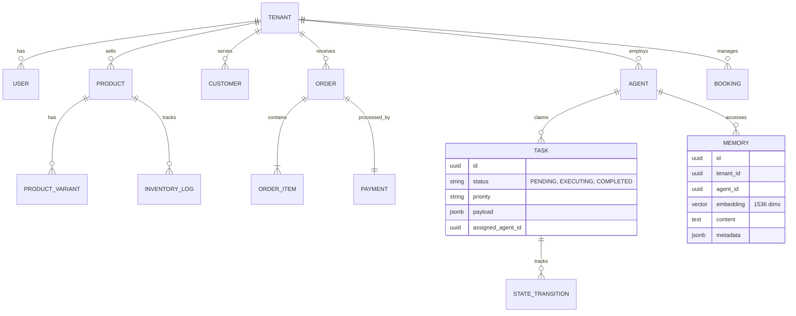

# Title
OHC Data Model: Entity-Relationship & Multi-Tenancy Architecture

## Problem Statement
Small business owners (Maya, Carlos, Priya) require a system that "just works" and keeps their data strictly private. Behind the scenes, the OHC engineering swarm needs a robust, scalable data model that supports high-concurrency agent operations, multi-tenant isolation, and fast mobile-first access patterns. Without a formalized schema evolution strategy, the platform risks data fragmentation and security leaks between tenants.

## Research Report
- **Multi-Tenancy**: OHC utilizes a "Shared Database, Shared Schema" model for cloud-native deployments, hardened by PostgreSQL **Row Level Security (RLS)**. In standalone mode, it uses localized SQLite file isolation.
- **Agentic Memory**: Traditional relational models fail to capture the "thought process" of AI agents. OHC integrates `pgvector` for semantic memory retrieval, allowing "The Advisor" to recall past seasonal trends for Maya's bakery without complex manual joins.
- **Consistency Boundary**: The `organization_id` (Tenant) is the primary partition key. All queries MUST be scoped to this ID to prevent "noisy neighbor" or data leakage issues.
- **Comparison**: Shopify, Wix, Squarespace, and GoDaddy rely on traditional relational tables mapped per-tenant but lack native vector embeddings in their core schema for seamless AI memory retrieval across all tenant objects.

## Design Doc

### Architecture Diagram

### UI Wireframes or Screen Flow Description (375px first)
1. **Dashboard Home**: Displays Organization Info, active Agent status, and daily Order counts, using a single optimized JSONB query.
2. **Data Privacy View**: Settings screen where business owners can review the agent memory logs explicitly scoped to their tenant ID.

### Mobile UX Flow
Optimized data retrieval ensures the app opens instantly. The "1-Tap Approval" uses optimistic UI updates while the background processes the `TASK` transition and emits a `Teammate Mesh` event for real-time synchronization.

### AI Agent Integration Points
- **Semantic Search**: Agents query the `MEMORY` table using `pgvector` to recall past interactions and customer preferences.
- **Task Claiming**: Agents poll the `TASK` table and claim tasks strictly within their assigned `tenant_id`.

### Key Design Decisions and Why
- **Mandatory Tenant Scoping**: Every table MUST contain a `tenant_id`.
- **RLS-First Security**: No query executes without `SET app.current_tenant`, ensuring data privacy.
- **Immutable Memory**: Long-term memories (AutoDream) are append-only to preserve the historical "learning" of the business safely.

## Implementation Prompt
Implement the evolved data model as described in the ER diagram. Ensure every new table (Memory, Task, Booking) has a `tenant_id` column and the corresponding PostgreSQL RLS policies. Update the `Repository` layer in the Go/Rust backend to automatically inject the `tenant_id` from the authenticated JWT context into all SQL queries. Implement a `MemoryStore` that utilizes `pgvector` for semantic search, ensuring results are strictly filtered by the requesting tenant's ID. Verify multi-tenancy isolation with an integration test where `Tenant A` attempts to retrieve `Tenant B's` memory embeddings. Ensure tests cover both UI success states and data scoping limits.

## Priority
P0

## Estimated Scope
Large
