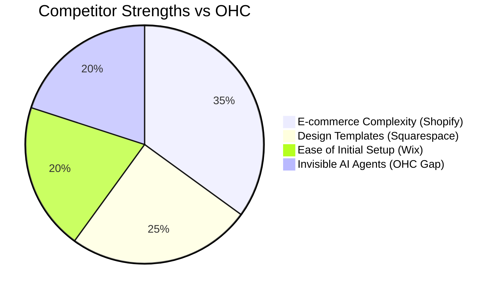
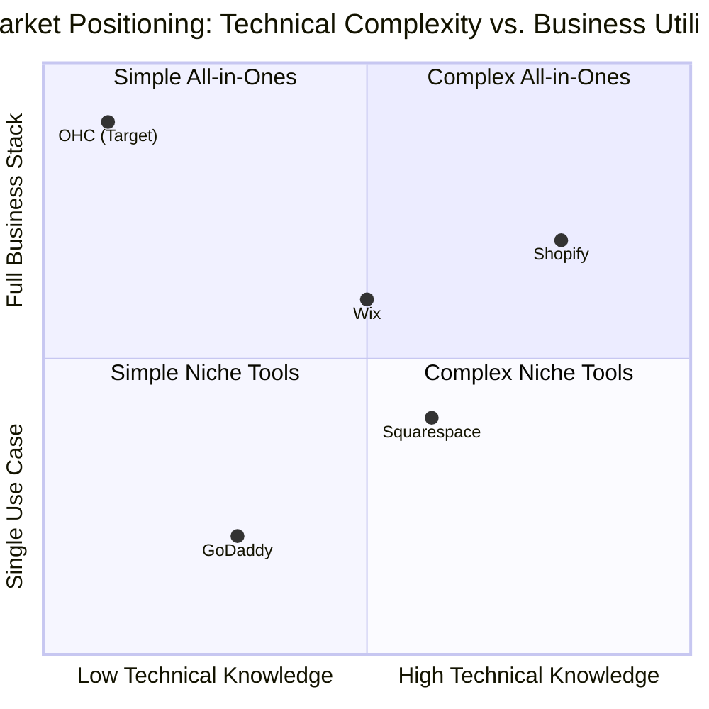

<div markdown="1" style="backdrop-filter: blur(20px) saturate(200%); font-family: Outfit, Inter, sans-serif; border: 1px solid rgba(255, 255, 255, 0.1); padding: 20px; border-radius: 12px; background: rgba(255, 255, 255, 0.05);">

# OHC Small Business App: Competitive Market Analysis & Feature Brief

## 1. Research Report

### 1.1 Competitive Landscape Comparison

| Feature / Platform | OHC (Vision) | Shopify | Wix | Squarespace | GoDaddy |
| :--- | :--- | :--- | :--- | :--- | :--- |
| **Setup Time** | **< 10 min** | 30-60 min | 20-40 min | 30-60 min | 20-40 min |
| **Tech Skill Required**| **Zero** | Low/Medium | Low | Low | Low |
| **AI Agents (Invisible)**| **Yes, built-in** | Chatbot (Sidekick)| Wix AI (One-time)| Limited | Airo (Branding) |
| **Mobile-First Mgt.** | **Yes (Full)** | Partial | Partial | No | No |
| **Business Scope** | **All-in-one** | Store focus | All (Complex)| Portfolio/Store| Basic |
| **Free Tier** | **Yes (Useful)** | No | Yes (Limited) | No | No |
| **Target Persona** | **Non-technical** | Tech-savvy SMB | Semi-technical| Creative Pro | Basic user |

### 1.2 Persona-Specific Pain Points

**Maya (Baker, 28) - The Home Business**
*   **Current State:** Sells via Instagram DMs, manual payment tracking.
*   **Pain Points:** Shopify is too complex for a simple cake catalog. Manually replying to common DMs (e.g., "Do you have vegan options?") takes hours.
*   **OHC Solution:** Simple mobile-first catalog, integrated Stripe deposits, and a Customer Success Agent to handle routine DMs invisibly.

**Carlos (Handyman, 42) - Service & Bookings**
*   **Current State:** Word of mouth, manual quoting via text/phone.
*   **Pain Points:** No automated booking. Missing leads when on a job. Quoting is tedious.
*   **OHC Solution:** Unified service listing with integrated booking/deposits. Sales Agent automatically sends quotes based on customer problem descriptions.

**Priya (Boutique Owner, 35) - Retail (Online + Offline)**
*   **Current State:** Uses separate systems for in-store POS and online sales.
*   **Pain Points:** Inventory doesn't sync properly between store and website. Manual email marketing is easily forgotten.
*   **OHC Solution:** Unified inventory system. Marketing Agent auto-sends new arrival emails based on inventory updates.

### 1.3 Feature Gap Heatmap (Mermaid)





### 1.4 AI Differentiation Manifesto

1.  **Invisible Execution:** AI should act autonomously (within approval boundaries) rather than acting as a chat interface.
2.  **Contextual Memory:** Agents must remember past interactions, customer preferences, and business state across departments.
3.  **Proactive Advisory:** Instead of users seeking analytics, the system pushes plain-language insights and actionable recommendations.
4.  **Mobile-First Approvals:** High-risk AI actions require simple, one-tap approvals on mobile devices.
5.  **Departmental Specialization:** AI is segmented into understandable business roles (Operations, Sales, Marketing, etc.) rather than a generic monolithic assistant.

---

## 2. Issue Brief

**Title:** Implement "Draft-for-Review" AI Action Approval Workflow in KAIROS

**Problem Statement:**
Business owners like Maya and Carlos want AI to handle customer communications and marketing, but they lack trust in fully autonomous systems for high-risk actions (like sending an email or publishing a social post). If the AI makes a mistake, it hurts their brand. They need a simple, mobile-friendly way to review and approve AI-generated actions before they are executed.

**Design Doc:**
*   **Core Concept:** Introduce an intermediate `PendingApproval` state for specific, high-risk KAIROS agent actions.
*   **Architecture Flow:**
    1.  Agent determines an action is required (e.g., Marketing Agent drafts an Instagram post).
    2.  Agent checks the `ActionRisk` level. If high (e.g., external communication), the action is saved to the KAIROS Orchestrator queue with status `PendingReview`.
    3.  A notification event is fired to the Teammate Mesh.
    4.  The mobile app (via WebSocket/Centrifuge) receives the notification and displays a "Pending Agent Action" card.
    5.  The user views the drafted content in a mobile-optimized 375px view.
    6.  The user taps "Approve" (executes KAIROS task) or "Reject/Edit" (sends feedback back to the agent memory).
*   **Data Entities:** Extend the KAIROS task payload to include `ActionRisk` (Enum: Low, High), `ProposedContent` (String/JSON), and `ApprovalStatus` (Enum: Pending, Approved, Rejected).
*   **UI/UX:** A simple, glassmorphism-styled card on the mobile dashboard. "Your Marketing Agent has drafted a new post for review."

**Implementation Prompt:**
Implement the "Draft-for-Review" workflow in the KAIROS orchestrator. Extend the agent task payload to include risk levels and approval states. Create the necessary KAIROS endpoints to allow the mobile client to fetch pending actions, approve them, or reject them. Ensure all pending actions are durably stored in the `ohc:lock` Redis structures and PostgreSQL queues. The implementation should support the Operations and Marketing departments first. Ensure high-fidelity Prometheus metrics track the approval/rejection rates of agent actions.

```yaml
issue_id: "OHC-RES-001"
title: "Implement Draft-for-Review AI Action Approval Workflow in KAIROS"
Priority: "P1"
Estimated Scope: "Medium"
```

</div>
