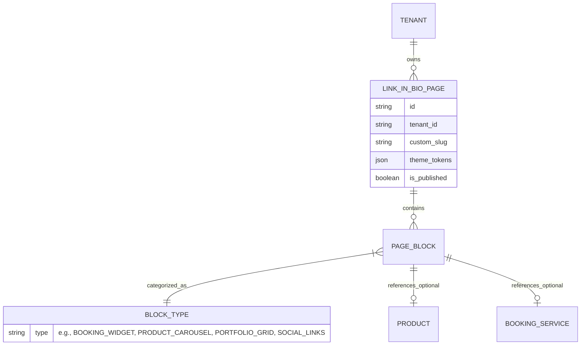
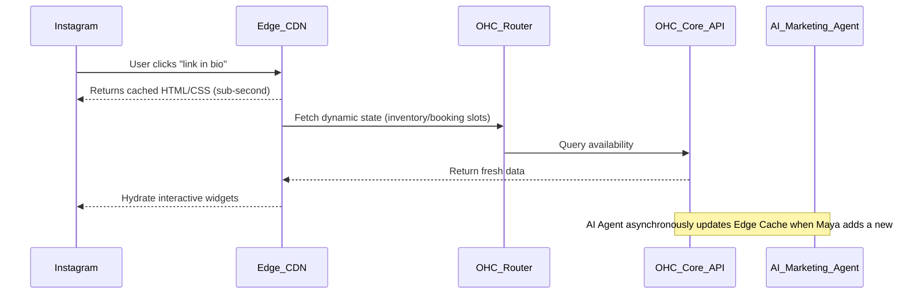

# [architecture] Dynamic Link-in-Bio and Portfolio Engine

## Title
Build a Dynamic Link-in-Bio and Portfolio Engine for Social-First Solopreneurs

## Problem Statement
For users like **Leo (music tutor, 22)** and **Maya (baker, 28)**, the primary acquisition channel is social media (TikTok, Instagram). Their "storefront" is often just a single link in their bio. Currently, they patch together fragmented solutions: Linktree for routing, a separate site for portfolios/galleries, Acuity for bookings, and Shopify/DMs for physical sales.

This fragmentation introduces significant friction:
1. **Brand inconsistency:** Bouncing between different branded tools decreases trust.
2. **Lost context:** Customers lose intent when jumping from a Linktree to a secondary site to book or buy.
3. **Analytics fragmentation:** Maya doesn't know if an Instagram click led to a cake order because the funnel breaks across three tools.
4. **Maintenance overhead:** Updating a Linktree, a portfolio, and a booking calendar separately is exhausting and prone to being outdated.

OneHumanCorp (OHC) needs a natively integrated, high-performance "Link-in-Bio" and Portfolio Engine that serves as a single, mobile-optimized entry point. It must seamlessly embed the OHC commerce, booking, and communication capabilities directly into a social-first landing page.

## Research Report
*   **Competitor Analysis:**
    *   **Linktree / Linkin.bio:** Dominates the space but offers shallow integration. They route traffic but don't natively own the transaction, booking, or inventory.
    *   **Stan Store / Beacons:** Better at capturing transactions directly in the link-in-bio, but lack robust physical product inventory management, complex booking capabilities, or omnichannel unified inbox features.
    *   **Shopify / Wix:** Too heavy to serve *only* as a link-in-bio. Their mobile responsiveness is often desktop-shrunk-down, rather than true mobile-first.
*   **The Opportunity:** OHC can provide a Zero-Config Link-in-Bio that acts as a micro-storefront. It automatically pulls the most relevant items (newest portfolio items, next available booking slots, trending products) and displays them instantly. Because OHC owns the entire backend (inventory, ledger, inbox), the conversion happens *on* the link-in-bio page without redirects.
*   **Performance Requirement:** The page must load in under 1 second on a 3G mobile connection to prevent drop-off from social platforms. This requires Edge caching.

## Design Doc

### Architecture Diagram

### UI Wireframes & Screen Flow (375px Mobile-First)

**The Social Micro-Storefront (Customer View)**
- **Header:** Full-bleed header image, rounded avatar overlapping the bottom edge, Tenant Name, and a 1-sentence bio.
- **Block 1 (Actionable):** "Book a Lesson" (Leo) or "Order a Custom Cake" (Maya) - highly visible primary CTA button. Tapping expands a native bottom sheet with date/time selection or a quick intake form, avoiding a full page navigation.
- **Block 2 (Carousel):** "Recent Work" / "Bestsellers" - horizontal scrolling cards. Each card shows an image, title, and price. Tapping a card opens a modal to Add to Cart / Buy Now with 1-click checkout (Apple Pay/Google Pay).
- **Block 3 (Social Links):** Minimalist icon row linking to TikTok, YouTube, etc.
- **Design System:** Translucent glassmorphism cards layered over a gradient or image background. No sharp corners; use OHC's standard 16px corner radii.

### Mobile UX Flow (Owner/Manager View)
1.  **Entry:** Owner opens OHC app, taps "My Page".
2.  **Edit:** Sees a live preview of the page. No complex "editor". Instead, there is a simple "Add Block" floating action button.
3.  **AI Generation:** Owner taps "Add Block" -> "Portfolio". The AI asks, "Show recent Instagram posts or upload new photos?" Owner selects "Instagram". The AI auto-generates the gallery block.
4.  **Publishing:** Changes are instantly pushed to the Edge CDN. No manual "Save and Publish" required.

### AI Agent Integration Points
*   **The Curator Agent:** Analyzes the tenant's inventory, booking popularity, and social media engagement to automatically suggest re-ordering blocks (e.g., "Your 'Vegan Chocolate Cake' is trending on TikTok. I moved it to the top of your bio page.").
*   **The Styling Agent:** When a user uploads a new avatar or logo, the agent automatically extracts the dominant colors and suggests a cohesive theme (glassmorphism over a complementary gradient background) ensuring it passes the "grandmother test" for design.

### Key Design Decisions
1.  **No Redirects:** All transactions (booking, buying, messaging) must occur within interactive widgets on the link-in-bio page via bottom sheets or modals. This prevents context loss and increases conversion.
2.  **Edge Caching is Mandatory:** Social media platforms penalize slow-loading links. The page structure must be edge-cached, hydrating dynamic inventory/availability data asynchronously.
3.  **Block-Based, Not Pixel-Perfect:** The owner cannot drag and drop elements anywhere. They can only reorder pre-designed, highly optimized "Blocks". This removes design cognitive load and guarantees mobile parity.

## Implementation Prompt
Implement the Dynamic Link-in-Bio engine. Create the underlying data models to support `LinkInBioPage` and `PageBlock` entities, enforcing strict tenant isolation. Develop the Edge-cached serving layer to ensure sub-second initial load times. Create the Owner UX for mobile (375px viewport) allowing them to enable the page, select a theme, and manage blocks (Bookings, Products, Portfolio, Links). Ensure the customer-facing view uses OHC design tokens (glassmorphism, smooth animations) and that all checkout/booking flows execute in-page without redirects.

## Priority
P1

## Estimated Scope
Medium
