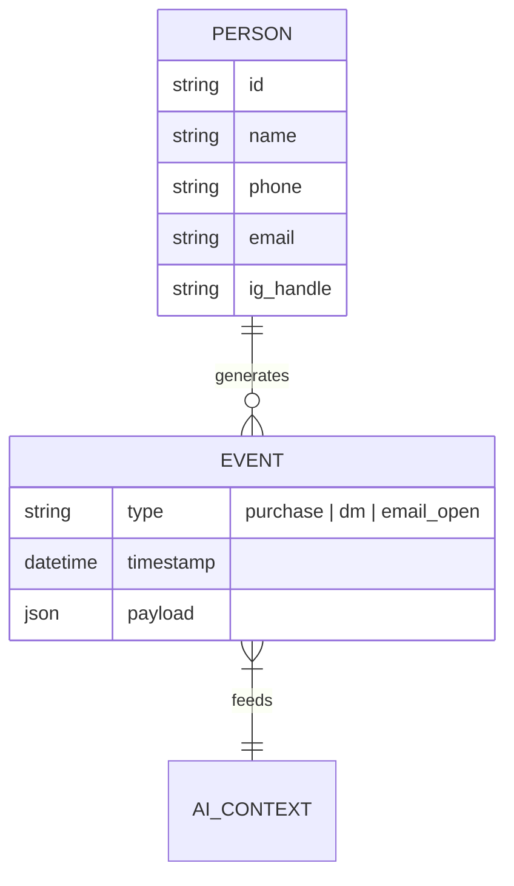

# [architecture]_ecommerce_data_model_anti_patterns.md

## Introduction
A major reason legacy platforms (Shopify, Magento, WooCommerce) become too complex for SMBs is their underlying data model. They are built for enterprise retailers with complex supply chains, multi-warehouse logistics, and thousands of SKUs. When a small business owner tries to sell a simple service or a handmade product, they are forced to interact with this enterprise data model.

This document outlines the data model anti-patterns OHC must avoid to maintain simplicity.

## Anti-Pattern 1: The SKU Obsession
### The Problem
Legacy systems require a Stock Keeping Unit (SKU) for everything. If Maya bakes a custom cake, Shopify expects a SKU. If Carlos fixes a pipe, he has to create a "Service Product" and give it a dummy SKU.
### The OHC Solution
Make SKUs entirely optional. The primary identifier should be a human-readable name or the AI-generated visual hash of the product image. The system should default to tracking inventory by simple counts (or infinite for services), hiding the concept of SKUs entirely unless the user explicitly switches to "Advanced Mode" for warehouse syncing.

## Anti-Pattern 2: Complex Variant Matrices
### The Problem
If Priya sells a t-shirt in 3 sizes and 3 colors, legacy systems create a 3x3 matrix of 9 distinct variants, each requiring its own inventory count, SKU, and potentially different pricing. If she adds a new color, the matrix explodes.
### The OHC Solution
Implement "Smart Modifiers" instead of strict variants. A modifier (e.g., "Size: Large") can adjust the base price or simply be a note attached to the order. Inventory can be tracked at the base product level if the user prefers, or at the modifier level. The UI should hide the matrix and ask plain-language questions: "Do you have different amounts of each size?"

## Anti-Pattern 3: Global Tax and Shipping Jurisdictions
### The Problem
Setting up taxes and shipping is the #1 drop-off point in Shopify onboarding. The system forces the user to define global shipping zones and complex tax rules before they can accept a single payment.
### The OHC Solution
Assume local/domestic first. The system should use the user's GPS/IP location to auto-configure standard domestic flat-rate shipping and default local tax rates based on standard API integrations (like Stripe Tax). Global shipping should be disabled by default and require an explicit opt-in.

## Anti-Pattern 4: The Fragmented Customer Record
### The Problem
In Wix and Shopify, a customer who buys a product is treated differently than a customer who subscribes to a newsletter, who is treated differently than a customer who sends an Instagram DM. The data is fragmented across the "Orders", "Marketing", and "Inbox" tables.
### The OHC Solution
The Unified Entity Model. A "Person" is the core entity. Every interaction (a purchase, an email sent, an abandoned cart, an Instagram DM) is simply an event appended to the Person's timeline. This enables the AI to have complete context when drafting auto-replies.

