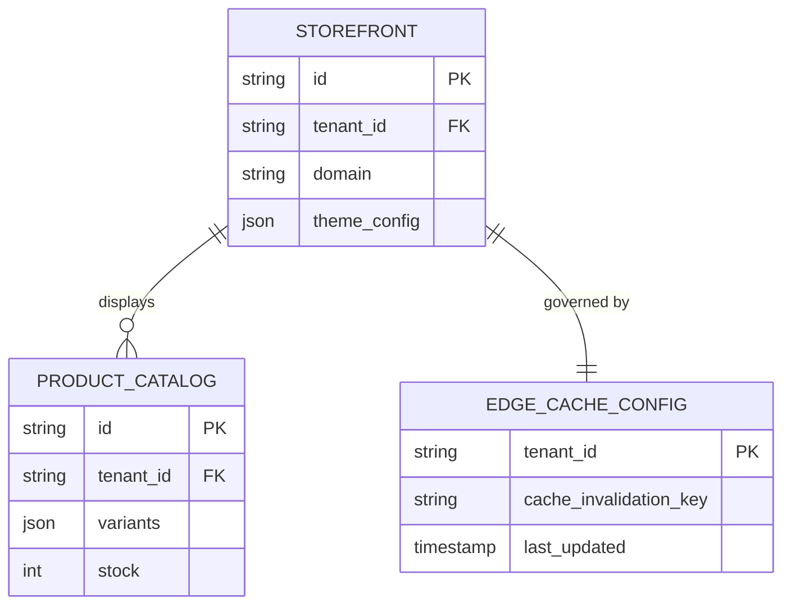
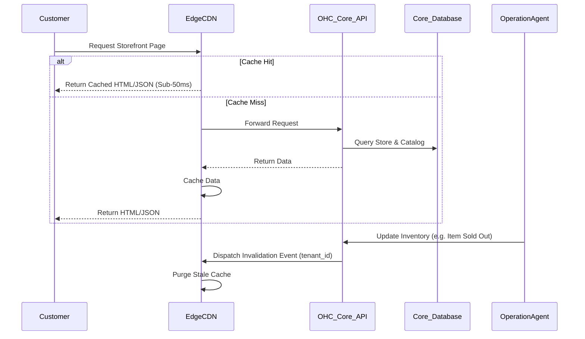

# Edge-Caching Dynamic Storefront Architecture

## Problem Statement

Small business owners like Maya (baker) and Fatima (food cart) rely on fast, robust mobile storefronts to capture sales, especially from mobile social media links (like Instagram or TikTok in-bio). A slow-loading storefront directly translates to lost sales and customer frustration. Currently, our storefronts fetch data dynamically from a centralized database for every request, which introduces unacceptable latency, especially for customers on poor mobile networks or geographically distant from our main servers. For users like Fatima running a busy food cart, the pre-order page must load instantly, even on older 3G/LTE connections.

## Research Report

Industry leaders invest heavily in edge delivery and intelligent caching:

- **Shopify**: Utilizes a globally distributed edge network with smart caching of product catalogs and storefront pages. They achieve sub-50ms Time To First Byte (TTFB) globally.
- **Wix & Squarespace**: Both aggressively use CDNs for static assets, but Wix's Velo also supports edge-based execution for faster dynamic data rendering.
- **Vercel / Cloudflare**: State-of-the-art modern e-commerce architectures push the entire storefront rendering logic and heavily read product data to the edge (e.g., using Edge Workers and KV/Durable Objects).

**Our Gap**: OneHumanCorp is currently lacking a dedicated edge-caching layer for multi-tenant dynamic storefronts. Every view hits the core orchestration database, resulting in slow page loads and wasted compute resources.

## Design Doc

### Architecture Diagram

### UI Wireframes (375px First) & Mobile UX Flow

1. **Storefront Landing (Customer View, 375px)**
   - Top Nav: Clean, translucent glass header with cart icon (top right).
   - Hero Section: Large high-res image (lazy loaded, but edge cached) with business title and primary CTA ("Order Now").
   - Product Grid: 2-column card layout displaying products. Prices and availability are cached.
   - Action: Tapping a product card feels instantaneous (pre-fetched or edge-cached).
2. **Advanced Settings (Owner View, 375px)**
   - Hidden stickily behind an "Advanced Settings" switch in the owner dashboard.
   - Toggle: "Global Speed Boost" (Hides terms like Edge Caching or CDNs).
   - "When you update a product, your store updates instantly worldwide."

### AI Agent Integration Points

- **Operations Agent**: Automatically invalidates specific tenant cache partitions when inventory reaches zero, a new product is added, or a price changes.
- **Marketing Agent**: Analyzes edge analytics (page load speeds, bounce rates based on location) to suggest optimizations to the owner (e.g., "Your images are too large, let me compress them for faster loading").

### Key Design Decisions

- **Stale-While-Revalidate (SWR)**: The edge network will serve stale content to the user while fetching the latest data in the background, guaranteeing instant page loads at the expense of momentary eventual consistency.
- **Tenant-Isolated Cache Keys**: All cached data must be strictly partitioned by `tenant_id` to guarantee zero-trust multi-tenant isolation and prevent data leakage.
- **Abstracted Complexity**: The business owner never configures cache TTLs or CDN rules. The platform manages all invalidations invisibly.

## Implementation Prompt

Implement the Edge-Caching Dynamic Storefront infrastructure. Provide an edge proxy service or Cloudflare/Vercel integration that caches storefront HTML and API responses based on `tenant_id`. Create the cache invalidation webhooks or gRPC endpoints that our internal Operations Agents can call to purge specific tenant caches when data changes. Ensure the implementation guarantees Zero-Trust multi-tenant isolation and achieves sub-100ms global response times for cached pages.

## Priority

P0

## Estimated Scope

Large
