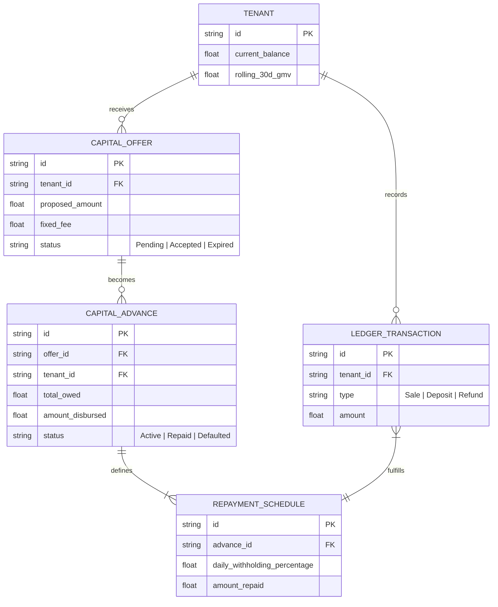
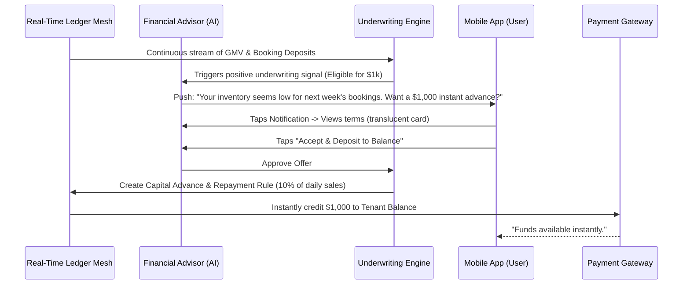

# Title: Embedded AI Capital and Micro-Lending Engine

## Problem Statement
Small business owners, especially those with fluctuating seasonal demand (like Priya the boutique owner) or emerging entrepreneurs (like Maya the baker), frequently face cash flow crunches. Traditional small business loans require massive paperwork, manual ledger audits, and weeks of waiting. Even existing platforms (Shopify Capital, Square Capital) are disjointed from the day-to-day operations and rely on static dashboards. Our personas need instant, contextual, and invisible micro-capital injections (e.g., to cover this week's bulk inventory purchase) driven by real-time platform data, completely embedded in their mobile workflow.

## Research Report
*   **Current Capabilities:** OHC has transaction ledgers and invoicing but currently relies on external banks or merchant cash advances for capital.
*   **Competitor Analysis:**
    *   *Shopify Capital:* Very successful, uses GMV data to offer cash advances, but lacks deep conversational AI integration for situational capital.
    *   *Square Loans:* Highly integrated with POS data, but rigid in terms of repayment (fixed percentage of daily sales) and lacks predictive insight.
    *   *Stripe Capital:* Strong API, but B2B focused rather than a direct, conversational merchant experience.
*   **Gap Identified:** A conversational, AI-driven embedded capital engine that proactively identifies working capital needs (e.g., "I see you have 3 large custom cake orders but need $500 for ingredients now") and offers instant micro-loans backed by pending OHC transactions or future booking deposits, all approved via a 1-tap mobile notification.
*   **Strategic Advantage:** By integrating the "Financial Advisor" AI department with real-time capacity and transaction ledgers, OHC can instantly underwrite risk and provide capital dynamically, entirely bypassing traditional banking friction and increasing platform lock-in.

## Design Doc

### Architecture Diagram

### Mobile UX Flow (375px First)
1.  **Proactive Insight:** The Financial Advisor AI agent detects a cash flow opportunity (e.g., based on upcoming confirmed bookings without inventory purchases). A non-intrusive notification appears in the daily briefing: "Unlock $1,500 working capital."
2.  **The Offer Card:** Tapping the notification reveals a translucent glass-styled half-sheet modal. It shows the proposed amount ($1,500), the flat fee ($150), and the repayment mechanism ("We'll automatically deduct 10% of your daily sales until $1,650 is repaid").
3.  **1-Tap Acceptance:** A single, prominent action button: "Swipe to Accept." No paperwork, no credit checks.
4.  **Instant Gratification:** A subtle confetti animation plays, and the available platform balance instantly reflects the injected capital, ready to be spent via the OHC corporate card or transferred.
5.  **Invisible Repayment:** Future incoming sales trigger a background ledger split where 10% is routed to the repayment ledger automatically, with a subtle progress bar visible only in the "Finances" tab.

### AI Agent Integration Points
*   **The Financial Advisor:** Proactively analyzes ledger velocity, upcoming bookings, and historical inventory costs to time capital offers perfectly. It translates complex underwriting into plain-language suggestions.
*   **The Risk Engine:** A background process (non-conversational) that maintains continuous underwriting models based on tenant platform activity to define maximum risk exposure dynamically.

### Performance & Security Integrity
*   **Zero-Trust Isolation:** Capital Advance Ledgers and Repayment Schedules are strictly partitioned by `tenant_id` at the database level to prevent accidental cross-tenant data exposure.
*   **Atomic Transactions:** The ledger split mechanism during repayment must utilize atomic database transactions to ensure that the exact withholding percentage is applied to the incoming sale before any funds are made available to the tenant's spending balance.
*   **Mobile-First Resilience:** The offer viewing and acceptance flow must load instantly, leveraging cached underwriting limits. If the user accepts while on a spotty connection, the intent is queued securely and processed immediately upon reconnection.

## Implementation Prompt
Implement the Embedded AI Capital and Micro-Lending Engine.
The system must establish the underlying data models (`CAPITAL_OFFER`, `CAPITAL_ADVANCE`, `REPAYMENT_SCHEDULE`) to support micro-loans based on platform GMV. Build the background ledger routing logic that securely and automatically deducts a defined percentage of incoming daily sales to service the active advance.
Ensure the UX follows the macOS-style Translucent Glass materials, presenting the capital offer via the Financial Advisor AI agent in plain language, passing the "grandmother test". All underwriting complexity must be completely abstracted from the user. Acceptance criteria include: successful generation of an automated offer, atomic 1-tap acceptance crediting the merchant's balance, and successful invisible percentage-based repayment routing on subsequent sales.

## Priority
P1

## Estimated Scope
Large
