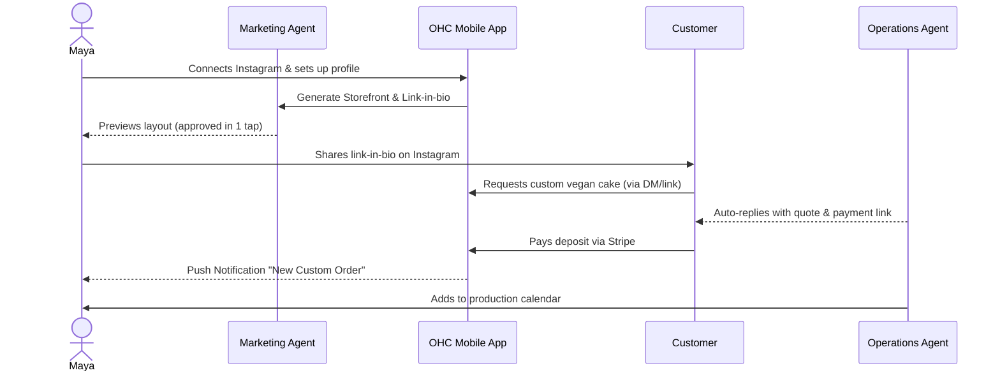
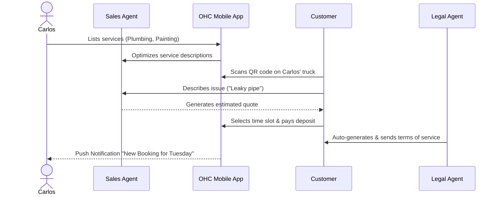
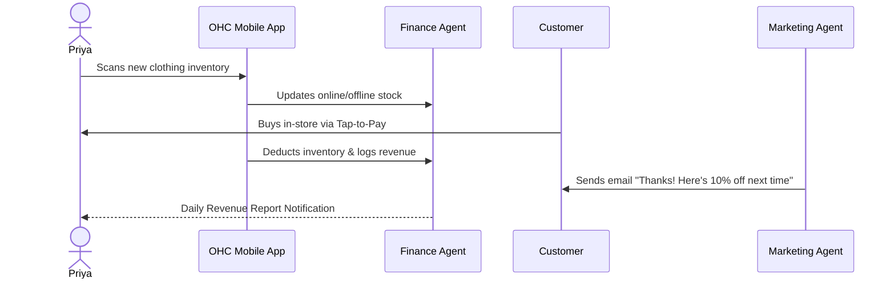
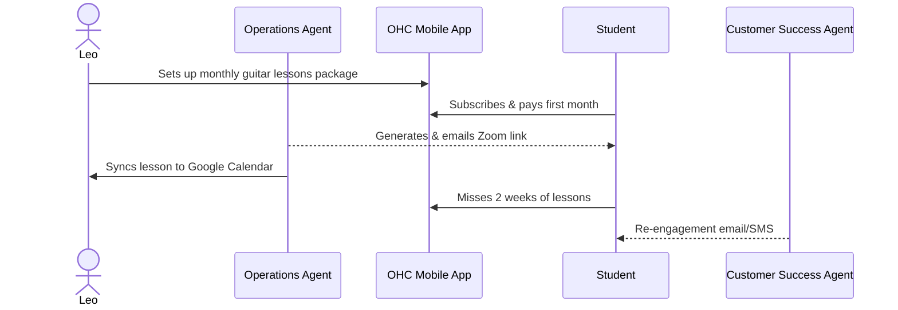
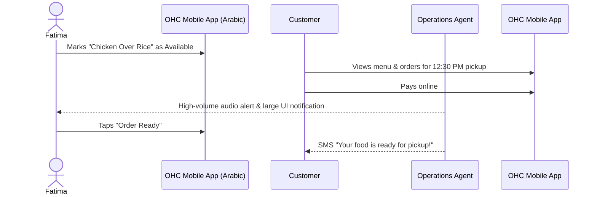
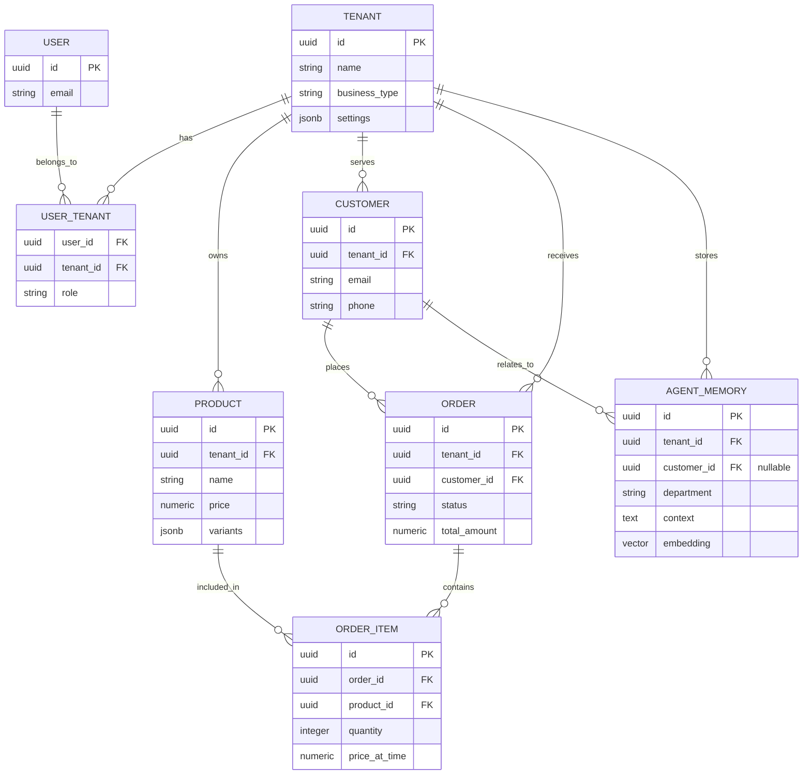

# OHC Architecture Research Report

## 1. Business Journey Architecture

### End-to-End User Journeys Across All Personas

**Problem Statement**
Small business owners—from bakers to freelance handymen to boutique owners—often lack the technical expertise to set up and grow an online presence. Existing tools like Shopify or Wix can be overwhelmingly complex. The OneHumanCorp (OHC) platform aims to bridge this gap, enabling a non-technical user to go from an idea to a fully operational, live business in under 10 minutes. Without mapped, persona-driven business journeys, we risk building fragmented, confusing experiences that lead to user drop-off and frustration. We must define the end-to-end journeys across all key phases—Acquisition, Onboarding, Activation, Retention, Revenue, and Referral—to ensure a seamless, mobile-first experience.

**Research Report**
- **Shopify / Wix / Squarespace / GoDaddy**: These platforms typically require 30–60 minutes of setup, assuming the user has high to moderate technical competence. They often focus heavily on the desktop experience for building the site.
- **OHC's Edge**: True mobile-first management. Setup in under 10 minutes from a phone (375px display) without ever writing code or manually tuning complex layouts. Invisible AI acts as the builder and manager.

**Persona Analysis & Friction Points**
- **Maya (The Baker)**: Heavy reliance on Instagram. Friction: Translating IG DMs into actual tracked orders. Needs a direct link-in-bio storefront and automated DM follow-ups.
- **Carlos (The Handyman)**: Entirely word-of-mouth. Friction: Capturing offline interest and translating it to a scheduled, paid booking. Needs simple offline-to-online bridges (e.g., QR codes) and an automated quoting agent.
- **Priya (The Boutique Owner)**: Omnichannel. Friction: Inventory mismatch between in-store and online. Needs seamless tap-to-pay and synchronized digital inventory.
- **Leo (The Music Tutor)**: Service & Subscription based. Friction: Manual scheduling and zoom link generation. Needs auto-sync with Google Calendar and subscription management.
- **Fatima (The Food Cart Operator)**: High-speed, offline, limited English. Friction: Complex menus and POS flows. Needs multi-language, high-contrast, pre-order toggles for quick pre-orders.

**Design Doc**

#### Architecture Diagrams (Mermaid.js)

**1. Maya (The Baker) - Custom Product Journey**

**2. Carlos (The Handyman) - Service Booking Journey**

**3. Priya (The Boutique Owner) - Omnichannel Retail Journey**

**4. Leo (The Music Tutor) - Subscription Journey**

**5. Fatima (The Food Cart Operator) - Quick Pre-Order Journey**

**UI Wireframes & Screen Flow (375px First)**
1. **Acquisition / Landing Page**: Minimal "Enter your business name" prompt with one clear CTA.
2. **Onboarding (The 10-Minute Setup)**: Chat-like interface where the Business Advisory Agent asks 3-4 conversational questions (e.g., "What do you sell?", "How do you want to get paid?"). The UI builds the storefront dynamically in the background.
3. **Dashboard (Activation & Retention)**:
   - **Top**: "Today's Revenue" (large font) & "Pending Orders" (actionable buttons).
   - **Middle**: "Agent Insights" feed (e.g., "The Promoter agent drafted an Instagram post for your new cakes. [Review & Post]").
   - **Bottom**: Fixed tab bar (Home, Orders/Bookings, Customers, Settings).
4. **Referral Flow**: A simple "Share OHC & get 1 month free" button in the Settings menu, pre-generating a personalized SMS message.

**Mobile UX Flow**
- **Input**: Use native mobile keyboards (numeric for pricing, email for customer data).
- **Offline Mode**: The dashboard caches today's orders and revenue. Edits made offline (like toggling an item "Sold Out") are queued and synced when the network returns.
- **Accessibility**: High contrast mode, large touch targets (44x44px minimum), and multi-language support (e.g., Arabic RTL layout for Fatima).

**Key Design Decisions**
- **Invisible Complexity**: Users never see "database", "DNS", or "API". The onboarding feels like a friendly text message conversation.
- **Action-Oriented Dashboard**: The main screen isn't a static menu; it's a dynamic feed of what needs attention right now (Orders to fulfill, Agent actions to approve).
- **Persona-Driven Defaults**: Based on onboarding answers, the UI automatically hides irrelevant features (e.g., Maya doesn't see "Tap-to-Pay" settings by default, Carlos doesn't see "Shipping Zones").

## 2. Data Model Architecture

### Entities, Relationships, and Multi-Tenancy Guarantees

**Problem Statement**
As OneHumanCorp scales to support diverse business types—from bakers and freelance handymen to boutique owners—the underlying data model must remain robust, scalable, and strictly isolated per tenant. A non-technical small business owner relies on the system to keep their customer data, orders, and AI agent memories perfectly secure and separate from others. We must define clear entity relationships, access patterns, and invariants that guarantee row-level multi-tenancy without adding complexity to the business owner's experience.

**Research Report**
- **Goal**: Review and evolve the OHC data model to ensure complete tenant isolation and optimized access patterns for both the mobile-first UI and the background AI agents.
- **Context**: The backend uses PostgreSQL with Row-Level Security (RLS). Every query must implicitly respect the `tenant_id` context.

**Key Entities**
1.  **Tenant (Business)**: The core isolation boundary.
2.  **User (Owner/Staff)**: Associates real people with one or more Tenants.
3.  **Product/Service**: What the business sells. Needs to handle variants, pricing, and availability.
4.  **Order/Booking**: The transaction record. Must link to Customer, Product/Service, and Payment.
5.  **Customer**: The end-user buying from the Tenant.
6.  **Agent Memory**: Context and history for AI interactions, scoped per Tenant and sometimes per Customer.
7.  **File/Asset**: Images, documents, etc.

**Design Doc**

**Architecture Diagram (Mermaid.js)**

**Invariants & Multi-Tenancy Guarantees**
-   **Strict RLS**: Every table (except global configuration) MUST have a `tenant_id` column. PostgreSQL Row-Level Security policies MUST ensure that queries can only read/write rows where `tenant_id = current_setting('app.current_tenant')`.
-   **Agent Isolation**: AI agents retrieve context (`AGENT_MEMORY`) strictly filtered by `tenant_id`. An agent operating for Tenant A cannot access embeddings or memory from Tenant B.
-   **No Cross-Tenant Joins**: Application logic should never need to join data across different tenants.

**Access Patterns**
-   **Mobile App (Owner View)**: `SELECT * FROM orders WHERE status = 'pending' ORDER BY created_at DESC LIMIT 50`. (Implicitly scoped to the owner's `tenant_id` via RLS).
-   **Customer Success Agent**: `SELECT context FROM agent_memory WHERE customer_id = $1 ORDER BY created_at DESC LIMIT 10`. (Implicitly scoped).
-   **Analytics (Finance Agent)**: `SELECT date_trunc('day', created_at), sum(total_amount) FROM orders WHERE created_at > now() - interval '30 days' GROUP BY 1`.

## 3. Website & Storefront Builder Architecture

### Zero-Code AI Driven Design

**Problem Statement**
Traditional website builders like Squarespace or Wix offer too much flexibility for non-technical users, leading to decision paralysis, broken layouts on mobile, and hours wasted tweaking padding. Our users (Maya, Carlos, Leo) need a professional, high-converting storefront in minutes, not days. The OHC platform must provide a builder where AI handles the design, layout, and mobile responsiveness automatically, while allowing the user simple, guardrailed customization.

**Research Report**
- **Competitors**: Shopify's theme editor is robust but technical. Wix's AI is often a starting point that requires heavy manual adjustment.
- **OHC's Edge**: The "Marketing & Advertising Agent" acts as the designer. The user provides intent (e.g., "Make it look elegant and focus on custom cakes"), and the agent selects the right layout blocks, applies the premium design tokens, and generates the copy.

**Design Doc**

**Architecture Highlights**
1.  **Block-Based System**: The UI is composed of rigid, pre-tested blocks (e.g., `HeroBlock`, `ProductGridBlock`, `TestimonialBlock`, `ServiceListBlock`). Users cannot break the internal layout of a block; they can only reorder blocks or change the data within them.
2.  **AI Designer**: The Marketing Agent analyzes the business type (from Onboarding) and automatically generates an initial sequence of blocks, populated with AI-generated copy and stock imagery (or the user's uploaded images).
3.  **Global Theming (Design Tokens)**: Instead of tweaking individual colors, users select a "Vibe" (e.g., "Playful", "Minimal", "Premium"). This applies a cohesive set of CSS design tokens (Glassmorphism, specific font pairings like Outfit/Inter, color palettes) globally.
4.  **Publishing Pipeline**: When a user hits "Publish", the JSON representation of the blocks is compiled into static, highly optimized HTML/CSS (or a highly cached SSR representation) and pushed to the CDN.

**UI Wireframes & Screen Flow (Mobile-First)**
- **Edit Mode**: The user sees their live site on their phone screen. Tapping a section (e.g., the Hero) opens a bottom sheet.
- **Bottom Sheet Controls**: Instead of margin/padding sliders, the controls are intent-based:
  - "Change Image"
  - "Rewrite Text (AI)"
  - "Change Vibe (Color/Font)"
- **Block Reordering**: Simple drag handles on the side of sections to move them up or down.

**Mobile UX Constraints**
- The builder itself must be fully usable on a 375px screen.
- Previews are inherently 1:1 with the final mobile product.

## 4. Mobile-First Architecture Review

### Validating the 375px Constraint and Offline Capabilities

**Problem Statement**
A core promise of the OHC platform is that a business owner can run their entire operation from a smartphone. Many platforms claim to be mobile-friendly, but core management tasks (like setting up variants, viewing complex analytics, or editing website layouts) inevitably force the user to a desktop. We must ensure our architecture and UI designs strictly adhere to the mobile-first mandate, specifically targeting a 375px viewport (e.g., standard iPhone) as the primary management interface.

**Research Report**
- **Context**: Business owners like Maya (Baker) or Fatima (Food Cart) rely entirely on their phones, often in environments with spotty network connectivity (kitchens, street corners).

**Design Doc**

**Key Constraints & Architecture Mandates**
1.  **The 375px Rule**: Every single management screen (Dashboard, Product Creation, Order Fulfillment, Builder) must be fully functional without horizontal scrolling on a 375px wide screen. Desktop views are additive (e.g., showing more columns in a table), but the mobile view must contain 100% of the functionality.
2.  **Offline-Capable Dashboard (Read/Queue)**:
    - The mobile app must aggressively cache the current day's critical data (Pending Orders, Today's Appointments, Inventory Levels).
    - If Fatima loses signal, she must still be able to read her active orders.
    - If she marks an order as "Ready", the action is placed in a local queue and synced automatically when the connection is restored. The UI must optimistically update to show the action was successful.
3.  **Input Optimization**:
    - Avoid complex multi-select dropdowns or nested menus. Use full-screen bottom sheets for complex selections.
    - Enforce native keyboard types (e.g., `keyboardType: TextInputType.number` in Flutter for prices).
4.  **Performance Targets**:
    - Initial app load time < 2 seconds on a mid-range Android device.
    - All images uploaded by users are automatically compressed to WebP and served via a CDN resized to the exact viewport dimensions.

**UI Validation Checklist (for Implementers)**
- [ ] Are touch targets at least 44x44px?
- [ ] Is contrast sufficient for outdoor use?
- [ ] Does the UI rely on hover states? (If yes, redesign).
- [ ] Can the most critical daily task be completed with one hand?
