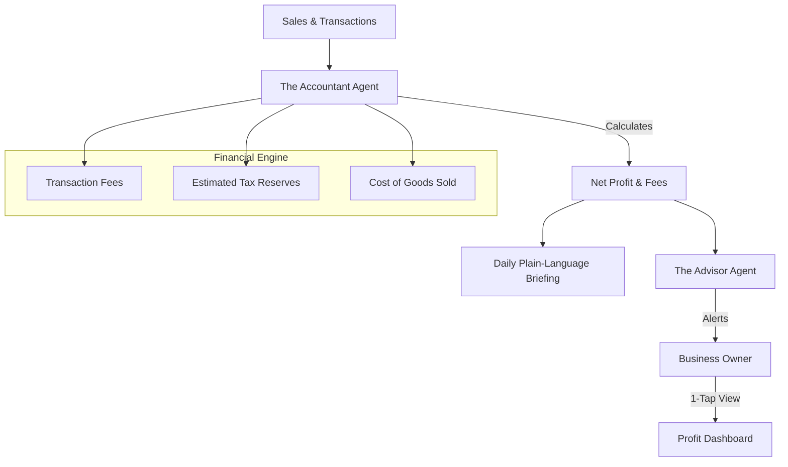

# Architecture Brief: Finance & Payments ("The Accountant")

## Title
OHC "Zero-Accounting": Profit-First Financial Architecture

## Problem Statement
Small business owners (Maya, Carlos, Leo) often struggle to understand their actual "take-home" profit. They see revenue coming in from Stripe but are blind to transaction fees, COGS (Cost of Goods Sold), and taxes until they export a spreadsheet at the end of the year. OHC must provide "Zero-Accounting"—real-time financial clarity where the business owner knows exactly how much they earned today, in plain language.

## Research Report
- **Market State**: Most accounting software (QuickBooks, Xero) is designed for accountants, not business owners. They require manual categorization and complex ledger management.
- **The Gap**: No e-commerce platform provides a native "Profit-First" view that automatically deducts fees and estimated taxes to show a "safe to spend" balance.
- **Strategy**: The Accountant agent acts as a proactive financial controller, reconciling every transaction and translating raw data into human-language insights.

## Design Doc

### "Zero-Accounting" & "Profit-First" Strategy
1.  **Automated Reconciliation**: Every sale from the storefront or POS is automatically reconciled against Stripe/Payment provider fees.
2.  **Safe-to-Spend Insight**: Instead of just showing "Gross Revenue," the dashboard highlights "Net Profit" (Revenue - Fees - Estimated Tax - COGS).
3.  **Human-Language Reporting**: Replaces balance sheets with daily/weekly sentences: *"You made $200 today. After fees and saving for tax, your profit is $160."*
4.  **Handoff to Advisor**: When margins drop below a certain threshold (e.g., due to rising shipping costs), The Accountant triggers The Advisor to suggest a price adjustment.

### High-Level Architecture (Mermaid.js)

### Key Design Decisions
- **COGS Tracking**: During product setup, The Accountant prompts for a "Cost to Make/Buy" to ensure accurate profit tracking.
- **Tax Reserve Logic**: Automatically estimates a 20-30% tax reserve (configurable by region) to prevent end-of-year surprises.
- **Micro-Auditing**: The Accountant flags any unusual fees or refund spikes immediately.

### Mobile UX Flow
- **The "Profit Card"**: A prominent dashboard card showing: "Profit Today: $XX.XX" (Net of all fees).
- **1-Tap Tax Setup**: A simple wizard: "Where do you pay taxes? [Select Region]". The Accountant handles the rest.

## Implementation Prompt
**To Implementer Agent:**
Implement the "Zero-Accounting" engine for The Accountant department. Create a financial reconciliation system that processes payment and order events to calculate Net Profit by deducting transaction fees and estimated tax reserves. The system must provide a plain-language summary of daily, weekly, and monthly financial performance ("Net Profit"). The product entity should be updated to track basic cost data to enable accurate profit calculation. The Accountant must be able to trigger alerts for the Business Advisor when profit margins drop below business-critical thresholds.

## Priority
P1

## Estimated Scope
Medium
