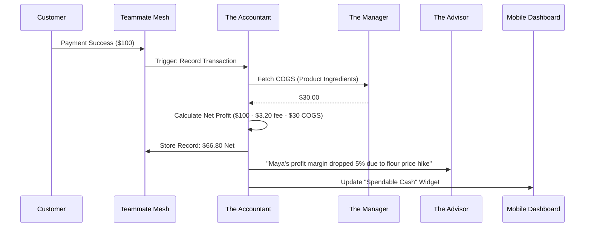

# Architecture Brief: Finance & Payments ("The Accountant")

## Title
OHC "The Accountant": Autonomous Finance & Profit-First Reporting Architecture

## Problem Statement
Small business owners (Maya, Carlos, Leo) suffer from "Financial Fog" (#9 pain point). They see revenue hitting their bank account but don't understand their actual profit after transaction fees, material costs, and taxes. Traditional tools like QuickBooks or Xero are too complex and jargon-heavy (Debits, Credits, Reconciliation). Maya needs to know one thing: "How much money can I actually spend today?"

## Research Report
- **Competitive Gap**: Stripe is great for processing but poor for business-level profit analysis. QuickBooks requires manual entry or complex bank syncing that often breaks.
- **OHC Advantage**: Because OHC handles the storefront, inventory, and payments in a unified mesh, "The Accountant" has 100% visibility into the "Cost of Goods Sold" (COGS) and "Net Margin" without any user input.
- **Fee Optimization**: OHC can automatically route payments to lower-fee methods (ACH for >$50) and transparently show the user the savings.

## Design Doc

### High-Level Architecture (Mermaid.js)

### Mobile UX Flow (375px First)
1.  **Home Widget**: "Profit Today" vs "Revenue Today" (Glassmorphism card).
2.  **The Briefing**: "The Accountant" sends a weekly summary: "You made $1,200. We've set aside $200 for taxes. You saved $15 by using ACH for your catering order."
3.  **1-Tap Payout**: Large button to trigger instant payout to the owner's bank.

### AI Agent Integration Points
- **Accountant + Manager**: Syncs product costs to calculate real-time margins.
- **Accountant + Advisor**: Flags when expenses are rising faster than revenue.
- **Accountant + Sales**: Suggests deposit amounts based on historical cancellation rates.

## Implementation Prompt
**To Implementer Agent:**
Implement the core logic for "The Accountant" department. Create the transaction listener that intercepts `PaymentSuccess` events and cross-references them with `ProductCost` data from the `The Manager` (Operations). Implement the "Plain-Language Financial Briefing" engine that generates a 3-bullet point summary of weekly performance. Ensure all financial data is strictly scoped to the `tenant_id` and utilizes the OHC Premium tokens for the dashboard widgets.

## Priority
P1

## Estimated Scope
Medium
