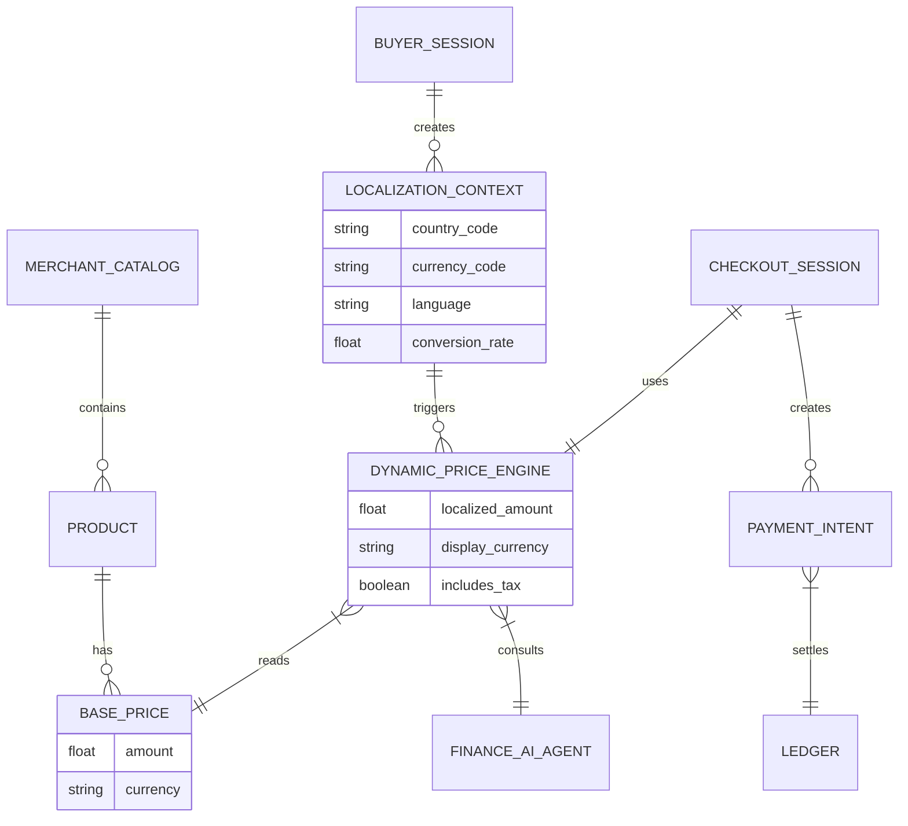

# [architecture]_global_multi_currency_and_localization_engine

## Title
Architectural Gap: Global Multi-Currency and Localization Engine

## Problem Statement
OneHumanCorp's current platform allows small business owners (like Maya the baker or Carlos the handyman) to quickly launch their stores and services. However, as these businesses gain traction online, they increasingly attract international customers. Right now, there is no unified, zero-configuration engine to automatically localize prices, checkout currencies, tax rates, and language nuances based on the buyer's geolocation. A business owner shouldn't have to manually create multiple storefronts, calculate exchange rate risks, or understand cross-border tax compliance to sell a digital product or accept a booking from another country. The lack of an invisible multi-currency engine limits their revenue potential and creates high drop-off rates at checkout for international buyers.

## Research Report
*   **Industry Standards**: Platforms like Shopify (via Shopify Markets) and Stripe (with Adaptive Pricing) provide automatic multi-currency conversion, local payment method surfacing (e.g., iDEAL in Netherlands, Alipay in China), and automated tax collection.
*   **Competitor Analysis**:
    *   *Shopify Markets*: Offers comprehensive cross-border management but requires the merchant to understand and configure market regions, set exchange rate margins, and manage duties.
    *   *Stripe Checkout*: Handles localized pricing dynamically if the underlying integration passes the right parameters, but it's a developer-centric setup.
*   **OHC Differentiation**: For OHC, cross-border commerce must be *invisible*. Maya shouldn't have to configure a "European Market" zone. The AI Operations and Finance agents should automatically detect international traffic, present localized pricing (including smart rounding, e.g., €19.99 instead of €18.43), surface local payment methods, and handle currency conversion and payout to her local bank account without any manual setup.
*   **Pain Points Addressed**: Exchange rate volatility risk, abandoned international carts due to unfamiliar currencies, and compliance/tax burden on the merchant.

## Design Doc

### Architecture Diagram

### Mobile-First UI Wireframes / Screen Flow (375px)
1.  **Product Discovery (Buyer View)**:
    *   Buyer accesses the OHC storefront from Germany.
    *   The engine automatically detects the IP/locale.
    *   Product card displays the price natively as "€25,00" (smart rounded from a $27 base price). No currency selector is needed; it just works.
2.  **Checkout Flow (Buyer View)**:
    *   Checkout screen at 375px summarizes the order in Euros.
    *   Local payment methods (e.g., Giropay, SEPA) are surfaced automatically above standard credit cards.
    *   Legal AI Agent dynamically injects required VAT terms into the footer.
3.  **Merchant Dashboard (Merchant View)**:
    *   In the "Sales" tab, the merchant sees the transaction natively in their home currency (e.g., $27.00).
    *   A subtle info icon reveals: "Purchased by a buyer in Germany for €25,00. Currency conversion handled automatically."
    *   Zero configuration required.

### AI Agent Integration Points
*   **Finance AI Agent**: Monitors live FX rates and maintains a safe buffer/margin to protect the merchant from currency fluctuations between the time of sale and payout. It applies "smart rounding" (e.g., ending prices in .99 or .00 depending on cultural norms).
*   **Operations AI Agent**: Handles the mapping of products to localized catalogs dynamically. If a physical product is restricted in the buyer's country, the agent hides it or adds a warning badge.
*   **Legal/Tax AI Agent**: Automatically calculates and collects necessary cross-border taxes (e.g., EU VAT for digital services) and appends the appropriate legal disclosures to the receipt.

### Key Design Decisions & Why
*   **Invisible Configuration**: No "Markets" or "Zones" dashboard for the merchant. Small business owners don't have time to be international trade experts. The platform defaults to global availability unless shipping restrictions apply.
*   **Smart Rounding**: Raw converted prices look unnatural (e.g., €13.42). We use the Finance Agent to apply smart rounding rules to maintain a premium feel.
*   **Merchant Ledger in Base Currency**: To avoid accounting confusion for the merchant, all dashboard metrics, ledgers, and payouts are displayed and settled in their base currency. The buyer's currency is abstracted away into the platform's treasury operations.
*   **Multi-Tenant Isolation**: The Localization Context is strictly scoped to the Buyer Session and Merchant Tenant ID to ensure no cross-contamination of pricing data.

## Implementation Prompt
**To the Implementer:**
Implement the Global Multi-Currency and Localization Engine.
*   **Outcome**: When a buyer visits an OHC storefront, the system must automatically detect their locale, convert the merchant's base prices into the buyer's local currency using smart rounding, and present localized payment methods at checkout. The merchant's ledger and dashboard must only reflect their base currency.
*   **Core User Journey (CUJ)**:
    1. A buyer in the UK visits a US-based OHC storefront.
    2. The storefront displays all prices in GBP (£) with clean numbers (e.g., £20.00).
    3. At checkout, UK-specific payment methods are offered.
    4. Upon purchase, the US merchant receives a notification and ledger entry for the equivalent USD amount, without ever seeing the GBP transaction details unless they dig into the advanced receipt.
*   **Acceptance Criteria**:
    *   System securely intercepts requests and injects a `LocalizationContext` based on the request's origin.
    *   Prices are dynamically converted and cached efficiently to avoid latency spikes.
    *   Checkout integrates with the local payment method surfaced by the underlying payment processor.
    *   Merchant ledger records only base currency.
    *   Mobile layout on a 375px screen remains clean, fast, and does not require manual currency selection drop-downs.

## Priority
P1

## Estimated Scope
Large
