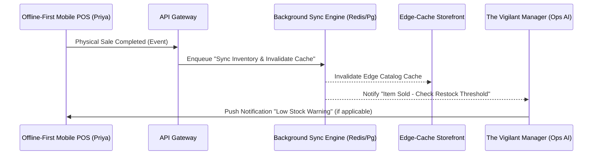

# Title: High-Performance Background Sync Engine for Edge-Cached Storefronts

## Problem Statement
One of the biggest pain points for non-technical small business owners (e.g., Priya the boutique owner) is keeping their online storefront synced with their in-store inventory and POS without manual intervention. Current platforms like Shopify and Wix struggle to provide a highly concurrent, zero-drop background queue specifically tailored for synchronizing physical changes with an edge-cached digital storefront. When Priya sells an item in-store, her online store needs an immediate and resilient update reflecting stock changes to avoid overselling.

## Research Report
- **Market Context**: Legacy platforms offer webhook-based updates which are prone to delays and dropped payloads, leading to double-booking and overselling.
- **OHC Positioning**: The OHC architecture requires a fully decoupled Background Sync Engine backed by the KAIROS Orchestrator to ensure reliable edge-cache invalidation and asynchronous agent notification.
- **Design Gap Identified**: We need a high-performance, background job queue tailored to bridging the physical Tap-to-Pay POS activity (offline/hybrid) with the cloud's multi-tenant Edge-Caching Storefront data model.

## Design Doc
### Architecture Diagram (Mermaid.js)

### Core Capabilities & Targets
- **Idempotency & Resiliency**: Jobs must handle retries with exponential backoff and guarantee idempotency across network drops.
- **Multi-Tenant Isolation**: Queue topics/channels must strictly isolate tenant data (`tenant_id`).
- **Mobile-First Validation**: Push notifications to the 375px mobile dashboard upon job failure or low-stock anomaly detection must be actionable via 1-tap.

## Implementation Prompt
Implement the "High-Performance Background Sync Engine" module in the backend. This engine must reliably dequeue physical sales events from the POS, immediately invalidate relevant Edge-Cache storefront segments, and hand off context to the Ops AI Agent for inventory threshold checking. Ensure you design robust error-handling, multi-tenant scoping, and clear API boundaries. Do not hardcode specific external service schemas.

## Priority
P0

## Estimated Scope
Large
