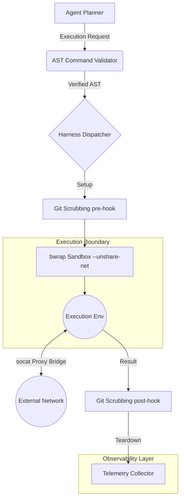

# [architecture] Hybrid Agentic OS Target Harness

## Title
Hybrid Agentic OS Target Harness Research Report

## Problem Statement
The OHC Hybrid Architecture needs a formal, published research report detailing its competitive edge against market leaders (AI coding assistant, OpenClaw, Hermes) specifically regarding the Agent Harness execution environment. This provides the blueprint for Implementer agents to build our enterprise-grade bwrap sandbox and proxy bridge.

## Research Report
Our synthesis of the `AI coding assistant(2_1_88).tgz` codebase and market analysis reveals that robust, production-ready local agents rely on specific, highly-secure execution environments. Unlike basic AI co-pilots or chat agents, an enterprise-grade agent harness must execute arbitrary code while preventing host contamination, network abuse, and prompt injection/evasion tactics.

The core architecture findings for a production-ready harness are:
1. **OS-level Isolation:** `bwrap --unshare-net` for deep OS-level isolation, preventing unauthorized access to host resources.
2. **Controlled Network Egress:** `socat` proxy bridging for controlled network egress, allowing specific, monitored communication channels.
3. **Sandbox Escape Prevention:** Pre/post-execution Git repository scrubbing to prevent sandbox escapes via filesystem hooks (e.g., malicious `.git/hooks`).
4. **Subshell Evasion Prevention:** Token-level AST command validation (e.g., using `tree-sitter-bash`) to prevent subshell evasion and ensure semantic understanding of executed commands.
5. **Observability:** Deep OpenTelemetry instrumentation across the execution lifecycle for real-time monitoring and auditing.

### OHC Differentiation
While OpenClaw and Hermes focus primarily on LLM interactions and context windows, OHC's differentiation lies in this impenetrable execution harness. It allows OHC agents to autonomously implement complex business operations safely on shared infrastructure, guaranteeing zero cross-tenant data leakage.

## Design Doc

### Architecture Diagram


### UI Design Tokens (Glassmorphism)
To reflect the secure, transparent nature of the harness in the developer portal, we will utilize a Glassmorphism UI token set:

```css
:root {
  /* Glass Backgrounds */
  --glass-bg-primary: rgba(255, 255, 255, 0.05);
  --glass-bg-secondary: rgba(255, 255, 255, 0.1);
  --glass-bg-accent: rgba(0, 168, 255, 0.15); /* OHC Blue */

  /* Glass Borders */
  --glass-border-light: 1px solid rgba(255, 255, 255, 0.1);
  --glass-border-accent: 1px solid rgba(0, 168, 255, 0.3);

  /* Blurs */
  --glass-blur-sm: blur(8px);
  --glass-blur-md: blur(16px);
  --glass-blur-lg: blur(24px);

  /* Shadows for Depth */
  --glass-shadow-inner: inset 0 0 10px rgba(255, 255, 255, 0.05);
  --glass-shadow-drop: 0 4px 30px rgba(0, 0, 0, 0.1);

  /* Text Colors */
  --glass-text-primary: rgba(255, 255, 255, 0.9);
  --glass-text-secondary: rgba(255, 255, 255, 0.6);
}
```
