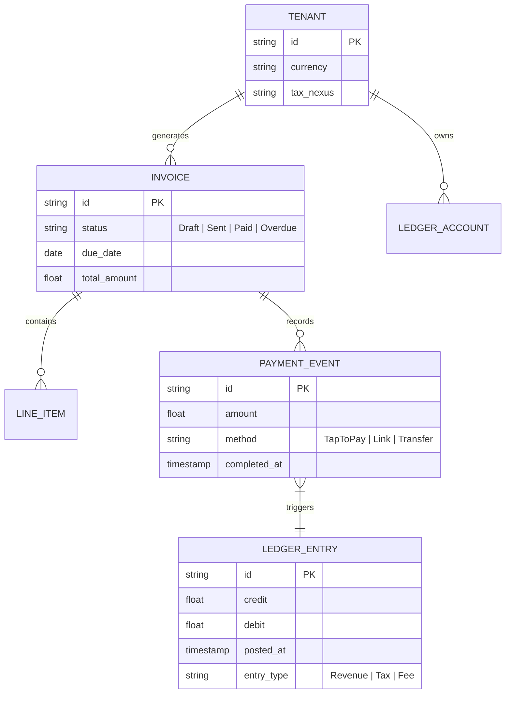
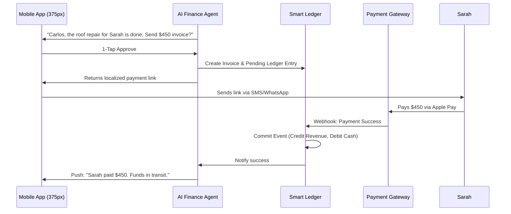

# [Architecture] Instant Localized Invoicing & Smart Ledger Engine

## Title
Instant Localized Invoicing & Smart Ledger Engine

## Problem Statement
Service providers, freelancers, and small business owners (like Carlos the handyman and Leo the music tutor) struggle with the friction of getting paid globally. They rely on manual, disconnected tools (Word documents, separate accounting software, manual bank transfers) to create invoices, track who has paid, and manage different currencies or local tax requirements. This creates massive administrative overhead, delayed payments, and cash flow anxiety. They need a zero-configuration, automated invoicing system that generates professional, localized invoices instantly from their phone, syncs with a unified ledger, and automatically follows up on unpaid bills, so they can focus on their actual work, not chasing payments.

## Research Report

### Competitive Landscape
*   **Stripe Invoicing / Stripe Billing**: Extremely powerful and globally compliant, but requires complex dashboard setup, API knowledge for advanced features, and feels disconnected from a unified "business operations" view for true beginners. High fee structure.
*   **QuickBooks / Xero**: Industry standards for accounting, but overwhelming for solopreneurs. They require understanding of double-entry bookkeeping (charts of accounts, reconciliation) which fails the "grandmother test". Mobile apps are companion viewers, not primary creation tools.
*   **Wave Accounting**: Free and good for simple invoices, but lacks deep AI automation (e.g., automatically drafting an invoice based on an Instagram DM conversation or a finished calendar appointment).
*   **Wix / Squarespace**: Offer basic invoice generation, but they are often bolt-on features without a robust underlying ledger capable of handling complex scenarios (deposits, milestone payments, multi-currency) natively.

### The OHC Gap
OneHumanCorp currently lacks a native, robust financial ledger system tightly integrated with its conversational AI agents. To enable "business in a box", we need an architecture where an AI Operations Agent can observe a completed service (e.g., a calendar event ending) and proactively draft an invoice, ready for a 1-tap approval on mobile.

## Design Doc

### Architecture Diagram

### Mobile UX Flow (375px First)
1.  **The Proactive Prompt:** The user receives a push notification after a service is marked complete or a booking ends: "Generate invoice for [Client] for [Amount]?"
2.  **The Draft View (Translucent Glass UI):** Tapping the notification opens a pristine, macOS-style card. It shows the client's name, the auto-calculated line items (pulled from context), the local tax added, and the total.
3.  **1-Tap Action:** A large, prominent primary button at the bottom: "Send via WhatsApp" or "Send via Email".
4.  **The Dashboard Widget:** The main dashboard features a simple, unified "Cash Flow" module. Green for money in, gray for pending invoices, red for overdue. No complex accounting terminology (no "Accounts Receivable", just "Unpaid").

### AI Agent Integration Points
*   **AI Finance Department (Trigger):** Listens to calendar events, CRM status changes, or direct user commands (e.g., "Bill Maya 50 bucks for the cake").
*   **AI Localization Engine:** Automatically translates the invoice into the recipient's language and converts to their local currency, applying the correct local tax rates (integrating with Stripe Tax / TaxJar).
*   **AI Collector:** Automatically sends polite, escalating follow-up messages on WhatsApp/Email for overdue invoices, adjusting tone based on the client relationship history.

### Key Design Decisions & Integrity
*   **Event-Sourced Ledger:** The underlying ledger must be immutable and event-sourced. Instead of updating a balance, we append credit/debit events. This guarantees auditability and allows us to easily reconstruct past states or sync gracefully when the user goes back online.
*   **Offline-First:** The merchant can draft and "send" an invoice even in a dead zone (e.g., a basement). The app queues the action locally and dispatches it the moment cellular connection is restored.
*   **Zero-Trust & Multi-Tenancy:** Financial data is strictly isolated via SPIFFE/SPIRE identity routing. The ledger queries must always include the `tenant_id` at the lowest repository level to prevent cross-contamination.
*   **"Grandmother Test" Approved:** Zero accounting jargon is exposed to the user.

## Implementation Prompt
Implement the core Instant Localized Invoicing & Smart Ledger Engine. Create a robust, multi-tenant capable API for generating invoices and an immutable, event-sourced double-entry ledger backend to track them.

The system must expose endpoints for an AI Agent to draft an invoice, which a user can then approve via a mobile client. When an invoice is paid, the system must automatically record the corresponding credit/debit entries in the ledger to track revenue and pending balances. Ensure that the database operations for payment events are transactional and strictly scoped to the requesting tenant. Do not implement the actual third-party payment gateway integration yet; focus on the internal data model, the state transitions of the invoice (Draft -> Sent -> Paid), and the ledger integrity.

**Acceptance Criteria:**
1.  Can create an invoice draft with multiple line items, tax, and total calculation.
2.  Can transition an invoice state and automatically write the appropriate balancing entries to an immutable ledger.
3.  A tenant's ledger balance can be accurately calculated by aggregating its ledger entries.
4.  Strict multi-tenant isolation is enforced on all queries.

## Priority
P0 (Critical)

## Estimated Scope
Large
