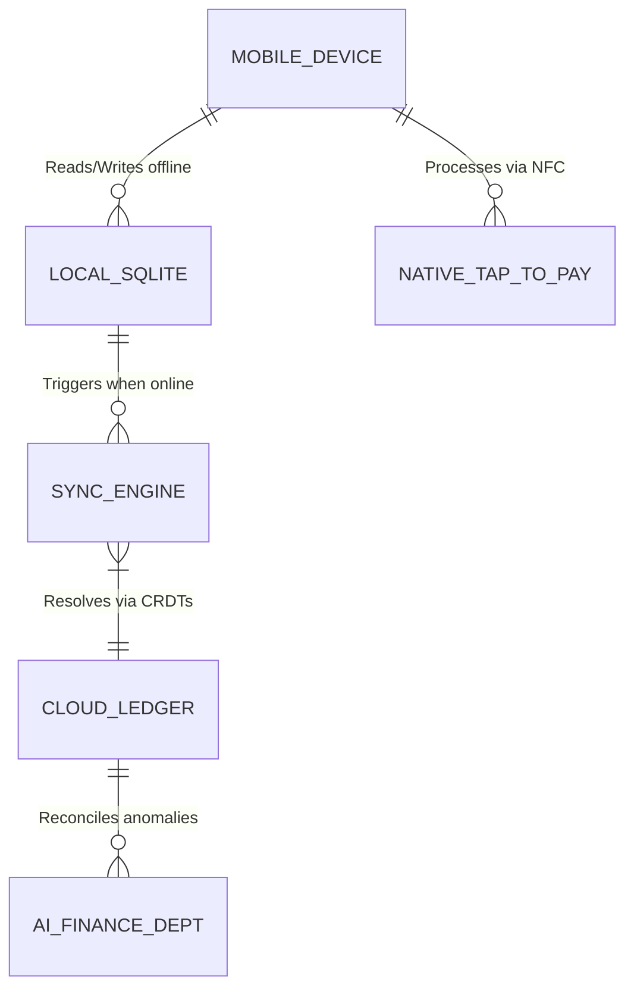

# Title
Instant Localized Offline-First Point of Sale (POS)

## Problem Statement
Small business owners like Priya (boutique owner) and Fatima (food cart operator) often operate in environments with unreliable internet connections (e.g., pop-up markets, basement shops, crowded festivals). Current cloud-reliant POS systems (Square, Shopify POS) fail completely when the connection drops, leaving merchants unable to process sales, leading to lost revenue and frustrated customers. Furthermore, these systems often require expensive proprietary hardware. They need a POS system that runs natively on their existing mobile devices, functions perfectly offline, and instantly synchronizes with the universal ledger the moment connectivity is restored, all while supporting localized payment methods.

## Research Report
*   **Square POS:** Requires proprietary hardware for card payments. Offline mode exists but is risky (merchants assume liability for declined cards processed offline) and has limited functionality.
*   **Shopify POS:** Very reliant on an active internet connection to sync inventory and process payments. Offline mode is severely limited.
*   **Wix POS:** Similar to Shopify, highly cloud-dependent.
*   **OHC Differentiation - "True Offline-First Localized Mesh":** OHC's POS is designed mobile-first and offline-first from the ground up using local device storage (SQLite/IndexedDB) and CRDTs (Conflict-free Replicated Data Types). It allows full catalog browsing, cash/offline payment recording, and queueing of digital payments. It also leverages native device capabilities (Tap-to-Pay on iPhone/Android) to eliminate the need for extra dongles.

## Design Doc

### Architecture Diagram

### UI Wireframes & 375px Baseline
*   **Global Viewport:** 375px width (Mobile First).
*   **Offline Indicator:** A subtle, persistent pill in the blurred glass top nav indicating status: `[🟢 Online]` or `[🟠 Offline - 12 Syncs Pending]`.
*   **Checkout Screen:** Fast, large touch targets for adding items. A prominent "Pay" button.
*   **Payment Methods:** Clearly displays localized options (e.g., Tap to Pay, Cash, PIX in Brazil, local QR codes). If offline, digital payment methods that require cloud authorization are gracefully disabled or switched to a "Queue for later processing" mode (with clear liability warnings).

### Mobile UX Flow
1. **Scenario:** Fatima is at a busy street festival. The cell network is overwhelmed. The OHC app automatically switches to `[🟠 Offline]` mode.
2. **Action:** A customer orders. Fatima taps the items on her phone screen.
3. **Payment:** The customer pays with cash. Fatima taps "Cash" and completes the order. The inventory is updated locally and the sale is recorded in the local SQLite database.
4. **Resolution:** Two hours later, the festival ends and Fatima gets back on Wi-Fi. The `SYNC_ENGINE` automatically pushes the queued orders to the `CLOUD_LEDGER`. The AI Finance Dept verifies the offline transactions and updates her daily summary.

### AI Agent Integration Points
*   **Finance Department:** Automatically monitors the sync process. If an offline-queued digital payment fails upon sync (e.g., insufficient funds), the AI agent proactively drafts a message to the customer (if their contact info is known) or flags it for the merchant to review.
*   **Operations Department:** Predicts inventory depletion based on offline sales velocity and alerts the merchant if they are likely to run out of a key ingredient before the sync happens.

### Key Design Decisions (Why, not How)
*   **Offline-First Native:** Web wrappers are too fragile for mission-critical POS. The mobile app must have a robust local database and sync engine.
*   **No Extra Hardware:** Leveraging Apple's Tap to Pay on iPhone and Android's equivalent is critical to the "launch in 10 minutes" vision. No waiting for a card reader in the mail.
*   **CRDTs for Conflict Resolution:** Essential for when Priya makes an offline sale at a pop-up while her partner simultaneously makes an online sale from their main store, ensuring inventory doesn't fall below zero incorrectly.

## Implementation Prompt
**To the Implementer Swarm:**
Your goal is to build the foundational offline-first architecture for the OHC Mobile POS.

**Customer User Journey (CUJ):**
1. User opens the OHC mobile app.
2. User turns on Airplane Mode (simulating network loss).
3. User adds items to a cart and completes a cash transaction.
4. User turns off Airplane Mode.
5. The transaction silently syncs to the cloud backend and appears in the global sales dashboard.

**Acceptance Criteria:**
*   **Mobile Parity:** Perfect layout on 375px viewport.
*   **Offline Capability:** The core checkout flow (adding items, cash payment) must function seamlessly with zero network connectivity.
*   **Sync Mechanism:** Implement a robust local-to-cloud sync protocol (e.g., using CRDTs or an append-only event log) that resolves conflicts upon reconnection.
*   **UI Indication:** The UI must clearly indicate the current network status and the number of pending offline sync operations.

## Priority
P0

## Estimated Scope
Large
