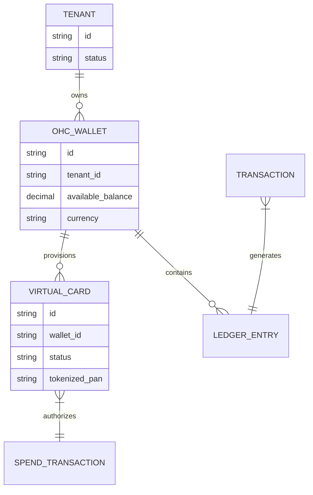
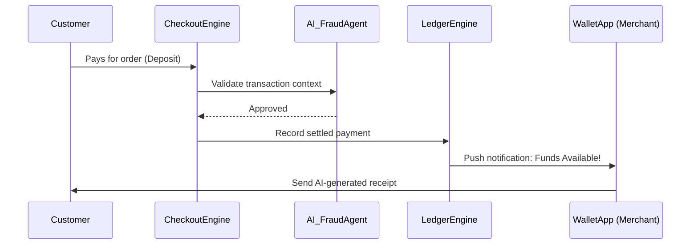

# [Architecture] Instant Payouts & Virtual Card Issuing Engine

## Title
Instant Localized Payouts and Virtual Card Issuing Engine

## Problem Statement
Small business owners—like Maya the baker or Fatima the food cart operator—often rely on deposits or daily sales to buy the very supplies they need to fulfill orders. Traditional payment processors (and leading platform competitors) hold funds for 2-5 business days before paying out to an external bank account. This artificial delay creates a cash flow choke point that stifles business growth and limits daily operations for micro-merchants. OneHumanCorp needs to bypass this latency entirely by issuing a platform-native Virtual Wallet and Business Debit Card, providing true instant liquidity the second a transaction clears.

## Research Report
### Competitive Analysis
- **Shopify:** Offers Shopify Balance, but setup requires rigorous business verification (EIN, SSN), heavily geared toward US-based established LLCs, and takes days to activate. Not feasible for a 10-minute setup.
- **Wix:** Relies on third-party gateways (Stripe, Square) which enforce standard rolling payout delays (usually 2+ days). No native instant spending capabilities.
- **Squarespace:** Connects to Stripe/PayPal. Suffers from identical third-party payout delays and holds.
- **GoDaddy:** Basic POS integration with external banks. Instant payouts usually carry a 1-2% extra penalty fee.

### Findings
If OneHumanCorp (OHC) acts as the ledger of record (in partnership with an embedded finance provider like Stripe Issuing or Unit), we can instantly clear funds to an internal OHC Wallet balance. Users get an immediate virtual card (Apple Pay / Google Pay ready) to spend those funds on supplies with zero delay and zero transfer fees, establishing immense platform stickiness.

## Design Doc

### Architecture Diagram

### UI Wireframes & Mobile UX Flow (375px First)
1. **Wallet Dashboard Card (Home Screen):**
   - Translucent glass material card spanning the top of the mobile feed.
   - Large text: `$450.00 Available`.
   - Primary action buttons: `[Pay with Phone (NFC)]` and `[View Card]`.
2. **Virtual Card Reveal Flow:**
   - User taps `[View Card]`.
   - Biometric prompt (FaceID/Fingerprint) intercepts.
   - OHC branded virtual card flips over in 3D using macOS-style smooth motion.
   - Button below card: `[Add to Apple Wallet / GPay]`.
3. **Spend Notification (Grandmother Test passed):**
   - Clean, large typography push notification: "Cha-ching! Maya, $50 deposit from Sarah just landed. Tap here to use it now."

### AI Agent Integration Points
- **AI Finance Department:** Monitors velocity of spend and daily balance. Automatically warns if the balance is too low for upcoming predicted subscription costs (like SaaS tools).
- **AI Fraud Department:** In the background, scores every deposit and payout attempt. If anomalies occur (e.g., unusually large transaction), it triggers a frictionless in-app verification flow rather than silently freezing the account.

### Key Design Decisions
- **Zero-Trust SPIFFE/SPIRE Isolation:** Wallet and ledger services must have strictly enforced mTLS and multi-tenant separation. Tenant A cannot ever query Tenant B's ledger.
- **Embedded Finance Abstraction:** Do not build raw ACH pipes. Use a BaaS (Banking as a Service) integration but entirely obscure it from the user. To them, it's just "OHC Cash".
- **Mobile First Spending:** The virtual card is provisioned in the first 10 minutes of onboarding and instantly pushed to native OS wallets. Physical cards are opt-in only.

## Implementation Prompt
**Objective:** Build the OHC Virtual Wallet and Ledger synchronization engine.
**User Journey (CUJ):** Maya receives a $100 deposit for a custom cake. Instantly, her OHC mobile app notifies her of the funds. She goes to the supermarket, taps her phone (using the OHC Virtual Card via Apple Pay), and spends $40 on flour and sugar.
**Acceptance Criteria:**
- Implement a strictly isolated ledger data model ensuring zero cross-tenant contamination.
- Build a generic issuing interface that provisions a tokenized virtual card upon tenant activation.
- Ensure the Mobile UI components strictly follow the macOS translucent glass and modular dashboard card aesthetic (optimized for 375px).
- Provide background events that the AI Finance agent can subscribe to for balance updates and fraud scoring.

## Priority
P1

## Estimated Scope
Large
