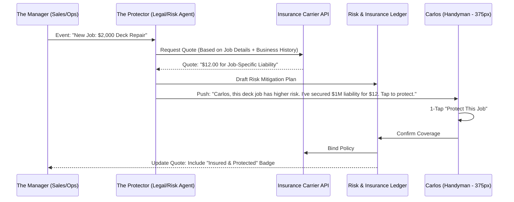
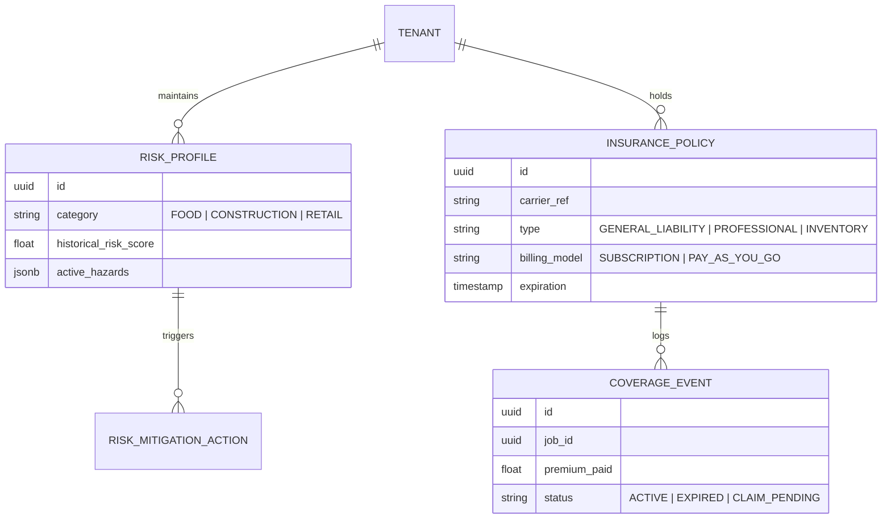

# [Architecture] Invisible AI-Powered Business Insurance & Risk Protection Engine

## 1. Title
**Invisible AI-Powered Business Insurance & Risk Protection Engine: Zero-Friction Liability Coverage**

## 2. Problem Statement
For OneHumanCorp (OHC) core personas—like **Maya (baker)**, **Carlos (handyman)**, and **Fatima (food cart operator)**—business insurance is an opaque, intimidating, and often neglected requirement.

Maya worries about a customer having an allergic reaction to her cakes. Carlos is terrified of accidentally damaging a client's property during a repair. Fatima faces the constant risk of foodborne illness or equipment theft. Currently, getting business insurance requires them to leave OHC, find a broker, fill out endless forms about their projected revenue and safety protocols, and wait days for a quote. This "Insurance Friction" leads many solopreneurs to operate without protection, leaving them one accident away from total financial ruin. They need an invisible partner that uses their OHC business data to provide instant, pay-as-you-go liability protection that scales with their sales.

## 3. Research Report
### Market Landscape & Competitor Analysis
*   **Shopify Protect:** Focuses primarily on "Fraud Protection" for online payments (chargebacks). It does not address general liability, professional liability, or equipment insurance for the physical activities of the merchant.
*   **Square / NEXT Insurance Partnership:** Square offers insurance via NEXT, but it is a "Referral & Sync" model. The user is still redirected to a third-party site to complete a traditional application. It's an integration, not an *invisible* part of the core platform.
*   **Thimble / NEXT Insurance / Pie:** These insurtechs have pioneered "on-demand" or "pay-as-you-go" insurance for freelancers. They provide APIs, but no major SMB platform has yet fully embedded "Invisible Underwriting" where the platform *is* the broker and the data source.

### The OHC Opportunity: "Invisible Underwriting"
OHC has a unique advantage: we already own the transaction data, the inventory ledger, and the business's "Vibe."
1.  **Zero-Form Underwriting:** Because OHC knows Maya's sales volume, her location, and her product types (from the "Magic Catalog"), "The Protector" agent can autonomously generate a risk profile and fetch a binding quote without asking Maya a single question.
2.  **Usage-Based Premiums:** Instead of a fixed $500/year fee, OHC can offer "Per-Sale Protection." Every cake Maya sells could include a $0.50 liability premium, making insurance a variable cost that never outpaces her cash flow.
3.  **Active Risk Mitigation:** The agent doesn't just provide the policy; it helps Maya *avoid* the claim (e.g., "Maya, I noticed you're selling a cake with nuts. I've added a mandatory allergy waiver to the checkout for this order.").

## 4. Design Doc

### Architecture Diagram (Mermaid.js)

### Data Model & Invariants

### Mobile-First UX Flow (375px First)
1.  **The "Safety Pulse" Dashboard Card:** A subtle glass card: *"Your business is 100% protected. Next job covered."*
2.  **The Risk Notification:** When Carlos drafts a high-value quote: *"I've analyzed this job's risks. For $12, I can add a $1M liability shield. Tap to include."*
3.  **The Certificate of Insurance (COI):** A single tab in the app: `[ 📄 View My Shield ]`. Carlos can show this to a client on his phone screen to build instant trust.
4.  **The Claim Assistant:** If something goes wrong, Carlos taps "Report Incident." The CS Agent takes over, gathering photos and notes to draft the claim for Carlos to approve.

### AI Agent Integration Points
- **The Protector (Risk & Legal):** Orchestrates the relationship with carriers and monitors the business for compliance (e.g., checking if Maya's health permit is expiring).
- **The Manager (Operations):** Feeds real-time sales and job data to the Protector for dynamic underwriting.
- **The Ambassador (CS Agent):** Handles the "Intake" for any claims, making the process feel like a supportive conversation rather than an interrogation.

## 5. Implementation Prompt
**Task for Implementer Agent:**
Build the "Invisible AI-Powered Business Insurance & Risk Protection Engine".

**Customer-User Journey:**
A handyman (Carlos) creates a quote for a client. The system identifies the job category and autonomously fetches a job-specific liability insurance quote. Carlos sees a "1-Tap Protect" button. Upon approval, the premium is added to the job cost (or absorbed), the policy is bound, and a digital Certificate of Insurance is generated.

**Acceptance Criteria:**
1.  **Data Entities:** Define `RiskProfile`, `InsurancePolicy`, and `CoverageEvent` with strict multi-tenant isolation.
2.  **Underwriting Hook:** Implement an asynchronous service that triggers a risk assessment whenever a high-value `Quote` or `Order` is created.
3.  **Carrier Integration (Mock):** Create a service interface for insurance carrier interaction that supports quoting and binding.
4.  **Mobile UI (375px):** Build the "Safety Pulse" dashboard card and the "1-Tap Protection" bottom sheet using the OHC Translucent Glass design tokens.
5.  **Digital COI:** Implement a mobile-optimized view for Carlos to display his proof of insurance to clients.
6.  **Grandmother Test:** No insurance jargon (e.g., "Subrogation", "Indemnity"). Use terms like "Shield", "Protection", and "Safety".

## 6. Priority
**P1** (High - Critical for the safety and credibility of physical service personas like Carlos and Fatima).

## 7. Estimated Scope
**Large** (Requires integration with the Quoting/Sales engines and external carrier APIs).
