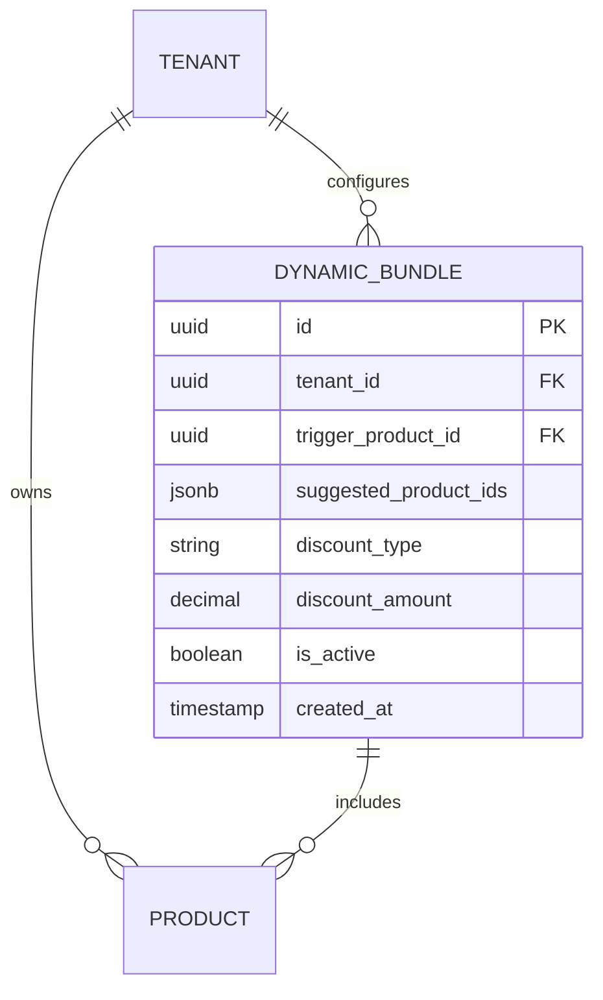

# Issue Brief: Invisible AI Product Bundling & Upsell Engine

## Title
[Architecture] Invisible AI Product Bundling & Upsell Engine

## Problem Statement
Small business owners leave significant revenue on the table because they lack the time, expertise, or mental bandwidth to manually create, manage, and pitch product bundles or upsells. A customer buying a single item (like a cake or a plumbing fix) is often willing to buy related items or services (candles, a maintenance plan) if presented seamlessly at the right time. Traditional platforms require manual configuration of complex rules, disjointed inventory linking, and rigid UI templates, making it impossible for non-technical users like Maya or Carlos to leverage upselling.

## Research Report
- **Competitor Landscape**: Shopify requires 3rd-party apps (e.g., ReCharge, frequently bought together apps) which cost extra monthly fees and require technical setup. Wix has rudimentary manual related-products. No platform dynamically generates and presents hyper-contextual upsells based on real-time inventory and conversational AI analysis.
- **User Needs**: Solopreneurs need an invisible system that analyzes their catalog, understands natural pairings, checks real-time inventory, and automatically presents compelling upsells to the customer during checkout or booking, without the owner lifting a finger.
- **AI Differentiation**: Instead of static "Related Products" widgets, OHC’s Sales AI analyzes past transaction patterns and product semantics to dynamically assemble bundles. The Marketing AI drafts the micro-copy for the upsell (e.g., "Add matching shoes to complete the look!"), and the Operations AI ensures stock availability before showing the offer.

## Design Doc
### High-Level Architecture
- **Trigger**: A customer adds an item to their cart, requests a quote, or initiates a booking.
- **Agent Action**: The AI Sales & Acquisition Department (The Salesperson) intercepts the pre-checkout event.
  - Queries `tenant_id` catalog and semantic memory for synergistic products or services.
  - Verifies stock/capacity with the Operations AI via distributed locks (`ohc:lock:{tenant_id}:inventory:{product_id}`).
  - Generates a targeted, context-aware bundle discount (e.g., 10% off).
- **Delivery**: The system injects the dynamic bundle into the client's checkout state. For in-person POS, it suggests the upsell to the merchant's screen before tap-to-pay.

### Mobile UX Flow (375px First)
1. **The Cart Drawer**: When the customer taps "Checkout", a macOS-style Translucent Glass bottom sheet slides up.
2. **The Pitch**: The sheet displays the AI-generated upsell: "Make it a Party Pack! Add custom candles and delivery for $15."
3. **1-Tap Action**: A prominent, touch-friendly (44x44px min) button "Add to Order" instantly updates the cart total and line items. A subtle "No thanks, continue to checkout" link is below it.
4. **Merchant POS (In-Person)**: For Priya scanning an item, her 375px POS screen shows a glass-card tip: "AI Tip: Recommend the matching blue scarf" with a 1-tap "Add to Cart" before initiating Stripe Terminal.

### Data Model & Invariants (Mermaid ER)

- **Invariants**: `tenant_id` must match across all products in the bundle. Row-level security ensures isolated bundle generation. Stock must be strictly decremented in a single transaction if the bundle is purchased.

## Implementation Prompt
Implement the "Invisible AI Product Bundling & Upsell Engine". Create a background worker that periodically analyzes a tenant's catalog to propose dynamic bundles. Build the API layer to serve these AI-generated upsells during the cart/checkout flow. Ensure the frontend consumes this API to display a translucent glass bottom sheet on 375px mobile screens offering a 1-tap "Add to Order" experience. Include comprehensive unit tests for the AI suggestion logic and Playwright E2E tests for the 1-tap checkout modification. Do not hardcode product pairings; use the LLM provider interface to generate suggestions.

## Priority
P1

## Estimated Scope
Medium
