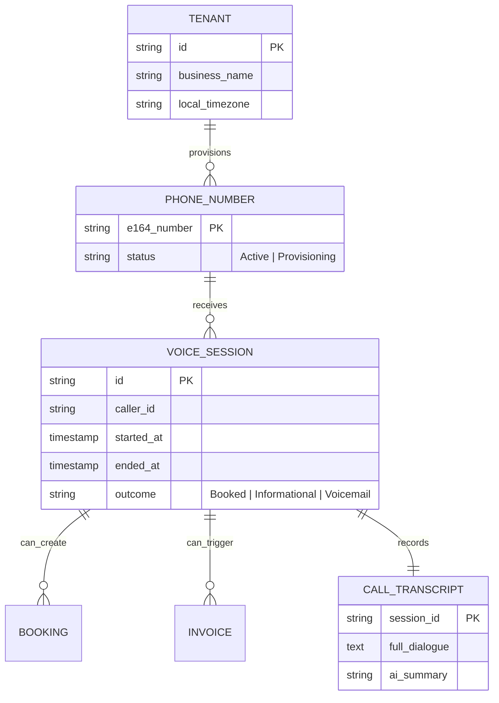
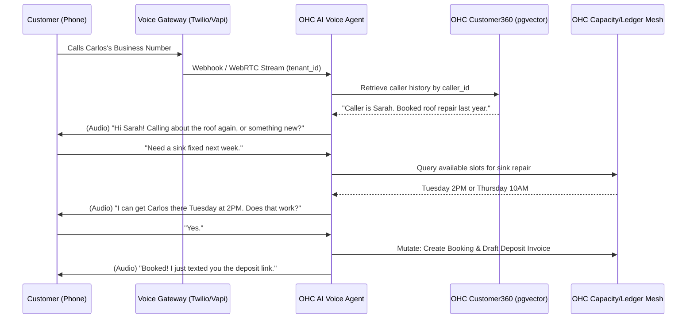

# [Architecture] Invisible AI Voice Receptionist Engine

## Title
Invisible AI Voice Receptionist Engine

## Problem Statement
Service providers and physical small business owners (like Carlos the handyman, Maya the baker, or Fatima running her food cart) are often hands-on. When a customer calls, they are up on a ladder, covered in flour, or actively serving a line of people. Missing a phone call often means losing a high-intent customer to a competitor. Traditional voicemail is a dead end, and setting up complex IVR (Interactive Voice Response) phone trees fails the "grandmother test." They need a zero-configuration AI agent that answers their business phone line, sounds natural, understands context (e.g., business hours, pricing, calendar availability), and can autonomously book appointments or take pre-orders without the business owner lifting a finger.

## Research Report

### Competitive Landscape
*   **Twilio / Vapi / Bland AI / Retell:** These are powerful developer platforms offering ultra-low latency conversational voice AI. However, they are APIs, not products. They require significant engineering to integrate with a business's calendar, inventory, and payment systems, completely failing the small business persona requirements.
*   **Google Duplex / Grasshopper / RingCentral:** Traditional virtual phone systems only route calls or transcribe voicemails. They do not actively perform business operations like negotiating a quote or checking real-time availability.
*   **Existing "Chatbots" on Squarespace/Wix:** Typically limited to text on a web page and completely disconnected from the telephone network (PSTN), leaving the "phone call" channel entirely unaddressed.

### The OHC Gap
OneHumanCorp currently has strong foundational models for unified AI text quoting, conversational checkout, and inbox management. However, we lack a synchronized, real-time Voice Voice layer. We need an architecture that connects PSTN (Public Switched Telephone Network) directly to our AI orchestrator, maintaining sub-500ms audio latency while accessing the same multi-tenant state (Unified Ledger, Capacity Mesh) as our text-based agents.

## Design Doc

### Architecture Diagram

### Mobile UX Flow (375px First)
1.  **Zero-Touch Provisioning:** During onboarding, OHC automatically provisions a local or toll-free number. No configuration needed.
2.  **The "Call Log" Card (Translucent Glass UI):** On the main dashboard, a simple widget shows recent calls. Instead of audio voicemails, the user sees a crisp summary: "Sarah called for a sink repair. AI booked her for Tuesday 2PM and sent a $50 deposit link."
3.  **Active Call Takeover:** If Carlos happens to be holding his phone when a call comes in, he sees the AI talking to the customer in real-time via live transcription. A massive primary button allows him to "Take Over Call" seamlessly, transitioning the AI to a silent listener.
4.  **Voice Persona Settings (Advanced):** Tucked away in settings, users can select the voice type (Friendly, Professional, Calm) and set strict boundaries (e.g., "Never give discounts over the phone").

### AI Agent Integration Points
*   **AI Voice Department (Real-Time Node):** Handles STT (Speech-to-Text), LLM reasoning, and TTS (Text-to-Speech). It must have direct, memory-cached access to the business's context to minimize latency.
*   **AI Memory/Context (Customer360):** Injects previous interaction history based on caller ID.
*   **AI Operations Agent:** Background worker that processes the outcome of the call (e.g., sending the SMS deposit link, updating the CRM).

### Key Design Decisions & Integrity
*   **Sub-500ms Latency Target:** Voice interactions break down if latency is high. The Voice Agent must run on edge nodes closest to the PSTN gateways, avoiding deep database queries during active conversation unless strictly necessary.
*   **Separation of Real-Time vs Background Tasks:** The Voice Agent *only* handles the conversation and intent extraction. Heavy operations (sending invoices, updating ledgers) are published as events to the background AI Operations queue so the voice thread never blocks.
*   **Multi-Tenant Telephony:** Incoming calls are strictly routed by the dialed E.164 number to the correct `tenant_id`. All memory and capability checks must enforce this boundary using Zero Trust (SPIFFE/SPIRE) principles.
*   **Offline-Graceful:** If the core OHC backend is briefly unreachable, the Voice Agent falls back to a locally cached "business hours and basic FAQ" mode, politely taking a message instead of dead air.

## Implementation Prompt
Implement the backend architecture for the Invisible AI Voice Receptionist Engine. Create a secure, multi-tenant capable WebRTC/WebSocket service that can interface with external PSTN gateways (e.g., Twilio Media Streams or Vapi).

The system must handle incoming audio streams, route them to the correct AI Voice Agent context based on the dialed number, and maintain a real-time conversational loop. You must implement the event-publishing mechanism that allows the Voice Agent to securely query the `Capacity Mesh` and trigger background tasks in the `Operations Queue` (like sending follow-up SMS). Ensure strict multi-tenant isolation on all state access. Do not build the frontend dashboard yet; focus on the high-throughput, low-latency voice orchestration layer and the strict separation of conversational state from background mutations.

**Acceptance Criteria:**
1. System can accept a simulated incoming voice connection and route it to the correct tenant context.
2. Voice Agent can perform a conversational turn under simulated conditions within strict latency targets.
3. Voice Agent can successfully publish an intent (e.g., "Booking Requested") to the asynchronous Operations Queue.
4. Strict multi-tenant isolation is enforced for all queries during the call lifecycle.

## Priority
P1 (High)

## Estimated Scope
Large
