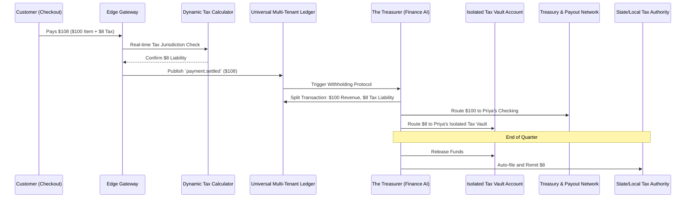

# [Architecture] Invisible Automated Tax Withholding and Filing Vault

## Title
**Invisible Automated Tax Withholding and Filing Vault**

## Problem Statement
For small business owners like **Priya (boutique owner)** who sells both locally and online across different states, and **Carlos (handyman)** who manages complex service-based sales tax, managing tax liabilities is one of the most stressful aspects of running a business.

Currently, they must navigate complex local and state tax rates, manually calculate what they owe, and crucially, remember to physically set aside that money into a separate bank account so they don't accidentally spend it on inventory or payroll. Come quarterly tax season, they scramble to piece together records, often facing penalties or cash flow crunches. They need an automated system that handles tax calculation, securely segregates the funds instantly upon purchase, and automates the filing process.

## Research Report
### Competitive Landscape
*   **Shopify Tax & Stripe Tax:** These tools excel at *calculating* the correct tax rate at checkout based on jurisdiction. However, they stop there. They deposit the full sum (product price + collected tax) into the merchant's single operating account, placing the burden of saving and filing back on the business owner.
*   **QuickBooks/Xero:** Provide reporting and can file taxes, but they are reactive tools. They require manual reconciliation and do not actively secure the tax funds at the moment of the transaction.

### Opportunity
OneHumanCorp (OHC) can bridge this gap by offering a true "Tax Vault." When a transaction occurs, the AI dynamically calculates the correct local/state tax. Crucially, as the funds settle, the KAIROS Orchestrator automatically splits the payout: the core revenue goes to the owner's operating account, while the tax portion is immutably routed to an isolated, multi-tenant "Tax Vault." The Finance AI then handles the automated remittance to the appropriate tax authority when due, providing complete peace of mind.

## Design Doc

### Architecture Diagram (Mermaid.js)

### UI Wireframes & Mobile UX Flow (375px First)
**Screen 1: Dashboard Home (The Daily Brief)**
*   Clean, macOS-style Translucent Glass dashboard card.
*   A new, persistent, calming "Tax Vault" widget.
*   Text: *Vault Balance: $452.00 (Fully Funded for Q3)*
*   Primary Action: Tap widget to view details.

**Screen 2: Tax Vault Detail Modal (Bottom Sheet)**
*   Slides up smoothly.
*   Large, clear typography showing the protected balance.
*   Breakdown: *"We automatically saved $8 from the 'Summer Dress' sale today."*
*   Toggle: `[ Auto-File Quarterly Taxes ]` (Default ON).
*   Reassurance Text: *"The Treasurer AI handles your filings. You don't need to do a thing."*

### AI Agent Integration Points
*   **The Treasurer (Finance AI):** Responsible for the core logic. It listens to settled payment events, interfaces with the Dynamic Tax Calculator for accurate liability assessment, and commands the Treasury network to route the exact tax amount into the isolated Vault. It also schedules and executes the quarterly remittance to external tax authorities via API.
*   **The Business Advisory Agent (Ops AI):** Translates complex tax operations into simple, reassuring dashboard updates and plain-language notifications (e.g., *"Good news! We just paid your Q3 state taxes. Your vault balance is reset to $0."*).

### Key Design Decisions and Why
*   **Invisible Splitting:** The merchant never sees the tax money in their primary checking account, eliminating the psychological trap of "accidental spending."
*   **Reassuring UI:** Small business owners are terrified of the IRS. The UI must use calming language and clear indicators that the system is fully handling the liability.
*   **Multi-Tenant Safety & Zero Trust:** The isolated Tax Vault must strictly segregate funds per tenant (Priya's tax money cannot mix with Carlos's). The Universal Ledger must enforce immutable, audit-proof records for every cent withheld and remitted.
*   **Mobile-First Confidence:** The entire status of the business's tax liability and vault balance must be understandable at a glance on a 375px screen.

## Implementation Prompt
**To the Implementer:**
Your task is to build the "Invisible Automated Tax Withholding and Filing Vault" capability.

**Core User Journey (CUJ):**
Priya opens the OHC mobile app and enables the "Tax Vault". When a customer purchases a $100 item in a jurisdiction with 8% sales tax, the customer pays $108. The system automatically routes $100 to Priya's operating account and $8 to her isolated Tax Vault. At the end of the quarter, the Finance AI automatically remits the collected $8 to the tax authority and notifies Priya via a plain-language dashboard card.

**Acceptance Criteria:**
*   **Automated Routing:** The event mesh must capture the settled payment and trigger the Finance AI to split the funds accurately based on the calculated tax liability.
*   **Multi-Tenant Vault:** The data model must support secure, isolated sub-accounts (the Vault) for each tenant, ensuring funds are strictly segregated and protected.
*   **Mobile Parity:** The Tax Vault widget and detail modal must adhere to the macOS-style translucent glass design system and pass the grandmother test on a 375px viewport.
*   **Agentic Remittance:** Implement the background job scheduling for the Finance AI to initiate external payouts to tax authorities without requiring user intervention.

*(Note: You are free to design the exact database schemas, ledger tables, and API integrations required to fulfill this CUJ. Ensure complete multi-tenant isolation and financial accuracy.)*

## Priority
`P0`

## Estimated Scope
Large
