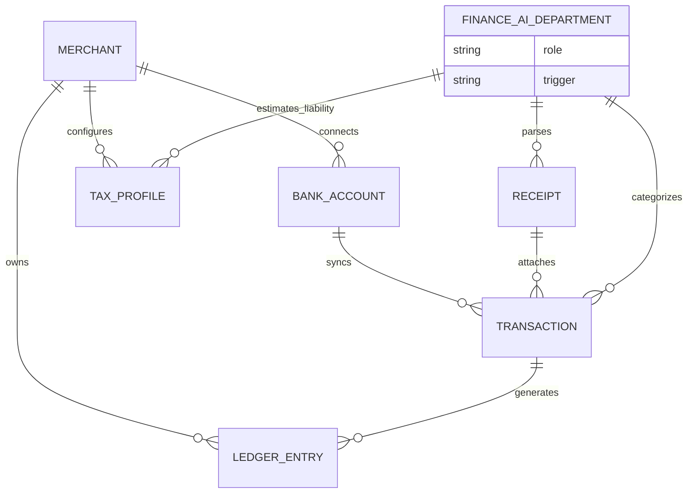

# Title: Implement Invisible Autonomous Bookkeeping and Tax Ledger

## Problem Statement

For non-technical small business owners like Maya (the baker) and Carlos (the handyman), managing finances is a dreaded, error-prone task. They are experts in their craft, not in double-entry bookkeeping, expense categorization, or quarterly tax estimations. Traditional software like QuickBooks requires them to understand charts of accounts and manual reconciliations—failing the "grandmother test." When tax season arrives, they scramble to compile receipts, often overpaying taxes or missing deductions because their business and personal finances get tangled, or they simply forget to track cash expenses. They need a system that tracks every cent invisibly, automatically categorizes expenses, sets aside estimated taxes, and generates compliant reports without them ever needing to touch a spreadsheet or know what a ledger is.

## Research Report

**Market Gap:**
*   **Shopify / Wix / Squarespace:** They track sales well but have rudimentary expense tracking and almost no native, automated tax estimation (they rely on clunky third-party apps). They don't handle the full profit-and-loss lifecycle for hybrid physical/service businesses easily.
*   **QuickBooks / Xero:** Built for accountants. The learning curve is immense for a solopreneur. The mobile apps are secondary interfaces for viewing data, not full-featured autonomous systems.
*   **Stripe / Square:** Good at transaction processing and payouts, but they do not automatically handle receipt OCR, expense categorization from external bank accounts, or proactive tax reserving based on dynamic local tax codes.

**Competitive Analysis:**
We lack an integrated, zero-touch financial ledger. OHC must provide a system where the AI acts as a virtual CFO. Every transaction (inbound payment, outbound expense, or uploaded receipt) is instantly reconciled, categorized, and recorded in a multi-tenant, immutable ledger. This system must calculate estimated tax liabilities in real-time and suggest (or automate) tax withholding, keeping the user compliant effortlessly.

## Design Doc

### Architecture Diagram

### Mobile UX Flow (375px first) & UI Wireframes
*   **Home/Dashboard:** A simple "Money In / Money Out" card. No mention of "Ledger" or "Reconciliation".
*   **Profit & Tax Card:** Shows current profit and a clearly marked "Estimated Tax Safe" (money the AI suggests reserving for taxes).
*   **The "Scan & Forget" Flow:**
    1.  User taps the "+" button on the bottom nav and selects "Snap Receipt".
    2.  Camera opens. User snaps a photo of a hardware store receipt.
    3.  A bottom sheet slides up briefly: "AI is categorizing your $45.20 expense at Home Depot... Done. Marked as 'Supplies'."
*   **Advanced Settings (Hidden):** Only here do we show CSV exports, detailed charts of accounts (mapped automatically for tax purposes), and accountant access toggles.

### AI Agent Integration Points
*   **Finance Department (Receipt OCR & Categorizer):** Triggers when a photo is uploaded or a bank feed syncs a new transaction. Uses LLMs to infer the business purpose (e.g., "Home Depot" + Carlos's profile as a handyman = "Job Materials/Supplies", not "Office Expenses").
*   **Legal/Tax Department:** Continuously monitors net income and local tax jurisdiction rules to update the "Estimated Tax Liability" pool dynamically.

### Key Design Decisions
*   **Event-Sourced Immutable Ledger:** Under the hood, all financial changes are append-only. This ensures auditability and guarantees no data loss, but this complexity is entirely hidden from the user.
*   **Zero-Trust Multi-Tenancy:** Each merchant's financial data is strictly isolated. The AI models only have context for the specific merchant to avoid cross-pollination of sensitive financial data.
*   **Offline-First Snap:** The receipt scanner must work instantly offline. The image is cached locally and the AI categorization queue processes it once connectivity is restored, without blocking the user.

## Implementation Prompt

**User-Facing Outcome:**
Deploy an invisible bookkeeping engine that automatically tracks income, categorizes expenses, and estimates tax liability in real-time. The user experience must consist of simply connecting a bank account or snapping photos of receipts. The dashboard should display simple "Money In", "Money Out", and "Tax to Save" metrics.

**Core User Journeys (CUJ):**
1.  **Expense Capture:** The user snaps a picture of a receipt while offline. The app saves it and, upon reconnecting, the AI automatically reads the amount, vendor, and date, and categorizes it without user intervention.
2.  **Tax Estimation:** As sales occur on OHC, the system automatically calculates the estimated income tax and updates a "Tax Safe" display, advising the user how much cash to hold back.
3.  **Bank Sync:** Bank feed transactions are silently mapped to ledger categories by the Finance AI Department based on the user's business type.

**Acceptance Criteria:**
*   Mobile-first design (375px) with translucent glass UI cards for financial summaries.
*   Receipt capture works offline and syncs in the background.
*   Finance AI reliably categorizes transactions without requiring manual rules.
*   Strict multi-tenant isolation of the underlying immutable ledger.
*   No accounting jargon (e.g., "debit", "credit", "reconciliation") is visible in the default UI.

## Priority
P0

## Estimated Scope
Large