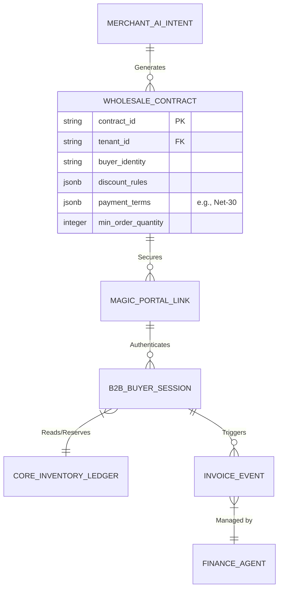

# [architecture] Invisible B2B Wholesale Engine

## Title
Invisible B2B Wholesale Engine

## Problem Statement
For business owners like Maya (baker, 28) and Priya (boutique owner, 35), growing their business often means moving from single B2C orders to bulk B2B wholesale orders (e.g., supplying a local cafe with 50 cupcakes daily, or a neighboring store with 20 dresses). Currently, managing this requires manual spreadsheets, disjointed invoicing software, and constantly negotiating minimum order quantities (MOQs) or Net-30 payment terms via email. If they try to do this on their existing website, they either have to create clunky discount codes or manually duplicate their entire catalog. They need a system where they can seamlessly offer customized, bulk pricing to specific partners without touching a single complex configuration screen.

## Research Report
*   **Shopify:** True B2B and wholesale features (like company profiles, price lists, and Net terms) are locked behind Shopify Plus, which starts at $2,000/month—completely out of reach for Maya and Priya. Standard tier users rely on hacky workarounds like third-party apps or completely separate storefronts.
*   **Wix / Squarespace:** Lack native B2B functionality. Merchants typically password-protect a specific page or rely on static discount codes, which fails to handle complex logic like MOQs or invoice-based payment terms.
*   **OHC Differentiation - "Invisible B2B":** Instead of forcing the merchant to build a separate wholesale website or manage complex pricing matrices, OHC uses the **Sales Agent** and **Finance Agent**. Priya simply tells the AI, "Give the Downtown Cafe a 20% discount on all dresses if they buy at least 10, and give them 30 days to pay." The AI instantly generates a secure, magic link for the Cafe that acts as a personalized purchasing portal, seamlessly syncing with Priya's existing core inventory.

## Design Doc

### Architecture Diagram (Mermaid.js)

### UI Wireframes & Mobile UX Flow (375px First)

**Screen 1: The AI Command (Merchant Dashboard)**
*   A clean, translucent glass chat interface within the OHC app.
*   Priya types or speaks: *"Set up a wholesale link for Downtown Cafe. 20% off all items, Net-30 terms, minimum 10 items."*

**Screen 2: The Action Feed Approval**
*   The Action Feed displays a summary card generated by the Sales Agent.
*   **Card details:** Buyer: Downtown Cafe. Terms: 20% Discount, Net-30, MOQ: 10.
*   **Action Button:** Primary button `[ Approve & Copy Link ]` or `[ Edit Terms ]`.

**Screen 3: The B2B Buyer Portal (Customer View on Mobile)**
*   The cafe owner clicks the magic link on their phone.
*   No password required (authenticated via secure token).
*   They see Priya's standard catalog, but all prices dynamically reflect the 20% discount.
*   The checkout button is disabled until they add 10 items to the cart.
*   At checkout, the payment option defaults to "Pay via Invoice (Net-30)" instead of requiring an immediate credit card.

### AI Agent Integration Points
*   **Sales Agent:** Parses natural language to construct the `WHOLESALE_CONTRACT` (discount rules, MOQs).
*   **Operations Agent:** Ensures wholesale orders draw from the exact same `CORE_INVENTORY_LEDGER` as retail orders to prevent double-selling.
*   **Finance Agent:** Takes over once the B2B order is placed. It autonomously generates the professional PDF invoice, emails it to the buyer, and handles friendly follow-up reminders on day 25, 29, and 31.

### Key Design Decisions (Why, not How)
*   **Single Unified Inventory:** Retail and wholesale must share the same underlying ledger. Duplicating catalogs for B2B is a massive pain point on other platforms and leads to overselling.
*   **Magic Links over Accounts:** Forcing B2B buyers to create accounts and remember passwords adds friction. A secure, cryptographically signed magic link provides instant access to their specific pricing tier.
*   **Abstracting Complexity via AI:** Pricing matrices and tier setups are extremely confusing. Using conversational UI to define business rules completely eliminates the technical learning curve for the merchant.
*   **Zero-Trust Isolation:** The `MAGIC_PORTAL_LINK` must strictly bind the buyer to a specific `tenant_id` and contract. The B2B buyer must never be able to access other tenants' data or modify their own discount rules.

## Implementation Prompt
**To the Implementer Swarm:**
Your objective is to architect and build the Invisible B2B Wholesale Engine. A non-technical merchant must be able to create custom wholesale pricing tiers and payment terms (like Net-30) for specific partners simply by interacting with their AI Sales Agent.

**Acceptance Criteria:**
*   **Conversational Setup:** The backend must successfully parse natural language rules (discount %, MOQ, payment terms) into a structured contract entity.
*   **Mobile Parity:** The B2B buyer portal must be flawlessly usable on a 375px viewport, utilizing our Translucent Glass design tokens.
*   **Magic Link Access:** The system must generate a secure, tenant-isolated magic link that grants the buyer access to their specific pricing view without requiring a password login.
*   **Unified Ledger:** Wholesale purchases must synchronously deduct from the core inventory ledger to prevent conflicts with retail sales.
*   **Finance Integration:** Upon checkout, the system must support delayed payment (invoice) terms, handing off the ledger event to the Finance Agent for future collection.

*(Note: Focus on the robust modeling of these business rules and the secure multi-tenant routing. You are fully empowered to design the exact data schemas and API endpoints required.)*

## Priority
P1

## Estimated Scope
Large
