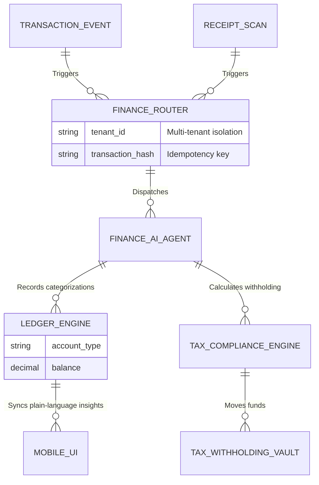

# [architecture] Invisible Bookkeeping and Tax Compliance Engine

## Title
Invisible Bookkeeping and Tax Compliance Engine

## Problem Statement
Small business owners like Carlos (a handyman) and Priya (a boutique owner) dread tax season and the administrative burden of daily accounting. They are experts in their crafts, not in double-entry bookkeeping, expense categorization, or calculating localized sales tax rules. Currently, they either guess, spend hours wrangling spreadsheets, or pay expensive CPAs for basic reconciliation. The friction of separating business and personal expenses or understanding cash flow health often leads to financial anxiety. They need an invisible, zero-touch financial layer that categorizes transactions automatically, sets aside taxes dynamically upon payment, and generates compliant reports without requiring them to understand accounting jargon like "chart of accounts" or "liabilities."

## Research Report
*   **Shopify:** Offers basic sales tax calculation and reports, but relies on third-party apps (like QuickBooks Online or Xero) for true bookkeeping and expense tracking. This breaks the single-platform promise and introduces accounting terminology to the merchant.
*   **Wix / Squarespace:** Provide simple revenue overviews but completely lack integrated expense management, localized tax withholding, and autonomous bookkeeping.
*   **QuickBooks / Xero:** The industry standards, but they are built for accountants, not micro-business owners. Their mobile apps are companions rather than primary tools, and they fail the "grandmother test" by requiring knowledge of reconciliation and ledger balancing.
*   **OneHumanCorp (OHC) Differentiation - "Invisible Bookkeeping":** OHC eliminates the concept of bookkeeping entirely for the user. By tightly coupling the multi-party ledger, payout routing, and the **Finance AI Agent**, OHC intercepts every transaction, auto-categorizes it using context from the Unified Inbox and Operations Engine, dynamically withholds estimated tax to a dedicated safe account, and presents the user with simple, plain-language cash flow insights.

## Design Doc

### Architecture Diagram

### UI Wireframes & 375px Baseline
**Core Layout: macOS-style Translucent Glass + Ubiquiti UniFi Modular Dashboard Cards**
*   **Global Viewport:** 375px width (Mobile First). No horizontal scrolling.
*   **Finance Dashboard:**
    *   **Hero Card (The "Safe to Spend" Balance):** A prominent, visually clear number showing real available cash, separated from withheld taxes. Frosted green glass.
    *   **Tax Vault Card:** A secondary card showing funds automatically set aside for taxes. "Taxes saved: $450 (On track for Q3)".
    *   **Recent Activity List:** A vertically scrolling list of recent transactions.
        *   Each transaction is instantly auto-categorized with a recognizable icon (e.g., a gas pump for fuel, a camera for marketing).
        *   Transactions needing human review have a subtle glowing amber badge (e.g., "Was this Home Depot trip for Carlos's business or personal?").
*   **Smart Receipt Scanner:**
    *   A floating action button (FAB) that opens the camera. The AI instantly extracts the merchant, total, and line items, classifying the expense without manual data entry.

### Mobile UX Flow
1. **The Transaction:** Priya buys inventory using her OHC business card or bank link.
2. **Invisible Processing:** The Finance AI Agent sees the transaction, reads the vendor name, and auto-categorizes it as "Cost of Goods Sold" in the background.
3. **The Withholding:** When Priya makes a sale, the Tax Compliance Engine calculates the local sales tax and her estimated income tax, routing those specific cents to the "Tax Vault" invisibly before the remaining profit hits her "Safe to Spend" balance.
4. **The Notification:** "You earned $100! We saved $15 for taxes, so you have $85 safe to spend."
5. **The Resolution:** If a transaction is ambiguous, the AI Ambassador sends a casual push notification: "Hey Carlos, was that $45 at Lowe's for the Smith job?" Carlos taps "Yes," and the ledger updates.

### AI Agent Integration Points
*   **Finance AI Agent:** The core brain. It learns the business's spending patterns, matches receipts to bank feeds, and translates complex ledger data into plain English summaries.
*   **Operations AI Agent:** Shares context with the Finance Agent. (e.g., "We just ordered 50 vegan cakes, expect a large flour expense soon.")
*   **Ambassador Agent:** Handles the human-in-the-loop interaction, asking conversational questions to clarify ambiguous transactions.

### Key Design Decisions
*   **No Accounting Jargon:** Terms like "Debit", "Credit", "Reconciliation", or "Chart of Accounts" are banned from the default UI. We use "Money In", "Money Out", and "Safe to Spend".
*   **Proactive Tax Withholding:** By default, the system intercepts revenue and sets aside estimated tax obligations. This is crucial for solopreneurs who often face tax bills they haven't saved for.
*   **Conversational Clarification:** Instead of presenting a grid of uncategorized expenses, the system treats categorization as a chat, asking the user simple questions when it lacks confidence.
*   **Zero Trust & Idempotency:** The Ledger Engine enforces strict multi-tenant boundaries. All financial operations are idempotent to prevent duplicate records during mobile network drops.

## Implementation Prompt
**Role:** Implementer Agent
**Task:** Build the Invisible Bookkeeping and Tax Compliance Engine core flows.
**User Journey (CUJ):** As a small business owner, when I receive a payment or make a business purchase, the system should automatically categorize the transaction, calculate required tax withholdings, and update my "Safe to Spend" and "Tax Vault" balances in real-time, displaying this in a simple, mobile-first dashboard.
**Acceptance Criteria:**
1.  **Event Ingestion:** Create a secure, idempotent router that ingests raw transaction events.
2.  **AI Categorization:** Integrate the Finance AI Agent to automatically assign a plain-language category to the transaction based on context.
3.  **Tax Routing:** Implement logic that intercepts incoming revenue events, calculates localized tax withholding, and updates the distinct "Tax Vault" and "Safe to Spend" balances.
4.  **Mobile-First State:** Ensure the mobile UI state strictly reflects these separated balances without exposing underlying double-entry ledger complexity to the user.
5.  **Conversational Escalation:** Build the flow for the Ambassador Agent to query the user for ambiguous transactions.
**Note:** Do not prescribe specific database schemas (e.g., PostgreSQL tables) or API routes. Design the high-level components to fulfill these outcomes reliably and safely.

## Priority
P0

## Estimated Scope
Large
