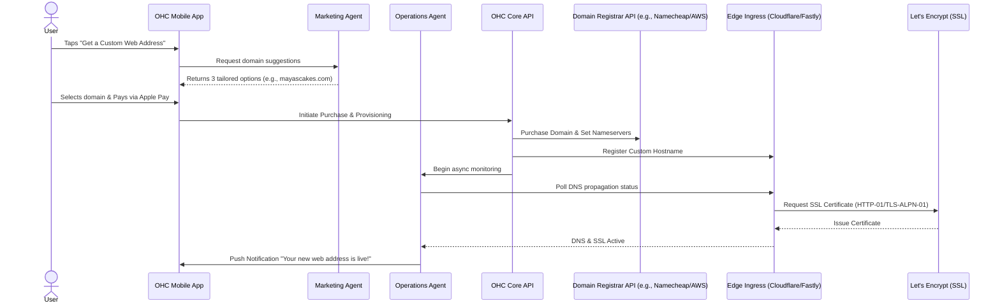

# Architectural Mapping of the Invisible Custom Domain and SSL Provisioning Engine

## Title
Invisible Custom Domain and SSL Provisioning Engine

## Problem Statement
The transition from a default platform subdomain (e.g., `maya-bakery.onehumancorp.com`) to a professional custom domain (e.g., `mayasvegancakes.com`) is a critical milestone for any small business, signaling trust and permanence. However, the current process on many platforms requires non-technical owners to grapple with DNS registrars, A-records, CNAMEs, TXT records, and SSL certificate provisioning. For personas like Maya the Baker or Carlos the Handyman, who run their businesses entirely from a mobile phone, this technical friction often results in abandonment or reliance on expensive third-party technical help. OneHumanCorp (OHC) requires an invisible, zero-config domain engine that allows users to search, purchase, configure, and secure a custom domain with a single tap, entirely from a 375px mobile interface.

## Research Report
### Context and Personas
This capability directly accelerates the "Revenue" and "Retention" stages of our personas:
1.  **Maya (Home Baker, 28)**: Needs a custom domain to look professional on Instagram. Cannot afford downtime or misconfigured DNS records.
2.  **Carlos (Handyman, 42)**: Wants a simple, memorable URL to print on his physical business cards and truck decals.
3.  **Priya (Boutique Owner, 35)**: Already has a domain with GoDaddy and needs a frictionless way to migrate or connect it without touching DNS settings.
4.  **Leo (Music Tutor, 22)**: Needs a clean domain for his TikTok link-in-bio to increase conversion rates.
5.  **Fatima (Food Cart Operator, 50)**: Requires automated handling of all technical aspects; English is her second language, so the flow must rely on simple visual cues rather than technical jargon.

### Competitor Systems Audit
-   **Shopify**: Offers native domain purchasing and automatic SSL provisioning via Let's Encrypt. However, connecting an existing domain still often requires manual DNS configuration unless the registrar supports Domain Connect. The mobile experience can be clunky when dealing with third-party connections.
-   **Wix**: Provides domain purchasing but heavily upsells. SSL is automatic, but DNS management is exposed to the user, causing potential confusion.
-   **Squarespace**: Seamless domain purchase integration, but transferring or connecting external domains still surfaces technical terminology (A, CNAME records).
-   **OHC Opportunity**: Completely abstract DNS and SSL. Provide 1-tap purchasing via Apple Pay/Google Pay on mobile. For external domains, utilize an AI Operations Agent to automatically detect the registrar and guide the user through an OAuth-style Domain Connect flow, or handle it completely in the background.

## Design Doc
### Key Design Decisions
-   **Zero-Config Philosophy**: Users never see DNS records (A, CNAME, TXT) unless they explicitly enable "Advanced Developer Mode".
-   **1-Tap Mobile Purchasing**: Domain purchases are treated like in-app purchases or simple mobile checkouts (Apple Pay / Google Pay).
-   **Automated SSL (Zero Trust)**: Every domain, whether purchased via OHC or connected externally, receives an automatic, auto-renewing SSL certificate via an ACME client integration (e.g., Let's Encrypt).
-   **AI Department Coordination**:
    -   *Marketing Agent*: Suggests available, relevant domain names based on the user's business profile and location.
    -   *Operations Agent*: Handles the background polling for DNS propagation and SSL issuance, notifying the user only upon successful activation.
    -   *Legal/Compliance Agent*: Manages ICANN WHOIS privacy settings automatically.

### Architecture Diagram (Mermaid.js)

### Data Model & Invariants
-   **Entities**:
    -   `DomainRecord`: tenant_id, domain_name, source (purchased/connected), status (pending, active, failed), auto_renew (boolean).
    -   `SSLConfiguration`: domain_id, provider (lets_encrypt), expiry_date, status.
    -   `TenantIngressConfig`: Maps active domains to the tenant's primary storefront or booking page.
-   **Multi-Tenant Isolation**: Strict logical partitioning ensures `Tenant A` cannot map `Tenant B`'s domain. Edge ingress dynamically routes traffic based on the validated `Host` header.
-   **Zero Trust**: All internal communication between the Core API, Edge Provider, and Registrar API requires mTLS and strictly scoped API keys.

### Mobile-First UX Flow (375px)
1.  **Discovery Card**: A clean, glassmorphic card on the dashboard says: "Upgrade to a professional web address."
2.  **Suggestion Screen**: "We found these available names for Maya's Cakes." Three large, tappable buttons with prices (e.g., "$12/year"). No technical jargon.
3.  **Checkout**: Native Apple Pay / Google Pay sheet slides up. 1-tap confirmation.
4.  **Optimistic State**: The dashboard updates immediately: "We're setting up mayascakes.com. We'll notify you when it's ready."
5.  **Success**: A rich push notification arrives: "🎉 mayascakes.com is live! Tap to view your new site."

### Performance & Offline Targets
-   **Latency**: Domain suggestions must return in < 800ms.
-   **Offline Capability**: If the user loses connection during the purchase, the KAIROS Orchestrator queues the transaction and completes it once connectivity is restored, notifying the user via push.

## Implementation Prompt
**To Implementer Agent:**
Implement the Invisible Custom Domain and SSL Provisioning Engine. This includes the data models (`DomainRecord`, `SSLConfiguration`) and the Core API endpoints necessary to interface with a mock Domain Registrar API and an Edge Ingress provider. Build the mobile-first (375px) UI flow that allows a user to search for a domain, select from AI-suggested options, and initiate a purchase using a simulated 1-tap payment method. Ensure the backend handles the asynchronous nature of DNS propagation and SSL issuance using a robust background job queue, updating the UI optimistically and triggering a final success notification. Adhere strictly to the Zero-Config philosophy: do not expose DNS records or SSL terminology to the user. Include unit and integration tests verifying the end-to-end flow from search to successful provisioning.

## Priority
P1

## Estimated Scope
Large
