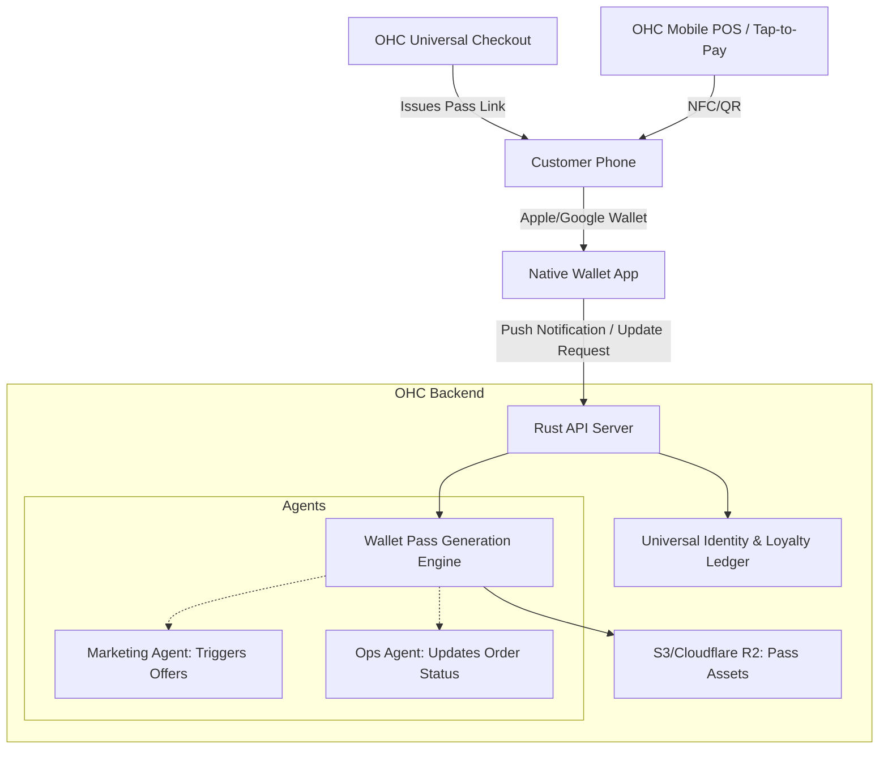

# [architecture] Invisible Digital Wallet and Loyalty Pass Engine

## Problem Statement

Small business owners—like Fatima (food cart) and Priya (boutique)—struggle with customer retention. Traditional paper punch cards get lost in wallets or laundry, and bespoke custom "loyalty apps" suffer from terrible adoption rates because customers do not want to download another app for a single store. Furthermore, when Maya (baker) takes custom orders with deposits, the customer often lacks a unified, branded digital artifact that represents their order status, receipt, and loyalty status all in one place. We need an invisible, frictionless way to embed loyalty, order tracking, and identity directly into the customer's native ecosystem (Apple Wallet & Google Wallet) without requiring them to install an app or remember a password.

## Research Report

**Industry Context:**
Major retail chains (Starbucks, Target) leverage highly integrated digital loyalty programs that drive a substantial percentage of recurring revenue. However, SMB platforms (Shopify, Square) often rely on email-based points systems or generic POS-screen phone number prompts which fail to establish a persistent branded presence on the customer's device.

**Competitor Analysis:**

- **Shopify:** Relies heavily on third-party apps (e.g., Smile.io) which cost extra and often just create a widget on the storefront rather than a native mobile wallet pass.
- **Square:** Offers phone-number based loyalty at the POS terminal, but lacks the rich, persistent push-notification capability of a native digital wallet pass for pre-orders or online bookings.
- **Wix/Squarespace:** Point systems are locked behind complex site logins.

**Opportunity for OneHumanCorp:**
By leveraging the native PKPass (Apple) and Google Wallet APIs, OHC can automatically generate and distribute branded, dynamic wallet passes immediately upon a customer's first interaction (purchase, booking, or quote request). These passes can update dynamically (e.g., "Your cake is ready for pickup", "You have 9/10 points") via push notifications, giving SMBs enterprise-grade retention tools with zero setup.

## Design Doc

### Architecture Diagram

### UI Wireframes & Mobile UX Flow (375px)

**Business Owner View (The "Grandmother Test"):**

- **Settings Screen:** A simple toggle switch: "Enable Digital Loyalty Cards". (No mention of Apple Wallet APIs or PKPass).
- **Design Screen:** Auto-populated from the store's primary colors and logo. A preview card shows how it looks on a phone.
- **Customer Detail Screen:** Shows a simple counter "Loyalty Points: 42".

**Customer UX Flow:**

1. **Checkout/Booking:** Customer completes a transaction on an OHC checkout (web or tap-to-pay).
2. **Delivery:** The confirmation screen and receipt email include a prominent, standard "Add to Apple Wallet" / "Save to Google Pay" button.
3. **Usage:** The pass lives on the user's phone. It displays a QR code or NFC payload tied to their OHC Universal Identity.
4. **Update:** When Maya updates the cake order to "Ready", the Ops Agent updates the wallet pass over the air, triggering a native push notification on the customer's phone: "Your cake from Maya's Bakery is ready!"

### AI Agent Integration Points

- **Operations Agent:** Automatically updates the pass state (e.g., Order Status, Next Appointment Time) based on backend ledger changes, triggering native push notifications.
- **Marketing Agent:** Can temporarily alter the visual design of the pass (e.g., adding a "Holiday Special: 2x Points" banner) and push updates to all active pass holders for a specific business.
- **Finance/Ledger:** Ensures strict multi-tenant isolation so points accrued at Priya's boutique cannot be spent at Fatima's food cart unless explicitly configured as a shared community coalition.

### Key Design Decisions

- **Zero App Download:** Strictly utilize native wallet APIs. OHC will not build a consumer-facing aggregator app.
- **Dynamic Updates:** Passes must be dynamic (updatable via API) to serve double-duty as both a loyalty card and a real-time order/appointment tracker.
- **Zero Trust Security:** Pass payloads must be cryptographically signed to prevent spoofing of loyalty points. The OHC API will validate the pass signature against the Universal Ledger during redemption.

## Implementation Prompt

**To the Implementer Agent:**
Build the Wallet Pass Generation Engine. It must expose endpoints to create, sign, and update Apple PKPass and Google Wallet objects.

1. The engine should automatically pull branding (logo, colors) from the existing tenant configuration.
2. It must provide a simple API for other internal services (like the Checkout Engine or Booking Engine) to request a pass link for a specific customer identity.
3. Ensure the service handles the background push notification mechanisms required by Apple/Google to update passes seamlessly.
4. Acceptance Criteria: A customer completing a test checkout should be able to click "Add to Wallet", see a branded pass in their native OS wallet, and receive a push notification when an admin updates their order status.

## Priority

P1 (High) - Crucial for driving the retention and customer LTV narrative for our core personas.

## Estimated Scope

Medium
