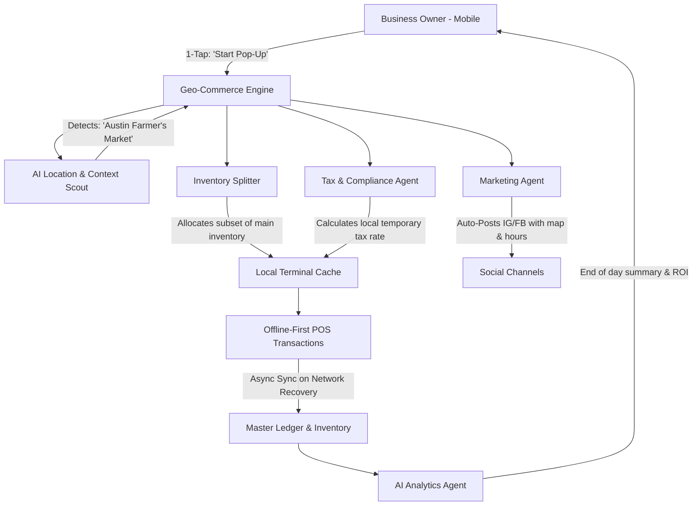
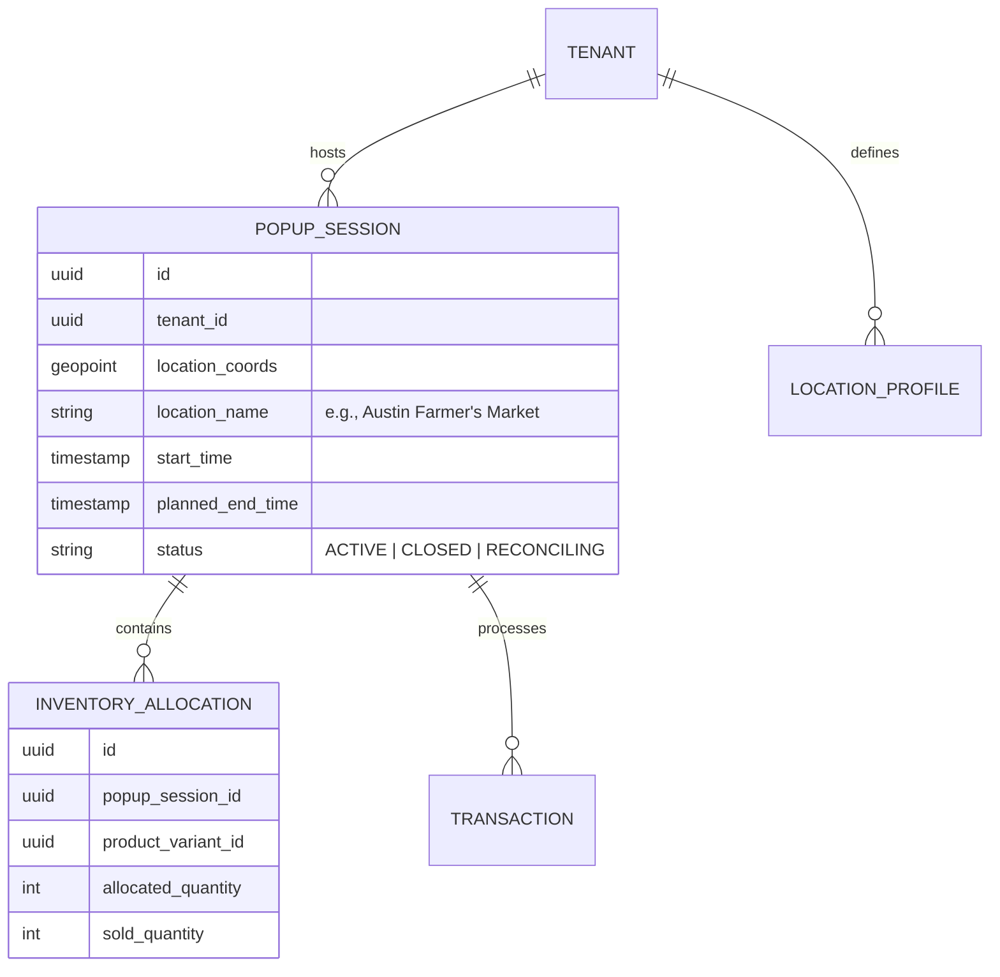

# [Architecture] Invisible Dynamic Pop-Up & Geo-Commerce Orchestration Engine

## 1. Title
**Invisible Dynamic Pop-Up & Geo-Commerce Orchestration Engine: Turning the World into a Storefront**

## 2. Problem Statement
Small business owners like **Priya (boutique owner)** and **Fatima (food cart operator)** often operate in temporary, dynamic, or shifting locations. Priya might have a physical store but regularly runs weekend pop-up shops at local farmers' markets or festivals. Fatima's food cart might change location daily or weekly based on foot traffic or events.

Currently, setting up a temporary storefront or managing geo-dependent commerce is incredibly manual. Owners have to manually update their location on social media, create temporary inventory segments to avoid double-selling items back at their main store, and configure clunky POS systems for offline/unreliable network conditions. They also miss out on hyper-local discovery ("Who is around me *right now*?"). Legacy platforms like Shopify or Wix are fundamentally anchored to static web addresses or single fixed physical locations. They lack the agility to seamlessly split inventory, broadcast location, and accept offline payments in a 24-hour geo-fenced scenario.

## 3. Research Report
### Competitive Landscape & Market Gap
*   **Shopify POS / Square:** Strong point-of-sale systems, but they treat a pop-up as just another permanent "Location" in the backend. Setting up a new location requires administrative overhead (creating the location, transferring inventory, setting up tax rates). It's not built for a temporary 6-hour event.
*   **Instagram / Meta:** Great for broadcasting location (e.g., Stories "We're at the farmer's market!"), but entirely disconnected from the actual inventory, ordering, and payment systems.
*   **Food Truck / specialized apps (e.g., StreetFoodFinder):** Niche solutions that don't connect to the core business operating system (inventory, CRM, accounting).

### The OHC Opportunity
OHC can introduce a "Geo-Commerce Orchestration Engine" that allows a business to instantiate a temporary, fully functioning digital and physical node with 1-tap. By tightly coupling offline-first POS capabilities, geo-fenced discoverability, autonomous inventory segmentation, and automated social broadcasting, OHC turns a complex administrative nightmare into a seamless growth lever.

## 4. Design Doc

### Architecture Diagram (Mermaid.js)

### Data Model & Invariants

### Mobile-First UX Flow (375px First)
1. **The "Go Live" Button**: A prominent, glowing "Start Pop-Up" button on the main dashboard for relevant business types.
2. **Context Auto-Detect**: The app requests location. "Looks like you're at the *Downtown Weekend Market*. Want to start a pop-up here until 5 PM?"
3. **Inventory Quick-Select**: "What did you bring?" AI suggests previous pop-up items or the user can tap to quickly scan/select items. "Allocate 50 Vegan Cakes to this pop-up."
4. **The Broadcast**: "I'll update your IG Story and website banner that you're here until 5 PM. [Approve]"
5. **The Local POS View**: The app switches into high-contrast, offline-first POS mode. Only allocated items are shown. Network status is subtly indicated, but transactions always succeed locally.
6. **The Wrap-Up**: At 5 PM, "Pop-up closed! You sold 45 cakes. I'm moving the remaining 5 back to main inventory and tallying your local taxes."

### AI Agent Integration Points
- **Marketing Agent**: Automatically generates geo-tagged social media posts and updates the business's public OHC storefront banner ("Find us today at X!").
- **Operations/Inventory Agent**: Manages the temporary "branch" of inventory to prevent double-selling online and handles the end-of-day reconciliation automatically.
- **Finance/Tax Agent**: Calculates the specific local tax jurisdiction rates for the temporary location to ensure compliance without manual setup.

### Key Design Decisions
- **Ephemeral Infrastructure**: A Pop-Up Session is designed to be temporary. It auto-cleans up and reconciles data when closed, leaving no administrative cruft in the main dashboard.
- **Zero-Configuration Offline Mode**: The moment a Pop-Up starts, essential data (allocated inventory, tax rates, cached customer data) is aggressively pinned to local storage (SPIFFE/SPIRE secured enclave) to guarantee zero downtime in crowded, low-signal areas.
- **Plain English Abstractions**: Avoid terms like "Inventory Transfer", "Location ID", or "Tax Nexus". Use "What did you bring?" and "Where are you today?".

## 5. Implementation Prompt
**Task for Implementer Agent:**
Implement the backend Geo-Commerce Engine and the mobile UI for the "Invisible Dynamic Pop-Up" feature.

**User-Facing Outcome:**
Priya arrives at a farmer's market. She taps "Start Pop-Up". The system auto-detects her location, asks her to quickly confirm the inventory she brought, and immediately updates her social media and website banner. Her phone switches into an offline-resilient POS mode. At the end of the day, she taps "Close Pop-Up," and the system automatically reconciles her inventory, calculates her temporary local taxes, and provides a plain-english daily summary of her market performance.

**Acceptance Criteria:**
1. Define the `PopupSession` and `InventoryAllocation` data entities with multi-tenant isolation.
2. Implement the "Inventory Splitter" logic to safely ring-fence stock from the main catalog during the active session.
3. Build the 375px mobile UI flow: Location auto-detect, Inventory quick-select, and the high-contrast POS mode using OHC design tokens.
4. Integrate with the Operations Agent to handle the automatic closing and reconciliation of the session when the `planned_end_time` is reached or the user manually closes it.
5. Ensure the offline-first transaction queue prioritizes high-speed local processing and reliable background sync.
6. Hide all complex configurations; the setup must take less than 30 seconds.

## 6. Priority
**P1** (High - Unlocks significant new revenue channels and solves a massive pain point for physical/hybrid SMBs).

## 7. Estimated Scope
**Large** (Requires complex inventory state management, location services integration, and offline-first data synchronization).