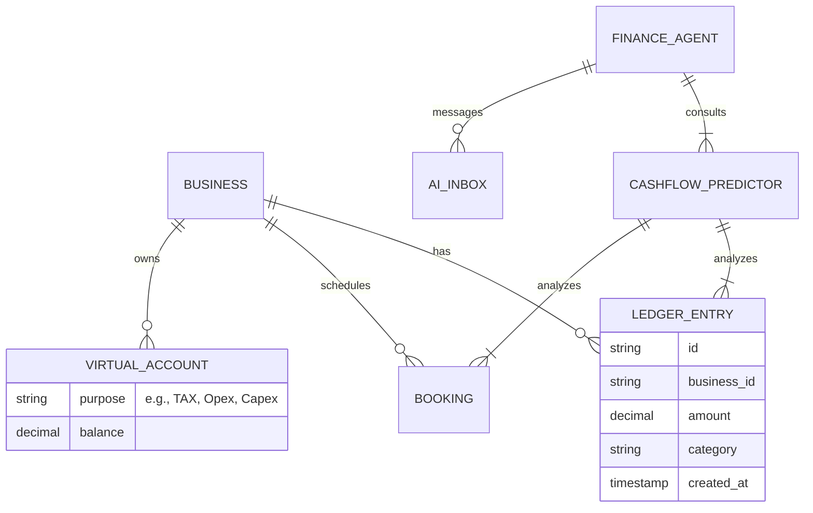
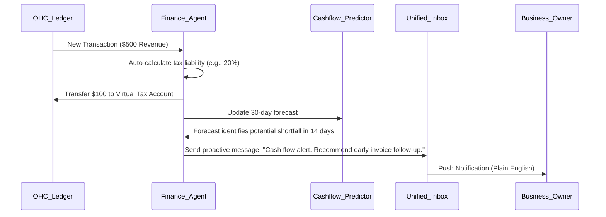

# [Architecture] Invisible Fractional CFO and Cashflow Engine

## Title
Invisible Fractional CFO and Cashflow Engine

## Problem Statement
Small business owners (like Maya the baker or Carlos the handyman) don't have the time, expertise, or resources to manage a traditional accounting system (e.g., QuickBooks or Xero). They struggle with cash flow forecasting, understanding their true profitability, setting aside money for taxes, and determining when they can afford to invest in their business (like buying a new oven or hiring an assistant). Financial anxiety is a primary reason for small business failure. They need financial intelligence that is proactive, invisible, and actionable in plain English.

## Research Report
*   **Competitor Landscape:**
    *   **QuickBooks/Xero:** Built for accountants, not micro-business owners. Requires manual reconciliation, chart of accounts setup, and jargon (e.g., "debits," "credits," "accrual vs. cash").
    *   **Shopify/Wix:** Basic sales reporting and dashboard metrics, but lack predictive cashflow and intelligent expense management. They tell you what happened, not what *will* happen or what you *should* do.
    *   **Stripe:** Offers capital and basic reporting, but isn't a holistic CFO.
*   **Gap:** No platform automatically segregates funds for taxes, predicts cash flow crunches based on historical seasonality and upcoming calendar bookings, or proactively advises the owner on pricing adjustments or capital expenditure via an AI conversational interface.
*   **Opportunity:** OneHumanCorp can leapfrog by integrating a "Finance Department AI Agent" that monitors the multi-party ledger, calendar bookings, and supply costs in real-time, offering proactive, non-jargon advice and automated tax set-asides directly via the unified AI Inbox.

## Design Doc

### Mobile-First UX Flow
1.  **The "Financial Health" Card (375px):** A UniFi modular card on the home dashboard using translucent glass materials. It simply shows "Safe to Spend: $X", "Reserved for Taxes: $Y", and a simple green/yellow/red pulse indicator for cashflow health over the next 30 days.
2.  **Proactive Alerts:** "Heads up Maya, based on your upcoming cake orders and expected supply costs, your cash flow looks tight next week. Want me to offer a 10% discount on Tuesday to drive more pre-orders?" -> [Yes, do it] [No, thanks]
3.  **Advanced Settings (Hidden):** The traditional P&L, balance sheet, and tax export ledgers are tucked away under a "Send to my Accountant" or "Advanced Settings" switch.

### Architecture Diagram

### AI Department Coordination
*   **Finance Agent (Primary):** Constantly monitors the ledger, calculates tax withholding dynamically based on the user's jurisdiction, and manages virtual bucket accounts.
*   **Operations Agent (Coordination):** Provides the Finance Agent with data on upcoming material costs (e.g., ingredients needed for next week's bookings).
*   **Marketing Agent (Coordination):** Executes promotional campaigns triggered by the Finance Agent's cash flow shortage alerts.

### Performance & Security Targets
*   **Zero Trust & Multi-Tenant Isolation:** Financial data is the most sensitive tenant data. Strong SPIFFE/SPIRE identity required for any cross-service RPC accessing the Ledger. Each tenant's financial data must be strictly isolated at the database level (e.g., tenant_id indexing and row-level security).
*   **Performance:** The cash flow predictor must run asynchronously in a background job queue to avoid blocking the main transaction path. Real-time ledger updates must clear < 100ms.

## Implementation Prompt
**For the Implementer Agent:**
Implement the "Invisible Fractional CFO and Cashflow Engine" for OneHumanCorp.
1. Build the data models and backend logic to support automatic percentage-based virtual account sweeps (e.g., sweeping 15% of all inbound revenue to a "Tax" virtual account).
2. Implement a background worker that calculates a 30-day cash flow projection using historical ledger entries and upcoming booked revenue (from the calendar).
3. Create the integration point for the Finance AI Agent to push plain-language alerts to the Unified Inbox when projected cash drops below a configurable safe threshold.
4. Ensure the mobile UI components reflect these "Safe to Spend" and "Reserved" buckets using our design system (translucent glass, UniFi modular cards).
Do not prescribe specific database technologies, but ensure strong tenant isolation (Zero Trust). Ensure 100% mobile parity for the UI components.

## Priority
P0

## Estimated Scope
Large
