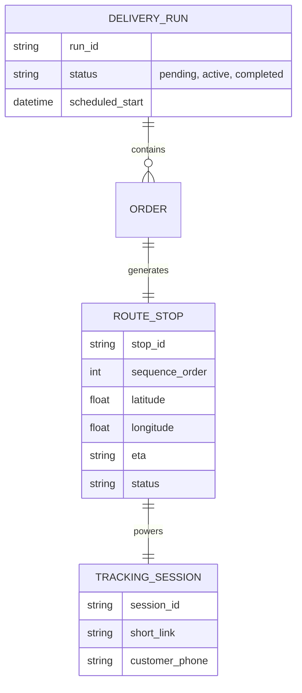
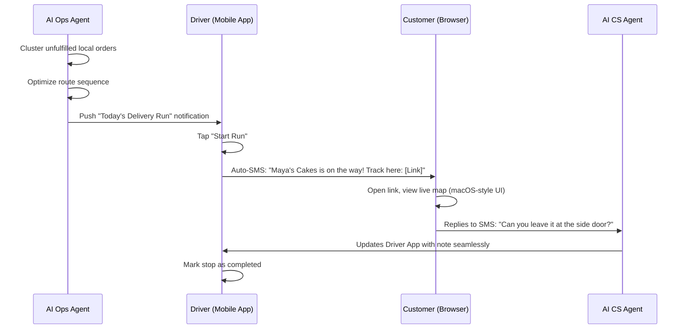

# [Architecture] Invisible Hyperlocal Dispatch & Routing Engine

## Title
Implement an Invisible Hyperlocal Dispatch, Routing, and Live Tracking Engine

## Problem Statement
For founders handling their own deliveries—like Maya dropping off custom cakes or Fatima running pre-ordered catering—the logistics of route planning are completely manual and error-prone. They typically juggle Google Maps, mental routing, and SMS to notify customers. When customers ask, "Where is my order?" or "When will you arrive?", it creates intense anxiety and pulls the founder away from driving or producing. They need an automated, Uber-like live tracking and optimized routing experience for themselves and their customers, without requiring them to purchase third-party fleet software.

## Research Report
**Market Reality:**
- **Shopify & Wix:** Focus heavily on shipping carriers (USPS, FedEx, UPS). Local delivery is often an afterthought, requiring expensive third-party plugins (e.g., Routific, Zippykind) which are complex to set up and too "enterprise-heavy" for a solo founder.
- **The Gap:** Solo founders running field operations (handymen, bakers, local florists) need integrated, turn-by-turn optimized routing for their daily stops, plus a seamless, branded live-tracking link sent automatically to the customer.

**Opportunity for OHC:**
By embedding an Invisible Hyperlocal Dispatch Engine into OneHumanCorp, we eliminate "Financial Fog" around delivery costs and operational friction. Our AI Operations Agent can automatically cluster orders by geographic zone, generate the optimal route sequence, and dispatch it to the founder's mobile app.

## Design Doc

### Architecture Diagram

### UI Wireframes & Mobile UX Flow (375px First)

**Driver Experience (Founder App):**
- **Home Card:** A clean, translucent glass Ubiquiti UniFi modular card displaying "Today's Delivery Run (8 Stops)".
- **Active Route Screen:**
  - Top: Large, readable ETA to next stop.
  - Middle: Map view with the route line.
  - Bottom Sheet (Draggable): Customer details, order contents (e.g., "1x Vegan Chocolate Cake"), and a one-tap "Navigate" button (deep-links to Apple/Google Maps) and a "Mark Delivered" button.
  - **Design Token Integration:** Soft blurs (`backdrop-filter: blur(12px)`), high-contrast primary actions, rounded corners (`border-radius: 16px`).

**Customer Tracking Experience (Web):**
- **Tracking View:** Mobile web (no app download). Clean, branded map using the merchant's theme.
- **Status Card:** Translucent glass floating at the bottom. Shows the driver's approximate location, ETA, and a simple "Contact" button that routes to the AI CS agent.

### AI Agent Integration Points
- **AI Operations Agent:** Automatically processes daily local orders, calculates the optimal traveling salesman route, and batches them into a `Delivery Run`.
- **AI CS Agent:** Handles inbound customer queries during the delivery window ("I'm not home, leave it on the porch") and updates the route stop notes in real-time, notifying the driver only if critical.

### Key Design Decisions
- **Zero Trust & Privacy:** The driver's exact GPS location is only shared within a small geofenced radius or offset to protect founder privacy. Tracking links are ephemeral and expire immediately upon delivery.
- **Offline-First:** The driver app must cache the entire route sequence and customer notes. If the founder enters a dead zone, they can still view details and mark stops as delivered, which syncs once connectivity is restored.
- **No Fleet Management Jargon:** We do not use terms like "manifest", "fleet", or "telematics". It's simply "Your Delivery Run" and "Stops".

## Implementation Prompt
**Objective:** Build the Invisible Hyperlocal Dispatch & Routing Engine.
**Acceptance Criteria:**
1. Develop the backend models and AI Ops Agent logic to cluster and sequence daily local orders into an optimized route.
2. Build the mobile-first Driver UI (375px) using the translucent glass design system, featuring an interactive route map and draggable stop details sheet.
3. Implement the ephemeral Customer Tracking web view with a live map and ETA card.
4. Integrate the AI CS Agent to handle customer SMS replies and update stop notes dynamically.
5. Ensure offline-capable state management for the Driver UI so deliveries can be marked complete without internet.
**Note:** Do not prescribe specific mapping libraries (e.g., Mapbox vs Google Maps) or database schemas; focus on achieving the described UX and architectural flow.

## Priority
P1

## Estimated Scope
Large
