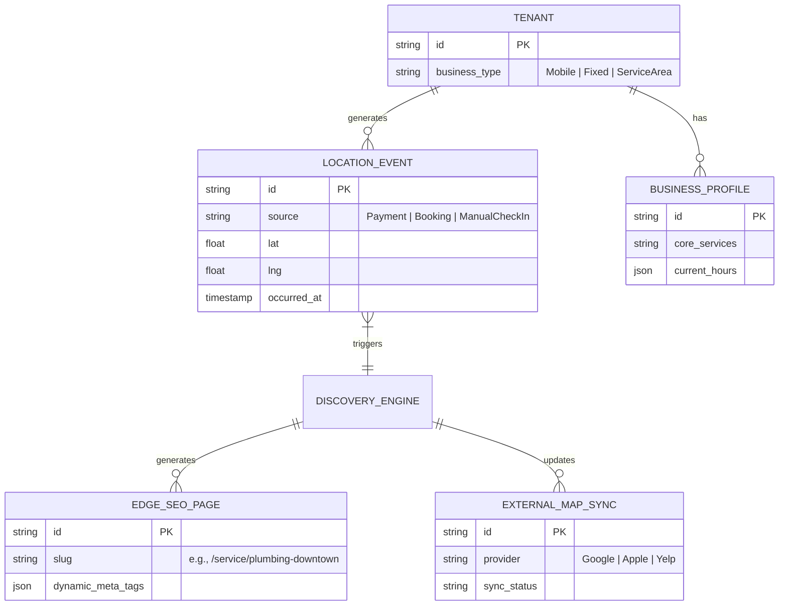

# [Architecture] Invisible Hyperlocal SEO & Discovery Mesh

## Title
Invisible Hyperlocal SEO & Discovery Mesh

## Problem Statement
Small business owners—especially service workers like Carlos (handyman) or mobile vendors like Fatima (food cart)—rely entirely on local foot traffic and proximity searches ("handyman near me", "halal cart open now"). However, maintaining listings across Google Business Profile, Apple Maps, Yelp, and localized search engines is a highly technical, tedious, and error-prone process. Platforms like Wix and Squarespace offer "SEO Wizards," but these still require users to manually type out meta tags, submit sitemaps, and regularly update operating hours. Our business personas do not have time to update 5 different map profiles when they move locations or finish a job. They need a zero-touch architecture that automatically detects their business activity (e.g., Carlos completing a job in a new zip code, or Fatima moving her food cart) and dynamically pushes localized SEO signals and map updates to the edge, completely invisibly.

## Research Report

### Competitive Landscape
*   **Wix / Squarespace**: Offer built-in SEO tools and integration with Google Business Profile. However, they rely heavily on manual "Wizards" (filling out forms, keyword planning). They do not adapt dynamically to real-time, real-world business movements.
*   **Shopify**: Strong e-commerce SEO, but fundamentally biased toward global/national shipping. Local pickup features exist, but lack the deeply integrated geo-fencing and dynamic hyper-local SEO required by mobile service providers.
*   **Yext**: Enterprise-grade local listing management. Extremely powerful, but far too complex and expensive for a single-person business. It’s an enterprise dashboard, failing the "grandmother test."
*   **GoDaddy**: Offers local listing sync, but again, via a manual dashboard interface that requires constant active management from the business owner.

### The OHC Gap
OneHumanCorp has robust agentic operations for booking and invoicing, but lacks an intelligent, autonomous discovery engine. We need a "Discovery Mesh" that acts as an invisible PR and SEO agency. When Carlos takes a payment for a plumbing job in a specific neighborhood, the system should automatically generate a hyperlocal landing page ("Plumbing Repair in [Neighborhood]"), update map listings, and gather local reviews, without Carlos ever hearing the acronym "SEO."

## Design Doc

### Architecture Diagram

### UI Wireframes (375px First)

**Screen 1: The "Invisible Magic" Dashboard Card (Home Screen)**
*   **Layout:** Clean, translucent glass card (Ubiquiti UniFi style) at the bottom of the home screen feed.
*   **Content:**
    *   **Header:** "Local Discovery" (Friendly icon of a map pin).
    *   **Body:** "We noticed you just finished a job in Westside! Your service area map and Google listing have been automatically updated to attract more customers there."
    *   **Action:** A simple "View Public Map" secondary button. No complex settings.
*   **Advanced Toggle (Hidden):** Behind a deep "Settings > Advanced SEO" menu, technical details (API sync logs, manual meta tag overrides) are stored.

**Screen 2: Mobile Operations Profile (Fatima's Use Case)**
*   **Layout:** Full-screen modal with a large, interactive map snippet.
*   **Content:**
    *   **Toggle:** "I'm open right now" (Large, highly tap-able switch).
    *   **Interaction:** When toggled ON, the phone's GPS pinpoints the current location.
    *   **Feedback:** "Location locked! Broadcasting to Apple Maps, Google Maps, and your storefront." (Auto-closes in 3 seconds).

### Mobile UX Flow
1.  **Implicit Trigger:** The user performs a core business action (e.g., taps to pay, finishes a calendar appointment, or hits a quick "Start Shift" toggle).
2.  **Agent Interception:** The AI Operations Agent detects the geolocation of the event.
3.  **Autonomous Update:** The Discovery Engine updates the OHC Edge Cache with a new localized service page (e.g., highlighting a recent verified job in that zip code).
4.  **External Sync:** The engine pushes API updates to Google Business Profile and Apple Business Connect (updating hours or current "food cart location").
5.  **Passive Notification:** The user receives a gentle, non-interruptive feed card confirming their local reach has expanded.

### AI Agent Integration Points
*   **Marketing Department Agent:** Monitors the event bus for `LocationEvent` or `PaymentEvent`. Upon detection, it drafts hyper-localized copy for dynamic edge pages (e.g., "Recently completed roof repair in [Neighborhood]").
*   **Operations Department Agent:** Handles the API state machine for syncing with external map providers, ensuring rate limits are respected and handling any API rejections gracefully without bothering the human CEO.

### Key Design Decisions
1.  **Event-Driven SEO:** SEO is treated as a derivative of business operations (payments, bookings), not a manual marketing task.
2.  **Edge Caching for Speed:** Hyperlocal pages must be generated and cached at the CDN edge instantly to pass Google's Core Web Vitals, crucial for mobile local search ranking.
3.  **"Grandmother Test" Enforcement:** The UI completely abstracts away concepts like sitemaps, structured data (JSON-LD), and API keys. The user only interacts with their business state ("I am here", "I finished a job").
4.  **Secure Identity (SPIFFE/SPIRE):** Background syncing with Google/Apple APIs utilizes secure, tenant-isolated credentials managed by the internal workload identity system.

## Implementation Prompt

**Role:** Swarm Implementer Agent

**Objective:** Build the backend event listeners, edge page generation logic, and UI components for the Invisible Hyperlocal Discovery Mesh.

**User Journey (CUJ):**
As Carlos (a mobile handyman), when I process a payment on my phone using Tap-to-Pay at a client's house in a new neighborhood, I want my public OneHumanCorp storefront to automatically feature this neighborhood in my "Service Areas", and my Google Business Profile to be pinged with fresh activity, so that I rank higher for local searches without doing any manual computer work.

**Acceptance Criteria:**
1.  Implement a background worker (sub-agent queue) that listens for `PaymentCompleted` or `BookingCompleted` events containing geolocation data.
2.  Create a service that dynamically generates or updates an SEO-optimized landing page snippet (in the edge cache) highlighting the service in the specific localized area based on the event.
3.  Implement a mock or abstracted integration point for syncing location/hours updates to external map providers.
4.  Build the "Local Discovery" feed card UI component in Tauri (mobile-first, 375px viewport, translucent glass styling) that confirms the autonomous action to the user.
5.  Ensure all complex technical details (like API keys or manual overrides) are hidden behind an "Advanced Settings" switch.
6.  Guarantee multi-tenant isolation; an event for Carlos must never leak into Maya's discovery profile.

## Priority
P1

## Estimated Scope
Large
