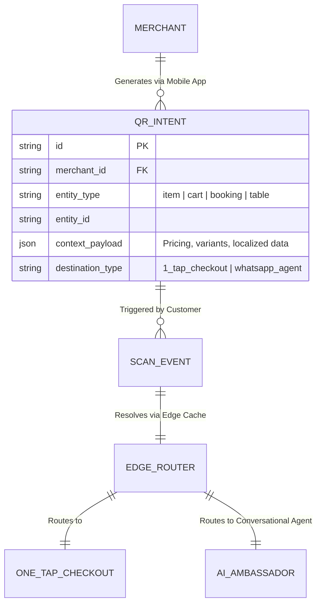
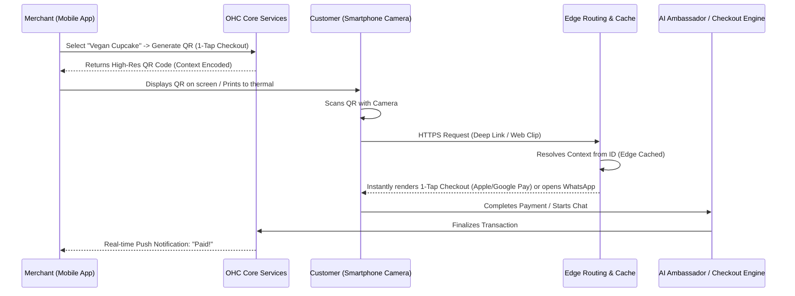

# [architecture] Invisible Offline-to-Online QR Contextual Commerce Engine

## Title
Invisible Offline-to-Online QR Contextual Commerce Engine

## Problem Statement
Small business owners like Fatima (food cart, limited English) and Priya (boutique owner) often interact with customers in the physical world. A huge friction point is converting that physical presence into a digital transaction. Pointing customers to a general website URL or a generic QR code forces the customer to navigate a menu, find their item, select it, add to cart, and checkout. It's too many steps. Customers in line or walking by need instantaneous, frictionless engagement. Currently, these business owners lack an easy way to generate context-specific, item-level, or table-level QR codes that drop the customer directly into a 1-tap Apple Pay/Google Pay checkout or an AI-driven conversational commerce flow via WhatsApp.

## Research Report
* **Shopify POS:** Relies heavily on hardware terminals for in-person transactions. QR codes generally link to a storefront, not an instant context-aware checkout.
* **Square:** Offers QR codes for ordering at tables, but the experience is often clunky, requiring the user to navigate a full digital menu.
* **Linktree / Biolinks:** Static routing, no native contextual checkout.
* **OneHumanCorp (OHC) Differentiation - "Invisible Commerce Bridge":** OHC enables the instantaneous generation of Contextual QR Codes directly from the merchant's mobile device. These aren't generic links; they encode the exact intent (e.g., "Buy 1 Vegan Cupcake", "Pay Table 4 Bill", "Book 30min Consultation"). Scanning the QR code instantly invokes a Zero-Trust, edge-cached web-clip (App Clip / Instant App experience) or a deep link to a WhatsApp/SMS conversation pre-loaded with the context. No app downloads, no generic storefront navigation. Just Scan -> FaceID -> Done.

## Design Doc

### Architecture Diagram

### AI Agent Integration Points
*   **Contextual Agent Hand-off:** If the QR code routes to a conversational flow (e.g., a high-ticket item requiring negotiation or custom specs), the OHC AI Ambassador is instantly primed with the exact item or service context. It greets the user: "Hi! I see you're looking at the vintage leather jacket. Any questions about sizing?"
*   **Dynamic Pricing & Yield:** The AI Operations department can dynamically adjust the payload associated with a static QR code based on time of day (e.g., happy hour pricing) without the merchant needing to reprint the code.
*   **Fraud Defense Engine:** Every scan event is evaluated invisibly by the Fraud Defense Engine to ensure transaction integrity, particularly for high-velocity physical locations.

### Key Design Decisions
1.  **Late Binding of Context:** The QR code encodes a secure intent ID, not the raw data. This allows the OHC platform (and AI agents) to dynamically update pricing, availability, or routing (e.g., item sold out -> route to "Join Waitlist" agent) without re-generating the physical code.
2.  **Edge-Cached Resolution:** The resolution of the QR intent ID must happen at the edge (CDN/Edge Workers) to guarantee sub-100ms load times, preventing customer drop-off.
3.  **App Clip / Instant App Priority:** The primary routing mechanism bypasses the browser where possible, aiming for OS-level native overlays (App Clips / Instant Apps) or direct deep-links to messaging platforms to minimize friction.

### Mobile UX Flow & UI Wireframes (375px)
*   **Merchant Generation (Creation):**
    *   **Screen 1:** Merchant taps an item in their inventory list.
    *   **Screen 2:** A sleek bottom sheet slides up. It has large, touch-friendly buttons: "Generate Checkout QR", "Generate WhatsApp QR".
    *   **Screen 3:** A massive, high-contrast QR code fills the upper half of the screen. Below it, buttons to "Print to Thermal", "Save to Photos", "Display Full Screen". The UI uses translucent glass materials and clean, rounded cards.
*   **Customer Experience (Consumption):**
    *   **Screen 1:** User scans. Their OS immediately prompts a native payment sheet (Apple Pay) or opens a clean, edge-to-edge web clip with a product photo, price, and a single massive "Pay with Apple Pay" button. No navigation bar, no generic branding.

### Zero Trust & Security
*   **Intent ID Expiration & Signing:** QR intent IDs can be configured to expire (e.g., a table session that expires when the bill is paid). They are cryptographically signed to prevent tampering or replay attacks.
*   **Multi-Tenant Isolation:** The resolution edge strictly enforces multi-tenant boundaries. A request must validate against the merchant's current active status and Zero-Trust identity policies.

## Implementation Prompt
**Task:** Implement the core domain logic and APIs for the "Invisible Offline-to-Online QR Contextual Commerce Engine".
**Outcome:** A merchant should be able to request a contextual QR code for an item, service, or abstract cart session. The system must generate a unique, cryptographically secure intent ID. When that ID is resolved via the edge router, it must return the localized context payload necessary to immediately render a 1-tap checkout or initiate an AI conversation.
**Acceptance Criteria:**
*   API endpoints exist to create, update, and resolve `QR_INTENT` entities.
*   The system supports late-binding (updating the payload associated with an intent ID).
*   Resolution must be optimized for edge caching (appropriate cache headers).
*   Integration tests verify that expired or invalid intent IDs return appropriate error states.
*   Strict multi-tenant authorization is enforced on intent creation and modification.

## Priority
P1

## Estimated Scope
Medium
