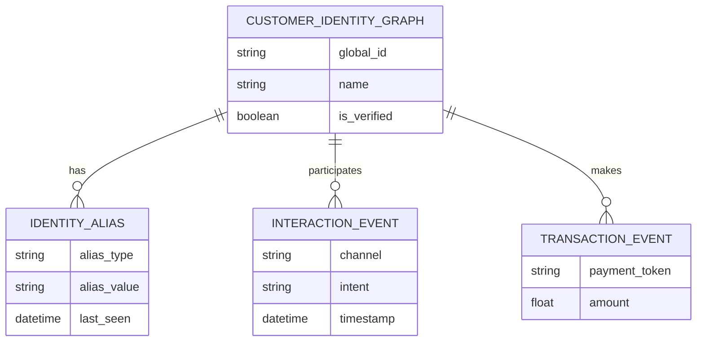

# [architecture] Invisible Omnichannel Customer Identity Graph

## Title
Invisible Omnichannel Customer Identity Graph

## Problem Statement
Small business owners like Maya (baker), Carlos (handyman), Priya (boutique owner), and Fatima (food cart) interact with their customers across multiple channels: Instagram DMs, SMS, WhatsApp, in-person (tap-to-pay), phone calls, and web store checkouts. Today, these interactions are siloed. If a customer messages Maya on Instagram and then buys a cake via the web storefront, Maya has no idea they are the same person unless she manually cross-references. They need a unified, invisible system that automatically stitches together customer identities, purchase history, conversational context, and preferences across all touchpoints, so they can offer personalized, context-aware service instantly without touching a database.

## Research Report
- **Shopify:** Offers Customer profiles, but it heavily relies on email/phone matching at checkout. Omnichannel messaging (like merging an Instagram DM with an in-store POS transaction) requires third-party apps like Gorgias or Klaviyo, which are expensive and complex to set up.
- **Wix:** Provides a CRM (Ascend) that captures form submissions and store orders, but lacks native invisible identity resolution across external social channels like WhatsApp and tap-to-pay offline events without manual entry.
- **Square / GoDaddy:** Square excels at in-person identity (linking cards to phone numbers), but struggles to bring that context into social media DMs. GoDaddy has a unified inbox, but identity resolution is basic.
- **Opportunity for OneHumanCorp:** By building an *Invisible Omnichannel Customer Identity Graph*, OHC can automatically link a customer's WhatsApp number, Instagram handle, email, phone number, and physical credit card token (from Tap-to-Pay) into a single, secure customer entity. This allows AI agents to provide hyper-personalized responses (e.g., "Hi Sarah, do you want to reorder your usual vegan cake?") regardless of the channel.

## Design Doc

### Architecture Diagram

### Mobile-First UI (375px)
- **Customer Profile Card:** Adopts macOS-style Translucent Glass materials combined with clean Ubiquiti UniFi modular dashboard card layouts.
- **Header:** Customer avatar (auto-generated or pulled from social), name, and a "Lifetime Value" stat in a soft translucent pill.
- **Unified Timeline:** A chronological scroll of touchpoints—an Instagram DM, an in-store Tap-to-Pay purchase, a web appointment booking—all seamlessly interleaved.
- **AI Suggested Actions:** One-tap action buttons (e.g., "Send Reorder Link", "Reply to DM") prominently placed above the fold.
- **Grandmother Test:** No complex "Merge Contacts" workflows. The UI simply presents a unified view. "Advanced Settings" hides the raw aliases and merge logic.

### AI Agent Integration
- **Customer Success (CS) Agent:** When an incoming message arrives via any channel, the CS Agent queries the Identity Graph to retrieve full context before generating a response.
- **Operations Agent:** Background task automatically proposes identity merges (e.g., matching a phone number from an SMS to a phone number on a web order) and asks for 1-tap approval in the Activity Feed if confidence is below 99%, or auto-merges if confidence is 100%.
- **Marketing Agent:** Uses the unified graph to identify highly engaged customers across channels for targeted VIP campaigns.

### Key Design Decisions
- **Invisible Graph Stitiching:** Identity resolution happens in the background. Merchants don't "manage a CRM"; they just talk to customers who are fully contextualized.
- **Zero-Trust Security (SPIFFE/SPIRE):** Every cross-channel identity merge event is cryptographically signed. Multi-tenant isolation guarantees that Maya's customer data is strictly segregated from Carlos's.
- **Deterministic vs. Probabilistic Matching:** Strong deterministic links (phone, email, payment token) trigger auto-merges. Probabilistic links (similar name + location) require 1-tap human approval via the Activity Feed.

## Implementation Prompt
Implement the backend and UI capabilities for the Invisible Omnichannel Customer Identity Graph.
- Create the data structures to support multiple aliases (Instagram handle, phone number, email, tap-to-pay token) mapping to a single Customer Entity.
- Build the background resolution service that listens for incoming events across channels and links them to the correct Customer Entity.
- Develop the 375px mobile-first Customer Profile view using the Translucent Glass and UniFi modular dashboard style.
- Ensure all multi-tenant isolation rules are strictly enforced and inter-agent queries are secured via SPIFFE/SPIRE.
- Do not assume specific database schema details; optimize for rapid read access by AI agents and seamless mobile UI rendering.

## Priority
P1

## Estimated Scope
Large
