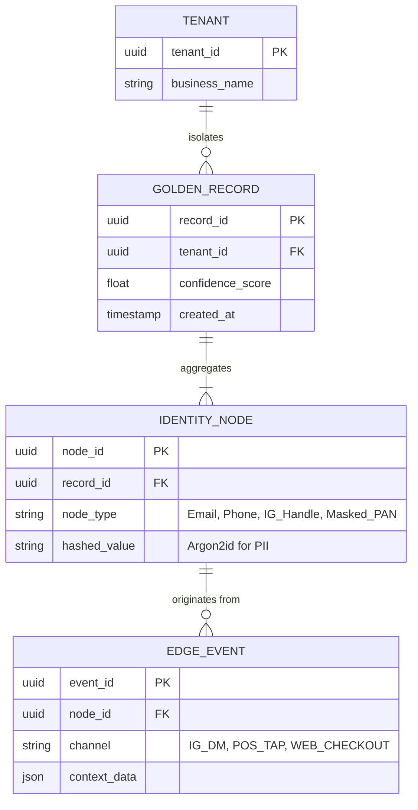

# Title: [Architecture] Invisible Omnichannel Customer Identity Graph

## Problem Statement
Small business owners like Maya (the custom baker) and Priya (the boutique owner) struggle to keep track of their customers across fragmented channels. A single customer might interact via an Instagram DM ("Do you do vegan cakes?"), later book a consultation via a web storefront, and finally complete a purchase in-person using Tap-to-Pay. Because these interactions occur in silos, Maya ends up with three disjointed customer profiles. She loses context, appears forgetful to her top clients, and misses critical up-sell opportunities. They need an invisible intelligence layer that automatically merges these identities into a single, cohesive "Golden Customer Record" without requiring the business owner or the customer to actively link accounts or remember login credentials.

## Research Report
- **Competitor Systems Audit:**
  - **Shopify**: Relies heavily on deterministic linking via email addresses and user accounts. It lacks native probabilistic merging for unstructured social media interactions (like Instagram or WhatsApp DMs).
  - **Square**: Strong at linking in-person POS transactions to digital profiles via email receipts and masked PANs (Primary Account Numbers), but weak on social mapping and initial acquisition tracking.
  - **Wix**: Basic CRM functionality that creates a new contact for almost every new form submission or order, leading to massive duplication that requires manual cleanup by the user.
- **OHC Advantage:** By leveraging an AI-driven `Invisible Omnichannel Customer Identity Graph`, OHC can combine deterministic data (emails, phone numbers, masked PANs) with probabilistic AI matching (social handles, conversational context, shipping addresses, partial names). This enables OHC to provide Maya with a unified timeline of a customer's journey from a casual DM to a loyal repeating customer, completely automatically.

## Design Doc

### Business Journey Mapping
1. **Acquisition**: A potential customer sends an Instagram DM. OHC creates an initial `GuestIdentity` tied to the IG handle. The Ambassador Agent replies.
2. **Activation**: The customer books a consultation slot via a web link sent in the DM, providing their email and phone number. The Identity Graph probabilistically merges the IG handle with the new deterministic data.
3. **Revenue**: The customer visits the boutique and pays via Offline-First Tap-to-Pay. The transaction is linked to a masked PAN. The Identity Graph securely maps the masked PAN to the existing profile via a subsequent digital receipt sent via SMS.
4. **Retention**: Priya pulls up the customer's profile on her phone and sees the complete history: the initial IG DM, the booked consultation, and the in-store purchase.

### Data Model & Invariants

### AI Department Coordination
- **Customer Success (The Ambassador)**: Ingests unstructured edge events (DMs, SMS) and extracts identity fragments (names, social handles).
- **Operations (The Manager)**: Processes formal edge events (checkout flows, POS taps) and extracts deterministic identity fragments (emails, masked PANs).
- **The Graph Resolution Agent**: A specialized background worker that continuously evaluates identity fragments. It computes confidence scores for potential merges and executes merges when the threshold is met, updating the Golden Record invisibly.

### Mobile-First UX Flow (375px)
- **The Customer Profile View**: When Maya views a customer profile on her phone, she sees a rich, macOS-style Translucent Glass card containing the customer's preferred contact method. Below it, a unified Activity Feed blends Instagram messages, completed orders, and booked appointments into a single chronological timeline.
- **Merge Suggestions (Edge Cases)**: If the Graph Resolution Agent computes a moderate confidence score (e.g., matching first name and city, but different email), the UI surfaces a simple, unobtrusive Tinder-like swipe card in Maya's Activity Feed: "Is @sally_bakes the same person as Sally Brown (sally@example.com)? [Yes / No]".

### Performance & Security Targets
- **Zero Trust & Multi-Tenancy**: The Identity Graph enforces strict multi-tenant isolation at the row level. A customer interacting with Maya's bakery and Priya's boutique will have two completely isolated Golden Records. Cross-tenant data merging is cryptographically prohibited.
- **PII Hashing**: Raw identity fragments (emails, phone numbers) are hashed using Argon2id before storage in the `IDENTITY_NODE` table. The application layer handles real-time decryption via secure, memory-safe enclaves when rendering the mobile UI.
- **SPIFFE/SPIRE**: All background worker calls to the Identity Graph API must present a valid SPIFFE SVID representing the specific tenant's context.

## Implementation Prompt
Implement the Invisible Omnichannel Customer Identity Graph.
1. Establish the `GOLDEN_RECORD` and `IDENTITY_NODE` data structures with strict tenant isolation and PII hashing mechanisms.
2. Develop the Graph Resolution background worker that subscribes to customer interaction events across all channels (Social DMs, Checkout, POS).
3. Implement the deterministic and probabilistic matching logic to merge identity fragments into a single Golden Record per tenant.
4. Expose an API endpoint for the mobile frontend to query the unified customer timeline and present moderate-confidence merge suggestions for manual approval.

## Priority
P1

## Estimated Scope
Large