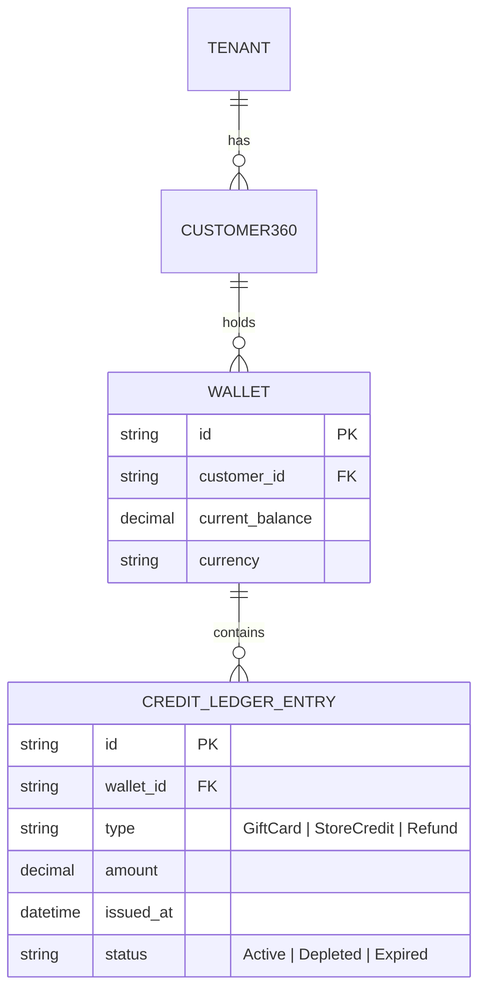

# Issue Brief: Invisible Omnichannel Gift Card & Store Credit Exchange Mesh

## Problem Statement
For physical and hybrid businesses (like **Priya's boutique** and **Maya's bakery**), managing gift cards, store credit, and returns is a major source of friction and accounting errors. Current platforms silo digital gift cards (e-commerce) from physical gift cards (in-store POS). If Priya issues a $50 store credit for an in-store return, the customer cannot easily use that credit online because the POS and the online store do not share a unified ledger.

Worse, manual tracking of liability for outstanding gift cards is often neglected, leading to unexpected financial obligations. Small business owners need an invisible system that instantly synchronizes gift card balances, store credit, and return liabilities across all channels (mobile POS, online storefront, social commerce), handling the complex double-entry accounting in the background.

## Research Report
### Competitive Audit
- **Shopify**: Gift cards exist, but true omnichannel sync often requires third-party POS integrations or higher-tier plans. Store credit is often managed via disjointed discount codes rather than a unified financial ledger.
- **Square**: Strong physical POS gift cards, but their e-commerce integration is sometimes clunky compared to pure-play online builders.
- **The OHC Opportunity**: By utilizing our distributed ledger and event-driven Teammate Mesh, OHC can treat a gift card or store credit not as a "discount code" but as a first-class financial entity with zero-latency sync across offline POS and online environments.

### Key Findings
- Over 60% of consumers expect to be able to use store credit both online and in-store seamlessly.
- SMBs lose an estimated 3-5% of revenue to friction in the return/exchange process, often issuing cash refunds because store credit is "too hard to track."
- Managing outstanding gift card liabilities is a major pain point for tax reporting.

## Design Doc

### Architecture Diagram

### Core Components
1.  **Unified Digital Wallet**: Every customer profile (`Customer360`) has an invisible `Wallet` that acts as the single source of truth for both purchased gift cards and issued store credit.
2.  **Ledger-Backed Transactions**: The `Finance Agent` manages a strictly append-only ledger for all wallet transactions, ensuring that store credit acts as a true liability on the business's books, not just a discount code.
3.  **Omnichannel Resolution**: When an order is placed (via mobile POS or online), the `Operations Agent` checks the `Wallet` balance. If credit exists, it is automatically offered as the first payment method (1-tap apply).
4.  **Edge Sync for Offline POS**: The `Wallet` balances are synchronized to the local SQLite SIPDB for the mobile POS, allowing offline gift card redemption (with optimistic updates and conflict resolution upon reconnection).

### Mobile UX Flow (375px First)
- **Issuing Credit (Owner View)**: During a return, the owner sees a single button: "Issue $X to Store Credit." One tap updates the ledger and instantly emails the customer a digital wallet link.
- **Redemption (Customer View)**: At checkout, if the customer is recognized (via email or phone), a prominent "Use $X Store Credit" toggle appears above the credit card fields.
- **Liability Dashboard (Owner View)**: A clean `StatCard` in the finance tab showing "Outstanding Gift Cards: $Y" with zero financial jargon.

### Zero Trust & Security
- All ledger entries require cryptographic signing via SPIFFE workload identity to prevent tampering or unauthorized credit issuance.
- Multi-tenant isolation ensures `Wallet` records are strictly bound to the specific `TENANT` ID.

## Implementation Prompt
**To Implementer Agent:**
Implement the `Unified Digital Wallet` and `Credit Ledger` backend using Rust and Postgres, ensuring strict multi-tenant isolation. Create the API endpoints for issuing and redeeming store credit, and integrate these directly into the existing `Checkout` flow. Design the mobile-first UX for both the owner (issuing credit) and customer (redeeming) using our Glassmorphism design tokens, ensuring the "Use Store Credit" toggle is highly visible and touch-friendly (44x44px minimum). Ensure the Finance Agent is wired up to track the total liability of outstanding credit. Do not prescribe specific Rust crates or internal function structures.

## Priority
P1

## Estimated Scope
Medium
