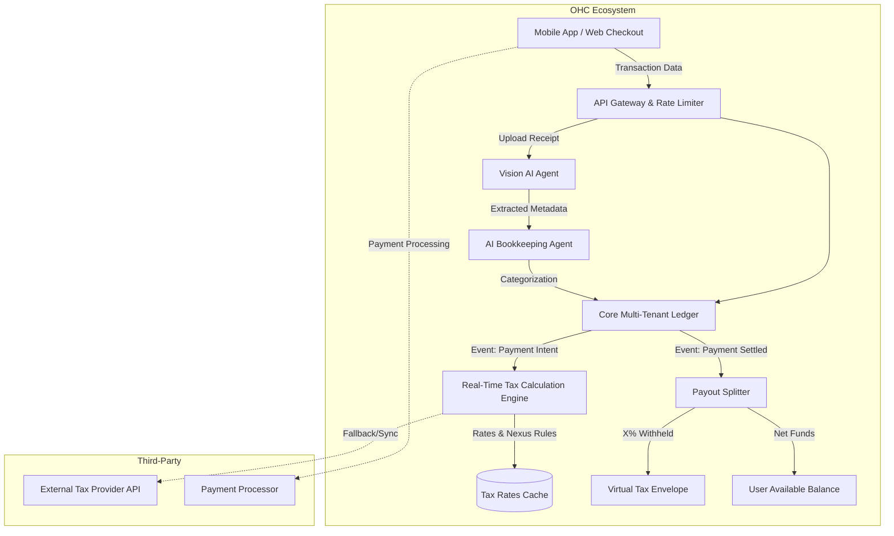

# Invisible Real-Time Tax & AI Bookkeeping Engine

## Title
Build the Invisible Real-Time Tax & AI Bookkeeping Engine

## Problem Statement
Small business owners (like Maya the baker and Carlos the handyman) despise accounting, calculating sales tax across jurisdictions, and categorizing expenses. Traditional platforms require manual exports to QuickBooks, setting up complex tax tables (e.g., Nexus rules in 50 states), and remembering to save receipts. For a teenager with a side hustle or an immigrant food cart operator like Fatima, this overhead is a barrier to entry. They need a system that invisibly handles tax calculation at checkout, sets aside estimated tax automatically from payouts, and categorizes income/expenses in real-time without ever showing them a traditional "ledger" or "spreadsheet" UI.

## Research Report
**Market Context & Pain Points:**
- **Shopify/Wix:** Offer basic tax calculation but often require third-party apps (e.g., TaxJar, Avalara) for accurate multi-state/multi-country compliance. Accounting is almost always offloaded to Xero or QuickBooks.
- **Stripe:** Stripe Tax exists but requires developer configuration.
- **SMB Reality:** 70% of new micro-businesses fail to correctly remit sales tax or track expenses in their first year, leading to painful audits or surprise tax bills.
- **The Gap:** There is no platform that natively combines instant checkout tax calculation, automatic payout withholding (setting aside money for taxes into a separate virtual envelope), and receipt-scanning AI into a single, cohesive, mobile-first experience.

**Competitive Edge for OHC:**
By embedding tax compliance and bookkeeping directly into the transactional path and relying on AI for categorization, we eliminate the need for third-party accounting software.

## Design Doc

### Architecture Diagram (Mermaid.js)

### Mobile UX Flow (375px First)

1. **Checkout (Buyer View):**
   - Clean, large typography. The price is shown. Underneath, a subtle "Taxes calculated automatically based on your location" line appears. No complex tax breakdown is forced on the buyer unless they tap "View details".
2. **Dashboard (Seller View - Maya/Carlos):**
   - The main dashboard shows "Available Balance".
   - A distinct, visually safe (e.g., green/blue) card says "Estimated Taxes Set Aside: $X".
   - A prominent, floating action button (FAB) for "Snap Receipt".
3. **Receipt Capture Flow:**
   - User taps FAB -> Camera opens -> Snaps picture of a Home Depot receipt (Carlos).
   - A quick macOS-style translucent glass loading overlay says "AI is reading..."
   - A success toast appears: "Added $45.20 for Materials. Tax deductible." No forms to fill.
4. **End of Year / Tax Time:**
   - One tap on a card that says "Generate Tax Report for Accountant" or "Send to TurboTax".

### AI Agent Integration Points

- **Finance AI Agent (Bookkeeper):** Listens to all settled transactions on the NATS event mesh. Automatically categorizes income streams and expenses. If confidence is low, it queues a simple push notification to the user: "Was this $50 at Amazon for office supplies or personal?"
- **Operations AI Agent (Tax Auditor):** Continuously monitors the user's sales volume across state/country lines. If they approach a "Nexus" threshold (e.g., $100k in sales in California), the agent proactively alerts the user and automatically begins collecting CA tax, without the user needing to understand what a Nexus is.
- **Vision AI Agent:** Processes uploaded images (receipts, invoices) using multi-modal LLMs to extract date, amount, vendor, and category.

### Technical & Security Constraints

- **Multi-Tenancy:** The Core Ledger and Tax Envelopes must enforce strict tenant isolation. A failure in one tenant's tax calculation must not bleed into another's ledger.
- **Performance:** Tax calculation during checkout must return in < 50ms (p95) to not impact conversion rates. This requires aggressive edge caching of tax rules.
- **Zero Trust:** The Vision AI Agent must only have permission to write to the specific tenant's ledger and must authenticate via SPIFFE/SPIRE.

## Implementation Prompt

**To the Engineering Swarm (Implementer Agent):**

Build the foundational Real-Time Tax and AI Bookkeeping Engine for OneHumanCorp. Your goal is to create the backend services and mobile-first UI components that allow for instant tax calculation at checkout and automatic expense categorization via receipt upload.

**Acceptance Criteria:**
1. Create a `TaxCalculationService` that accepts a cart payload and buyer location, returning the exact tax amount. It must hit a mock or lightweight internal tax cache (for edge performance) before falling back to external APIs.
2. Implement a `PayoutSplitter` module that intercepts settled transactions and automatically diverts a user-configurable percentage (default 20%) into a read-only "Tax Withholding" virtual ledger balance.
3. Build the mobile-first UI components (using our macOS glass/UniFi design tokens) for the Dashboard showing the "Tax Set Aside" card and the "Snap Receipt" FAB flow.
4. Create an `AIBookkeeperAgent` prompt/wrapper that takes raw OCR text from a receipt and returns structured JSON (Vendor, Date, Amount, Category).
5. Ensure all database accesses use the tenant ID for strict isolation.
6. The entire flow must be testable via unit tests and a Playwright mobile-viewport end-to-end test.

Do NOT prescribe the exact database schema or external API (e.g., Stripe Tax vs TaxJar). Focus on the OHC internal interfaces, event boundaries, and user experience.

## Priority
P1

## Estimated Scope
Large