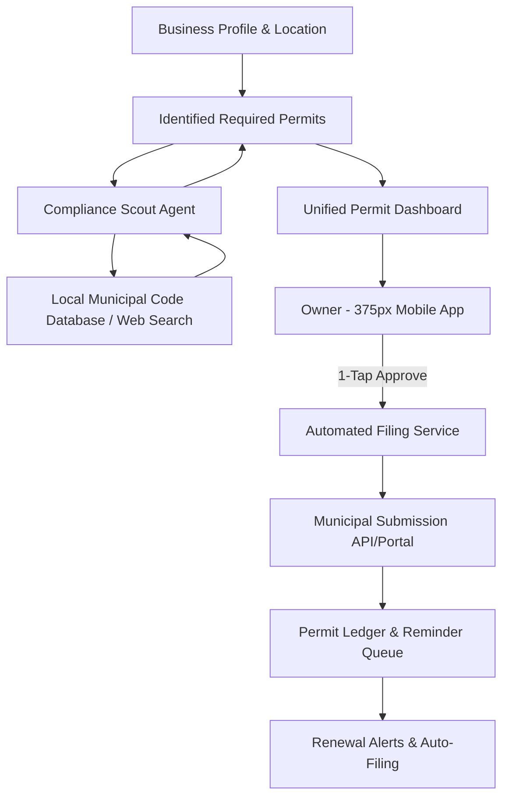
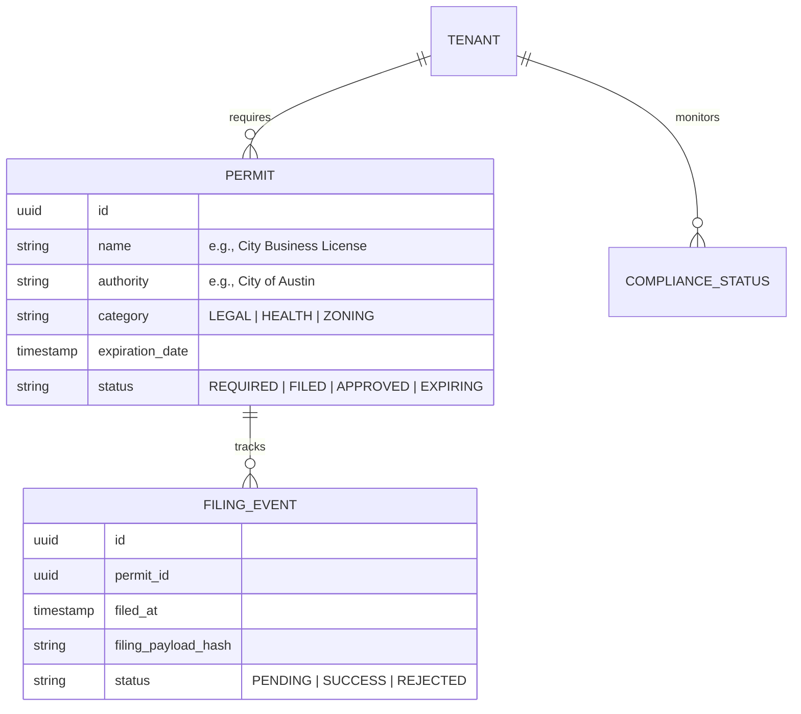

# [Architecture] Invisible Regulatory Compliance & Local Permitting Engine

## 1. Title
**Invisible Regulatory Compliance & Local Permitting Engine: Zero-Friction Municipal Onboarding**

## 2. Problem Statement
For small business owners like **Maya (baker)**, **Carlos (handyman)**, and **Fatima (food cart operator)**, navigating the labyrinth of local regulations, business licenses, and health permits is a major barrier to entry and a constant source of legal anxiety.

In many jurisdictions, a home-based bakery requires specific cottage food permits, a handyman needs a municipal contractor license, and a food cart needs health department clearance plus a mobile vendor permit. Currently, these owners have to manually research their city/county websites, download complex PDFs, visit municipal offices, and keep track of expiration dates on their own. Legacy platforms (Shopify, Wix) offer virtually no help with local permitting, leaving the owner to handle the "Bureaucracy Gap" alone. They need an invisible partner that proactively identifies necessary permits based on their location and business type, simplifies the filing process, and manages renewals automatically.

## 3. Research Report
### Market Gap & Competitor Analysis
*   **Shopify / Wix**: Focus heavily on digital presence and broad tax compliance (e.g., Avalara/TaxJar). They completely ignore "local physical presence" requirements, assuming the merchant has already handled the legalities of being a physical entity in their specific city.
*   **LegalZoom / ZenBusiness**: Excellent for business formation (LLC/Corp), but they treat permitting as a one-time upsell during formation rather than a continuous, integrated management feature. Their interfaces are desktop-heavy and form-intensive.
*   **Gov2Go / Municipal Portals**: While some cities are digitizing, the landscape is fragmented. Every city has a different portal, requiring different logins and data formats, which fails the "Grandmother Test."

### The OHC Opportunity
OHC can bridge the "Bureaucracy Gap" by using AI agents to scout local municipal requirements via LLM-driven research (crawling city codes and ordinance databases) and presenting a unified "1-Tap Permit" experience on a 375px mobile screen. By centralizing the business's data, OHC can auto-fill 95% of permit applications, requiring only a final signature from the owner.

## 4. Design Doc

### Architecture Diagram (Mermaid.js)

### Data Model & Invariants

### Mobile-First UX Flow (375px First)
1. **The Compliance Pulse (Dashboard Card)**: A glassmorphic card on the main dashboard: *"Your business is 60% compliant. I've found 2 required local permits for your bakery."*
2. **The Permit Detail Sheet**: Tapping the card opens a bottom-sheet listing identified needs: *"City Business License"* and *"Cottage Food Permit"*.
3. **The 1-Tap Solution**: Next to each permit is a primary action: `[ Handle it for me ]`.
4. **The Auto-Fill Summary**: A clean summary screen: *"I've drafted your application using your business info. No forms to fill. Just confirm your signature below."*
5. **The Success Chime**: Once filed, a green *"Pending City Approval"* status appears, and the AI takes over tracking.

### AI Agent Integration Points
- **The Protector (Legal AI Agent)**: The primary department head responsible for the business's legal health.
- **The Scout (Sub-agent)**: Specialized agent that periodically crawls municipal ordinances to detect new rules (e.g., new "Ghost Kitchen" regulations that might affect Fatima).
- **The Messenger (CS Agent)**: If a municipal clerk requests more info, the CS agent intercepts the email/portal message, summarizes it for the owner, and drafts the response.

### Key Design Decisions
- **Zero-Jargon Interface**: Replace "Municipal Code", "Ordinance", and "Jurisdictional Nexus" with "Local Rules" and "City Permits".
- **Optimistic Compliance**: The app assumes the user wants to be compliant and proactively scouts rather than waiting for the user to ask.
- **Cryptographic Filing Record**: Every filing event is hashed and recorded in the tenant-isolated ledger to ensure an immutable audit trail for the owner.

## 5. Implementation Prompt
**Task for Implementer Agent:**
Implement the backend compliance engine and mobile UI for the "Invisible Regulatory & Permitting Engine".

**User-Facing Outcome:**
A business owner (like Maya) enters her bakery's address and business type. The system autonomously identifies that she needs a "Cottage Food Permit" and a "Home Occupation Permit" from her specific city. She can tap "Approve" for each, and the system auto-fills and submits the applications (or provides a guided 1-tap experience), tracking the status until approval and managing renewals.

**Acceptance Criteria:**
1. Define the `Permit` and `FilingEvent` data entities with strict multi-tenant isolation and PostgreSQL RLS.
2. Implement a "Compliance Scout" service hook that identifies requirements based on zip code and business category (mocked or using LLM research integration).
3. Build the mobile-first (375px) "Compliance Pulse" dashboard card and Permit Detail bottom-sheet using OHC Translucent Glass design tokens.
4. Implement the state machine for permit lifecycle management (Required -> Filed -> Approved -> Expiring).
5. Ensure the "Protector" agent can trigger push notifications for expiring permits.
6. All developer/technical terms must be hidden; the UI must pass the "Grandmother Test."

## 6. Priority
**P1** (High - Critical for legal safety and establishing OHC as a "True Partner" rather than just a tool).

## 7. Estimated Scope
**Large** (Requires integration with location services, AI scouting logic, and a robust status tracking engine).
