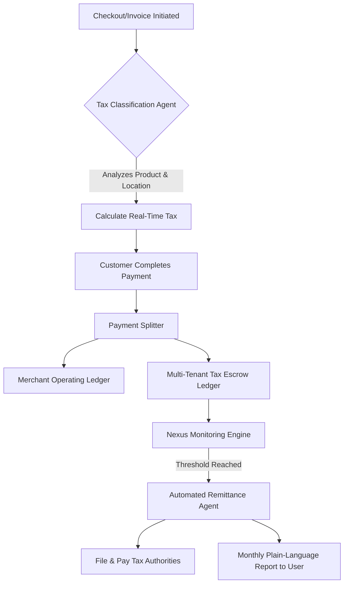

# Issue Brief: Universal Invisible Tax & Compliance Engine

## Title
[Architecture] Universal Invisible Tax & Compliance Engine

## Problem Statement
Small business owners (like Maya the baker and Carlos the handyman) are terrified of tax compliance. Figuring out state sales tax, economic nexus thresholds, cross-border VAT, and tax exemptions is complex, risky, and time-consuming. They don't want to become accountants or hire expensive firms just to sell a cake or fix a sink. Current platforms ask them to "configure tax rates," which assumes knowledge they don't have. They need a system where they never have to think about taxes—it should just calculate, collect, and remit automatically without any manual configuration.

## Research Report
- **Market Gap**: Platforms like Shopify and Wix require manual tax configuration or paid third-party apps (e.g., Avalara, TaxJar) that are too complex and expensive for micro-businesses.
- **Pain Point**: Business owners abandon e-commerce ambitions due to fear of IRS audits or nexus liabilities in other states.
- **Competitor Systems**: Stripe Tax exists but requires integration and configuration. OHC needs a Zero-Config, fully invisible solution.
- **AI Opportunity**: An AI Legal & Finance Agent can monitor transactions globally, automatically determine nexus, classify products (e.g., clothing vs. digital goods have different tax rules), and handle multi-jurisdiction remittance invisibly.

## Design Doc
### High-Level Architecture
- **Trigger**: A transaction is initiated (checkout or invoice generated).
- **Tax Classification Agent**: AI automatically categorizes the product/service (e.g., "Vegan Cake" -> Groceries/Prepared Food) and determines its taxability in the buyer's and seller's jurisdictions.
- **Nexus Monitoring Engine**: A background service continuously aggregates sales volume per state/country to predict and detect when a business hits an economic nexus threshold (e.g., $100k or 200 transactions in a specific state).
- **Invisible Ledger**: Collected taxes are automatically split and sequestered into a dedicated multi-tenant escrow ledger, completely separated from the merchant's operating revenue, ensuring the money is never accidentally spent.
- **Automated Remittance Agent**: AI automatically files and pays the respective tax authorities on the required schedules (monthly, quarterly) using the sequestered funds.

### Mobile UX Flow (375px First)
1. **Zero Setup**: The user does *nothing* to set up taxes. It is on by default.
2. **Transaction View**: When viewing an order, taxes are clearly shown as "Calculated & Collected," but the merchant's net payout is highlighted.
3. **Monthly Financial Briefing**: A plain-language card on the dashboard states: "We automatically filed and paid $342 in sales tax to NY and CA this month. You're 100% compliant."
4. **Advanced Settings**: A toggle hidden in settings allows the user to download detailed tax reports for their accountant if desired, but defaults to "OHC manages everything."

### Architecture Diagram

### AI Agent Integration Points
- **Finance Department (Tax Classification)**: Evaluates SKUs to determine tax categories dynamically using LLMs without the merchant needing to select tax codes.
- **Legal Department (Nexus & Compliance)**: Monitors transaction volumes against a dynamically updated database of state and international tax laws to automatically register for taxes when nexus is hit.
- **Operations Department (Remittance)**: Handles the actual API calls to state tax portals to file returns and transfer funds.

### Key Design Decisions
- **Zero-Config Default**: Merchants are legally indemnified by OHC (or a partner of record) acting as the Merchant of Record (MoR) for tax purposes.
- **Fund Sequestration**: Tax money never touches the merchant's available balance, preventing accidental spending and tax debt.
- **AI-Driven Categorization**: No manual mapping of products to tax codes.

## Implementation Prompt
Implement the Universal Invisible Tax & Compliance Engine. Build the core multi-tenant data structures and AI agent workflows to automatically classify transactions, calculate taxes in real-time, sequester collected tax funds, and monitor economic nexus thresholds. The system must function entirely in the background without requiring the merchant to configure tax rates or tax codes. Create the necessary internal APIs for the checkout and invoicing systems to query real-time tax amounts. Ensure strict isolation between merchant operating funds and the multi-tenant tax escrow ledger. Design the system to handle background automated remittance via the AI Operations department. Ensure the mobile UX reflects these capabilities via plain-language monthly summaries.

## Priority
P0

## Estimated Scope
Large
