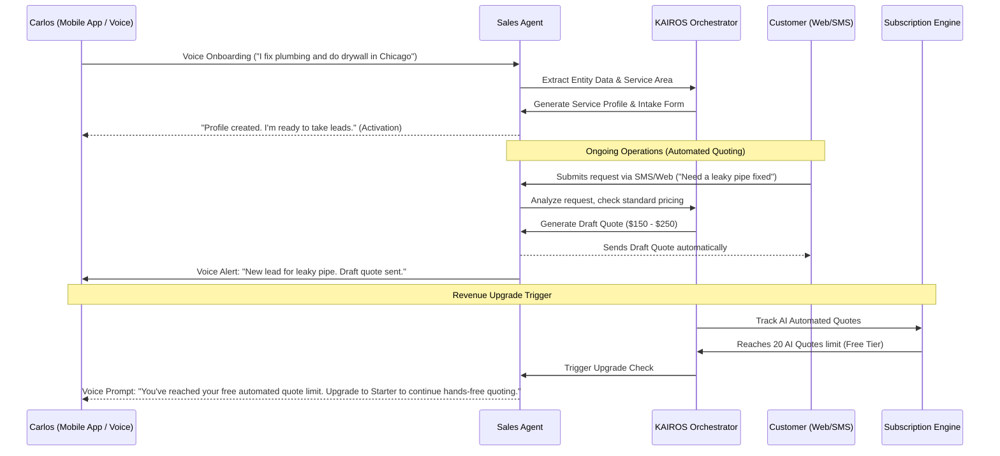

# Business Journey Architecture: Carlos (Handyman)

## Problem Statement
Service professionals like Carlos are constantly on the move, often driving between job sites. Their primary pain point is not having the time or ability to sit at a desk to configure software, respond to leads, or generate quotes promptly. Traditional CRM and quoting tools require significant screen time, leading to lost leads and administrative backlog. The OHC platform must support a "hands-free," mobile-first experience to ensure Carlos can operate his business while in transit.

## SaaS Landscape Research
- **Jobber/Housecall Pro:** Powerful dispatch and quoting tools, but heavily reliant on desktop setup or complex mobile app interactions that are unsafe or impossible while driving.
- **Phone Calls/SMS:** High friction for the business owner to manage manually, leading to delayed responses and lost revenue to faster competitors.
- **OHC's Opportunity:** Implement a voice-first interface and autonomous agents that handle lead capture and initial quoting without requiring Carlos to look at a screen.

## Architectural Sequence Diagram: Voice-First Onboarding & Quoting

## Key Design Decisions
1.  **Voice-First Onboarding:** The primary interaction model for onboarding and daily operations is voice. The app must parse spoken natural language to configure service areas, pricing, and availability.
2.  **Automated Quoting (Sales Agent):** The Sales Agent autonomously engages with incoming leads, requesting photos or details if necessary, and generates preliminary quotes based on historical data or standard rate cards.
3.  **Monetization via AI Action Quotas:** The value proposition is time saved. Monetization is tied to the number of AI-driven actions (e.g., automated quotes generated). Once the free quota is exhausted, an upgrade to the Starter tier is required to maintain the automation.

## Implementation Prompt
**Implementer Agents:**
-   Develop the voice-to-text processing pipeline for the mobile app, specifically tuning it for business setup commands and operational updates.
-   Implement the `Sales Agent` logic to intercept inbound leads (via SMS or web form), parse the request, and generate a draft quote.
-   Integrate text-to-speech alerts for the mobile app to provide Carlos with audio notifications of new leads and sent quotes.
-   Configure the `Subscription Engine` to track "AI Actions" (specifically, automated quotes) and trigger the Starter tier upgrade flow when the quota is reached.
