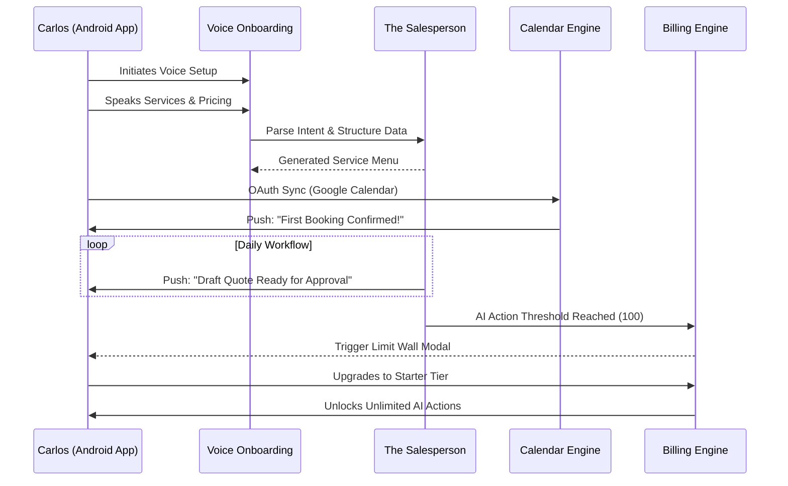

# Architecture Brief: SaaS Business Journey - Carlos the Handyman

**Title**: Architectural Mapping of the End-to-End SaaS Business Journey for Carlos (Handyman)

**Problem Statement**:
Carlos (42) represents a critical demographic for OHC: the established, offline service provider. He relies on word-of-mouth and operates his business entirely from an Android device while at job sites. The architectural challenge is mapping out his journey as a SaaS user—how he discovers the platform, how we onboard a user with zero patience for software configuration, and how we prove value so quickly that he integrates OHC into his daily workflow and eventually pays for a premium tier. If the SaaS lifecycle requires desktop interaction or complex CRM setup, Carlos will churn.

**Research Report**:
- **Acquisition Landscape**: Service professionals often discover software through industry peers, localized SEO, or targeted ads highlighting "Stop losing track of jobs."
- **Onboarding Friction**: Existing CRMs (like Jobber or Thumbtack) require significant upfront data entry (service lists, pricing schemas, calendar integrations) before providing any value. This is a massive barrier for an on-the-go professional.
- **Activation Metrics**: For a service provider, activation is defined by the first successfully booked job via the automated calendar system, eliminating the usual text-message ping-pong.
- **Retention & Revenue Drivers**: The key to retaining Carlos is time saved. AI-drafted quotes and automated scheduling are the primary value drivers. Upgrade triggers revolve around increasing AI usage limits or unlocking advanced tax reporting features.

**Design Doc**:
- **SaaS Business Journey Flow**:
  1.  **Acquisition**: Carlos clicks an ad: "Let AI handle your schedule." He downloads the OHC Android app directly while waiting in his truck.
  2.  **Onboarding**:
      - The app utilizes a "Voice First" onboarding flow. Carlos speaks: "I do drywall repair and TV mounting. I charge fifty bucks an hour."
      - The AI processes this, creates a basic service menu, and asks for permission to sync with his Google Calendar.
      - Total onboarding time: < 3 minutes.
  3.  **Activation**:
      - Carlos shares his new OHC booking link with a prospective client via SMS.
      - The client uses the link to book a TV mounting slot for Tuesday.
      - Carlos receives a push notification: "New Job Booked for Tuesday." He didn't have to negotiate the time. This is the activation moment.
  4.  **Retention**:
      - "The Salesperson" AI actively monitors incoming requests. When a complex drywall request comes in, it drafts a quote based on historical data.
      - The daily push notifications ("Review Quote," "Job Reminder") make the app indispensable.
  5.  **Revenue (Upgrade Trigger)**:
      - The Free tier limits Carlos to 100 AI actions (drafting quotes, parsing incoming messages) per month.
      - By week three, his business volume exceeds this limit.
      - The app prompts: "Upgrade to Starter ($9/mo) to unlock unlimited AI quote drafting and automated SMS reminders for clients." Carlos upgrades because the ROI is immediately apparent.
  6.  **Referral**:
      - Carlos refers another contractor on a job site using a simple QR code generated from his app dashboard.

- **Architecture Diagram (Mermaid.js)**:

- **Key Design Decisions**:
  - **Voice-First Input**: Recognizing the environment (a truck, a job site), text entry is minimized during onboarding in favor of voice parsing via LLM to structure the initial data model.
  - **Action-Based Tiers**: The monetization strategy is tied to AI usage limits rather than basic features, ensuring the core booking functionality remains accessible to prove value.
  - **Aggressive Integration**: Immediate syncing with existing tools (Google Calendar) is prioritized over forcing the user to adopt a new proprietary calendar, drastically reducing friction.

**Implementation Prompt**:
To Implementer Agent:
Implement the SaaS lifecycle tailored for "Carlos the Handyman". Build the audio-to-text pipeline that allows the onboarding wizard to ingest spoken service descriptions and structure them into catalog items. Develop the calendar synchronization service that reliably negotiates OAuth with external providers (Google/Apple Calendar) immediately upon account creation. Implement the telemetry and billing hooks that track AI action usage per tenant, enforcing the tier limits and triggering the upgrade modal when the quota is exhausted. Ensure the mobile client robustly handles the state transitions between the Free and Starter tiers without requiring a restart.

**Priority**: P0
**Estimated Scope**: Large
